[](https://dealna-de-v1-3-3806d4fcd64f.herokuapp.com/)


  
---
[]( https://dealna-de-v1-3-3806d4fcd64f.herokuapp.com/)

[]( https://Dealna.de)

[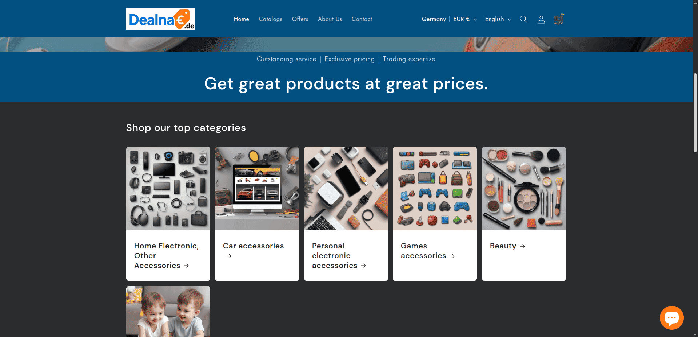]( https://Dealna.de)

[]( https://dealna-de-v1-3-3806d4fcd64f.herokuapp.com/)
 
[]( https://dealna-de-v1-3-3806d4fcd64f.herokuapp.com/)


[]( https://dealna-de-v1-3-3806d4fcd64f.herokuapp.com/)

  
---
 
# **_Dealna.de E-Commerce V1.3_**

## Dealna.de v1.3 (Shop Smart, Live Better) - Portfolio Project 5 - Full Stack Toolkit Project.

**Dealna.de v1.3:** A Gateway to Seamless Online Shopping  

The **Dealna.de E-Commerce Platform** is designed to provide users with a modern, intuitive, and secure online shopping experience. Powered by Django, this dynamic platform delivers a seamless experience for browsing, purchasing, and managing products across diverse categories, reflecting a commitment to quality, reliability, and user satisfaction.

### A Platform for Smart Shopping  

At its core, **Dealna.de v1.3** offers users a curated selection of products, from fashion and electronics to home goods and lifestyle essentials. The intuitive navigation and categorization make it easy for shoppers to discover products tailored to their needs. Each product listing includes detailed descriptions, high-quality images, and customer reviews, creating a sense of trust and connection between buyers and sellers.

### A User-Centric Experience  

The platform is designed with usability in mind, featuring:  
- **Dynamic Product Listings:** Easily browse products by category, price, or rating.  
- **Secure Checkout:** A seamless and secure payment process ensures a hassle-free shopping experience.  
- **Personalized Profiles:** Registered users can view order history, save payment information, and track deliveries.  
- **Mobile Responsiveness:** The site ensures accessibility across devices, making it convenient for users on the go.  

### A Tool for Informed Decisions  

By presenting detailed product information, customer reviews, and competitive pricing, **Dealna.de v1.3** empowers users to make informed purchasing decisions. Whether shopping for everyday essentials or unique finds, users are encouraged to explore and engage with the platform, ensuring a satisfying shopping experience.

### Continuous Innovation and Growth  

The **Dealna.de v1.3** reflects the iterative evolution of a robust platform. Features such as advanced search filters, personalized recommendations, and seamless social sharing are just the beginning of a roadmap aimed at enhancing the user experience. Each iteration is a step closer to making this platform a go-to destination for online shoppers worldwide.

### Conclusion  

In an era of rapid digital transformation, **Dealna.de v1.3** stands out as a reliable and engaging online shopping destination. It goes beyond simply selling products; it fosters trust, inspires confidence, and creates connections among its users. The live site invites you to explore this vibrant e-commerce hub and experience the future of online shopping.

**You can view the live site here - [Dealna.de For E-Commerce v1.3]( https://dealna-de-v1-3-3806d4fcd64f.herokuapp.com/).**  


---

**You can view Dealna.de live site here - [Dealna.de](https://Dealna.de).**  


---

[]( https://dealna-de-v1-3-3806d4fcd64f.herokuapp.com/)

--- 


# Contents

- [**_Dealna.de E-Commerce V1.3_**](#dealnade-e-commerce-v13)
  - [Dealna.de v1.3 (Shop Smart, Live Better) - Portfolio Project 5 - Full Stack Toolkit Project.](#dealnade-v13-shop-smart-live-better---portfolio-project-5---full-stack-toolkit-project)
    - [A Platform for Smart Shopping](#a-platform-for-smart-shopping)
    - [A User-Centric Experience](#a-user-centric-experience)
    - [A Tool for Informed Decisions](#a-tool-for-informed-decisions)
    - [Continuous Innovation and Growth](#continuous-innovation-and-growth)
    - [Conclusion](#conclusion)
- [Contents](#contents)
  - [Purpose of the Project – **Dealna.de E-Commerce v1.3**](#purpose-of-the-project--dealnade-e-commerce-v13)
  - [User Stories:](#user-stories)
    - [**User Stories**](#user-stories-1)
    - [**Additional User Stories for Site Admin and Site Owner**](#additional-user-stories-for-site-admin-and-site-owner)
    - [**Additional User Stories for New Apps**](#additional-user-stories-for-new-apps)
  - [**Site Structure**](#site-structure)
    - [**1. Home Page**](#1-home-page)
    - [**2. Product Categories**](#2-product-categories)
    - [**3. Product Page**](#3-product-page)
    - [**4. Shopping Cart**](#4-shopping-cart)
    - [**5. Checkout Page**](#5-checkout-page)
    - [**6. User Account**](#6-user-account)
    - [**7. Admin Dashboard**](#7-admin-dashboard)
    - [**8. User Interaction Features**](#8-user-interaction-features)
  - [Design Choices](#design-choices)
    - [Colour Scheme](#colour-scheme)
    - [**Typography**](#typography)
  - [**Features**](#features)
    - [**Existing Features**](#existing-features)
    - [**Future Features**](#future-features)
  - [**Technologies Used**](#technologies-used)
    - [**Languages**](#languages)
    - [**Frameworks \& Libraries**](#frameworks--libraries)
    - [**Database**](#database)
    - [**Tools \& Services**](#tools--services)
    - [**Design Tools**](#design-tools)
  - [**Data Model**](#data-model)
    - [**Core Models**](#core-models)
    - [**Relational Model**](#relational-model)
    - [**Example Relationships**](#example-relationships)
    - [**Database Schema Diagram**](#database-schema-diagram)
  - [**Email Marketing Integration**](#email-marketing-integration)
    - [**Mailchimp**](#mailchimp)
    - [**Screenshot of Mailchimp Pricing**](#screenshot-of-mailchimp-pricing)
  - [**Compliance and Trust**](#compliance-and-trust)
    - [**Händlerbund Membership**](#händlerbund-membership)
    - [**Trusted Shops Seal**](#trusted-shops-seal)
    - [**European Compliance**](#european-compliance)
    - [**Screenshot of Trusted Shops Seal**](#screenshot-of-trusted-shops-seal)
  - [Testing:](#testing)
    - [Chrome Test](#chrome-test)
    - [Lighthouse Testing](#lighthouse-testing)
      - [Performance](#performance)
        - [Desktop lighthouse Performance](#desktop-lighthouse-performance)
        - [Mobile lighthouse Performance](#mobile-lighthouse-performance)
      - [Accessibility Testing](#accessibility-testing)
        - [Lighthouse Accessibility Testing](#lighthouse-accessibility-testing)
        - [WAVE Web Accessibility Evaluation Tool](#wave-web-accessibility-evaluation-tool)
    - [Fixing Accessibility issues:](#fixing-accessibility-issues)
    - [Adobe Color Accessibility Tool](#adobe-color-accessibility-tool)
  - [**Responsive Testing**](#responsive-testing)
    - [**Testing Tools**](#testing-tools)
    - [**Issues with Online Tools**](#issues-with-online-tools)
    - [**Key Findings**](#key-findings)
    - [Manual Testing:](#manual-testing)
    - [Automated Unit Testing:](#automated-unit-testing)
    - [Running Tests:](#running-tests)
  - [Validator Testing - Bugs Fixed:](#validator-testing---bugs-fixed)
  - [HTML Validation](#html-validation)
    - [**Example 1: Invalid Attribute in an Element**](#example-1-invalid-attribute-in-an-element)
      - [**Error**:](#error)
      - [**Cause**:](#cause)
      - [**Fix**:](#fix)
      - [**Code Example**:](#code-example)
      - [**JavaScript Access**:](#javascript-access)
    - [**Example 2: Invalid Width Attribute Value**](#example-2-invalid-width-attribute-value)
      - [**Error**:](#error-1)
      - [**Cause**:](#cause-1)
      - [**Fix**:](#fix-1)
      - [**Code Example**:](#code-example-1)
    - [**Key Takeaways**:](#key-takeaways)
  - [CSS Validation](#css-validation)
  - [JS Validation](#js-validation)
    - [Fixes Applied](#fixes-applied)
  - [Py Validation](#py-validation)
  - [Getting Started:](#getting-started)
  - [Deployment:](#deployment)
  - [Credits](#credits)


## Purpose of the Project – **Dealna.de E-Commerce v1.3**  

The goal of **Dealna.de** is to create a modern, user-friendly e-commerce platform that offers a seamless shopping experience. Built with Django and PostgreSQL, this platform is designed to support a wide range of products, including electronics, clothing, homeware, and special offers.  

With features such as advanced search, secure checkout, product categorization, and personalized user accounts, **Dealna.de** aims to provide an intuitive and efficient marketplace for both buyers and sellers. Customers can easily browse, purchase, and track their orders, while vendors can manage their inventory and sales through a robust backend system.  

Whether you're a shopper looking for the best deals or a seller aiming to expand your reach, **Dealna.de** offers a powerful and scalable solution to meet your e-commerce needs.


---

**Facebook Business Page for Dealna.de v1**  
As part of our project requirements, we have created a dedicated Facebook business page for our e-commerce platform, **Dealna.de v1**. This page serves as a marketing and engagement tool to connect with potential customers, showcase our products, and promote special offers. The page includes essential details about our platform, such as the website link, contact information, and a brief description of our mission to provide a seamless shopping experience. Screenshots of the Facebook business page have been included in this documentation to verify its creation and authenticity.**You can visit our Facebook business page using the following link:** [Dealna.de v1 Facebook Page](https://www.facebook.com/share/1B8bq6A3Jw/).  


[](https://www.facebook.com/share/1B8bq6A3Jw/)


[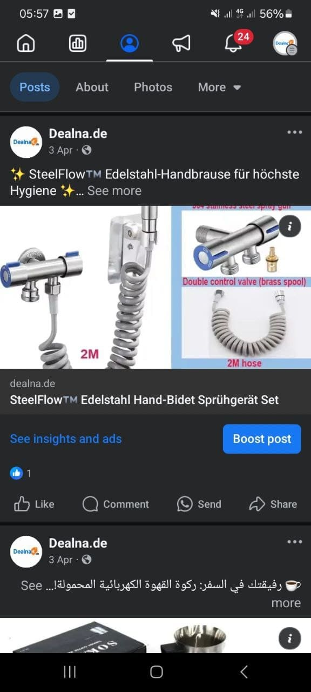](https://www.facebook.com/share/1B8bq6A3Jw/)


[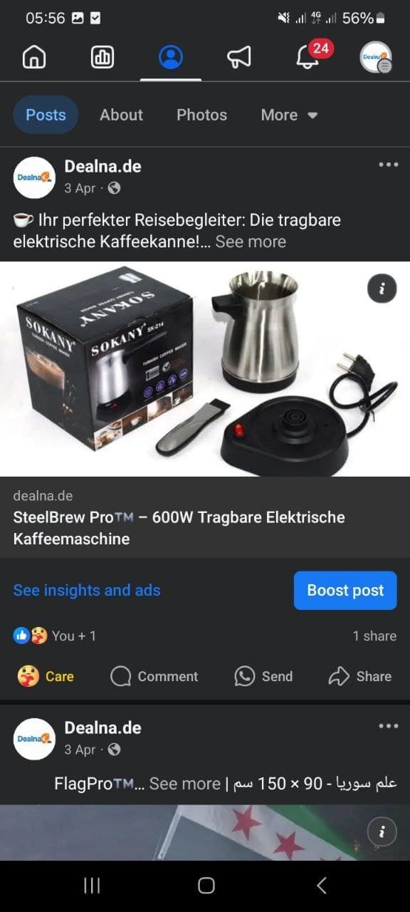](https://www.facebook.com/share/1B8bq6A3Jw/)

--- 
 


 
## User Stories:


  


 
 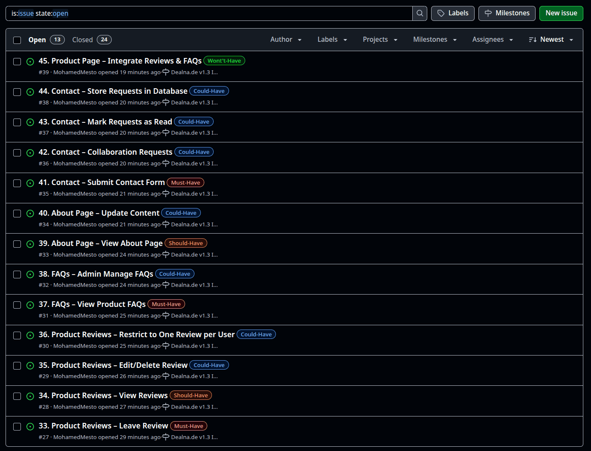


### **User Stories**

| User Story ID | AS A / AN | I WANT TO BE ABLE TO... | SO THAT I CAN... |
| --- | --- | --- | --- |
| | | ***Viewing and Navigation*** | | 
| 1 | Shopper | View a list of products | Select some to purchase and identify the price, description, and product rating |
| 2 | Shopper | View individual product details | See the product image and available sizes |
| 3 | Shopper | Quickly identify deals, clearance items, and special offers | Take advantage of special savings on products I'd like to purchase |
| 4 | Shopper | Easily view the total of my purchases at any time | Avoid spending too much |
| | | ***Registration & User Accounts*** | | 
| 5 | Site User | Easily register for an account | Have a personal account and view my profile |
| 6 | Site User | Easily login or logout | Access my personal account information |
| 7 | Site User | Easily recover my password in case I forget it | Recover access to my account |
| 8 | Site User | Receive an email confirmation after registering | Verify that my account registration was successful |
| 9 | Site User | Have a personalized user profile | View my personal order history, order confirmations, and save my payment information |
| | | ***Sorting & Searching*** | | 
| 10 | Shopper | Sort the list of available products | Easily identify the best-rated, best-priced, and categorically sorted products |
| 11 | Shopper | Sort a specific category of product | Find the best-priced or best-rated product in a specific category, or sort the products in that category by name |
| 12 | Shopper | Sort multiple categories of products simultaneously | Find the best-priced or best-rated products across broad categories, such as "clothing" or "homeware" |
| 13 | Shopper | Search for a product by name or description | Find a specific product I'd like to purchase |
| 14 | Shopper | Easily see what I've searched for and the number of results | Quickly decide whether the product I want is available |
| | | ***Purchasing & Checkout*** | | 
| 15 | Shopper | Easily select the size and quantity of a product when purchasing it | Ensure I don't accidentally select the wrong product, quantity, or size |
| 16 | Shopper | View items in my bag to be purchased | Identify the total cost of my purchase and all items I will receive |
| 17 | Shopper | Adjust the quantity of individual items in my bag | Easily make changes to my purchase before checkout |
| 18 | Shopper | Easily enter my payment information | Check out quickly and with no hassles |
| 19 | Shopper | Feel my personal and payment information is safe and secure | Confidently provide the needed information to make a purchase |
| 20 | Shopper | View an order confirmation after checkout | Verify that I haven't made any mistakes |
| 21 | Shopper | Receive an email confirmation after checking out | Keep the confirmation of what I've purchased for my records |
| | | ***Admin & Store Management*** | | 
| 22 | Store Owner | Add a product | Add new items to my store |
| 23 | Store Owner | Edit/update a product | Change product prices, descriptions, images, and other product criteria |
| 24 | Store Owner | Delete a product | Remove items that are no longer for sale |

---

### **Additional User Stories for Site Admin and Site Owner**

| User Story ID | AS A / AN | I WANT TO BE ABLE TO... | SO THAT I CAN... |
| --- | --- | --- | --- |
| | | ***Site Admin*** | | 
| 25 | Site Admin | Moderate user posts and comments | Manage inappropriate content |
| 26 | Site Admin | Create, read, update, and delete posts | Manage blog content |
| 27 | Site Admin | Create draft posts | Finish writing the content later |
| 28 | Site Admin | Manage categories | Keep the content organized |
| 29 | Site Admin | View all user activities | Ensure compliance with community guidelines |
| 30 | Site Admin | Update About page content | Keep the About page up-to-date |
| | | ***Site Owner*** | | 
| 31 | Site Owner | Mark collaboration requests as "read" | Track which requests I still need to process |
| 32 | Site Owner | Store collaboration requests in the database | Review them later |
| 33 | Site Owner | Add a contact form for collaboration requests | Allow users to submit collaboration requests |

### **Additional User Stories for New Apps**
 
| User Story ID | AS A / AN  | I WANT TO BE ABLE TO...                       | SO THAT I CAN...                                              |
| ------------- | ---------- | --------------------------------------------- | ------------------------------------------------------------- |
|               |            | ***Reviews App***                             |                                                               |
| 34            | Shopper    | Leave a review for a product                  | Share my experience and help other shoppers decide            |
| 35            | Shopper    | View reviews from other users                 | Make better-informed purchasing decisions                     |
| 36            | Shopper    | Edit or delete my own review                  | Correct mistakes or remove feedback I no longer want to share |
| 37            | System     | Restrict each user to one review per product  | Ensure fair and balanced feedback                             |
|               |            | ***FAQ App***                                 |                                                               |
| 38            | Shopper    | View frequently asked questions for a product | Quickly find answers without contacting support               |
| 39            | Site Admin | Add, edit, or delete FAQs                     | Keep product information accurate and up to date              |
|               |            | ***About App***                               |                                                               |
| 40            | Shopper    | View an About page                            | Learn more about the store, its mission, and values           |
| 41            | Site Admin | Update the About page content                 | Keep the information current                                  |
|               |            | ***Contact App***                             |                                                               |
| 42            | Shopper    | Submit a contact form                         | Ask questions or request help                                 |
| 43            | Site Owner | Receive collaboration requests                | Explore opportunities with potential partners                 |
| 44            | Site Owner | Mark collaboration requests as “read”         | Track which requests I still need to process                  |
| 45            | Site Owner | Store collaboration requests in the database  | Review them later                                             |

 
Got it ✅ — I’ll update the **Site Structure** to reflect the **new apps (Review, FAQ, About, Contact)** while keeping everything consistent with your existing structure.

---
Perfect 👍 Let’s lock it in. Here’s your **final updated site structure (text format)**, ready to commit into your repo’s documentation:

---

## **Site Structure**

**Dealna.de v1** is designed as a modern e-commerce platform with a user-friendly interface and seamless navigation. Here's an updated overview of its structure:

---

### **1. Home Page**

* A visually appealing landing page showcasing featured products, special offers, and categories.
* Includes a navigation bar with links to key sections: **Shop, Deals, About, Contact, and User Account**.

---

### **2. Product Categories**

* **Shop by Category:** Products organized into categories (e.g., Clothing, Homeware, Electronics).
* **Deals & Offers:** Highlights discounted products, clearance items, and promotions.
* **New Arrivals:** Displays the latest products added to the platform.

---

### **3. Product Page**

* **Product Details:** Images, price, description, available sizes, and ratings.
* **Add to Cart:** Select size/quantity and add products to cart.
* **Product Reviews (Review App):**

  * Shows ratings and comments.
  * Logged-in users can leave, edit, or delete reviews.
* **FAQs (FAQ App):**

  * Displays product-related questions and answers.
  * Admins can add/edit/delete FAQs.

---

### **4. Shopping Cart**

* **Cart Summary:** All items, quantities, price, and total cost.
* **Edit Cart:** Adjust quantities or remove items.
* **Proceed to Checkout:** Redirects to secure checkout page.

---

### **5. Checkout Page**

* **Shipping Details:** Enter shipping address and delivery options.
* **Payment Information:** Secure form for card/PayPal.
* **Order Summary:** Final breakdown of items and costs.
* **Place Order:** Completes purchase and shows confirmation.

---

### **6. User Account**

* **Registration & Login:** Create or log into account.
* **Order History:** View previous orders with details.
* **Saved Payment Methods:** Manage saved cards/payment info.
* **Profile Management:** Update personal info and preferences.
* **My Reviews (Review App):** Manage submitted product reviews.

---

### **7. Admin Dashboard**

* **Product Management:** Add, edit, or delete products.
* **Order Management:** View and manage customer orders.
* **User Management:** Manage user accounts and permissions.
* **FAQ Management (FAQ App):** Add/edit/delete product FAQs.
* **Review Moderation (Review App):** Monitor and remove inappropriate reviews.
* **About Page Management (About App):** Update company details/vision.
* **Contact Management (Contact App):** Review contact/collaboration form submissions.

---

### **8. User Interaction Features**

* **Wishlist:** Save products for future purchase.
* **Product Reviews (Review App):** Submit and read reviews.
* **FAQs (FAQ App):** Quick answers to product-related questions.
* **Newsletter Subscription:** Get updates and promotions.
* **Contact Form (Contact App):**

  * Users send support, inquiry, or collaboration requests.
  * Submissions stored in database for admin follow-up.
* **About Page (About App):**

  * Displays company mission, vision, and values.
  * Managed by admin for credibility and transparency.

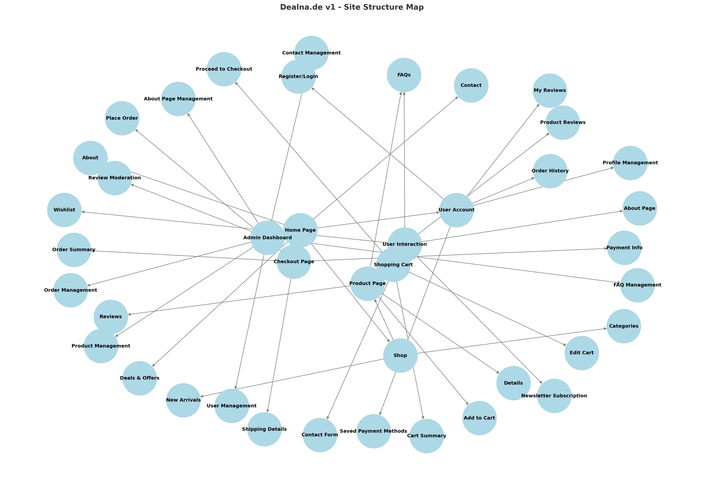


---

 
 
The **Dealna.de For E-Commerce v1.3** is accessible at [Dealna.de For E-Commerce v1.3]( https://dealna-de-v1-3-3806d4fcd64f.herokuapp.com/), offering an intuitive layout with seamless access to all sections via the navigation bar.  

[Back to top](<#contents>)  


## Design Choices

### Colour Scheme
 

The color scheme of Dealna.de v1 is designed to create a modern, engaging, and user-friendly experience. The interface features a clean and professional look with a primary color of #04668C (a deep blue) for headings and key elements, complemented by #A7C3D1 (a soft blue) for secondary accents and backgrounds. To draw attention to important actions and highlights, #DE8C1C (a warm orange) is used for buttons and interactive elements. The text is displayed in #000000 (black) for readability, while #FFFFFF (white) is used for backgrounds and contrast. This cohesive color palette ensures a visually appealing and intuitive experience for users, enhancing both functionality and aesthetics.

[Back to top](<#contents>)

  


  


 


 
[Back to top](<#contents>)
 
 
 Got it! If the **About Us** page is not currently implemented and is planned as a future feature, I’ll adjust the content accordingly. Here’s the updated version:

---
Here’s the updated content with image links for both **mobile devices** and **notebooks/desktops** for each feature point. I’ve included placeholders for the image links, which you can replace with actual screenshots from your project.

---

### **Typography**

The typography of **Dealna.de v1** is designed for clarity, readability, and a modern aesthetic. A clean sans-serif font is used throughout the website, ensuring a professional and approachable feel. The text is displayed in **#000000** (black) for primary content and **#FFFFFF** (white) for text on darker backgrounds, ensuring high contrast and reducing eye strain. Headings and key elements are emphasized using **#04668C** (deep blue), while interactive elements like buttons are highlighted with **#DE8C1C** (warm orange). This typography choice enhances the user experience, making the platform intuitive and easy to navigate.

---

## **Features**

### **Existing Features**

The **Dealna.de v1** offers a range of features designed to enhance the user experience and streamline the shopping process:

1. **Navigation**  
   - The navigation menu is prominently featured at the top of the page, providing easy access to key sections such as **Shop**, **Deals**, **Account**, and **Cart**.  
   - **Responsive Design:** The navigation bar adapts seamlessly to different screen sizes, ensuring a smooth user experience across devices.  
     - **Notebook/Desktop View:**   
     - **Mobile View:**   
 
2. **User Registration and Authentication**  
   - Users can create accounts, log in, and log out securely. Registered users can access personalized features such as order history and saved payment information.  
     - **Notebook/Desktop View:**   
     - **Mobile View:** 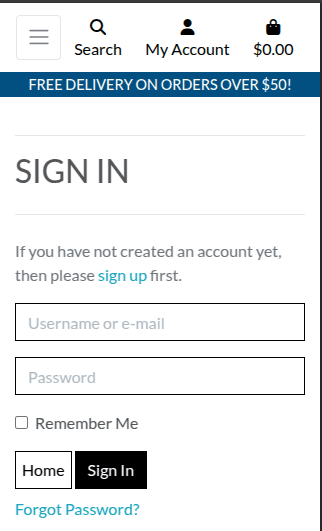  
     - **Notebook/Desktop View:**   
     - **Mobile View:** 
     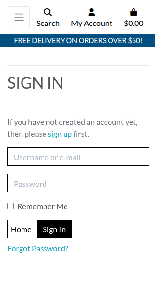  
 
3. **Product Browsing and Filtering**  
   - Users can browse products by category, sort by price, rating, or name, and filter by deals or special offers.  
   - Each product page includes detailed information, images, available sizes, and user reviews.  
     - **Notebook/Desktop View:** 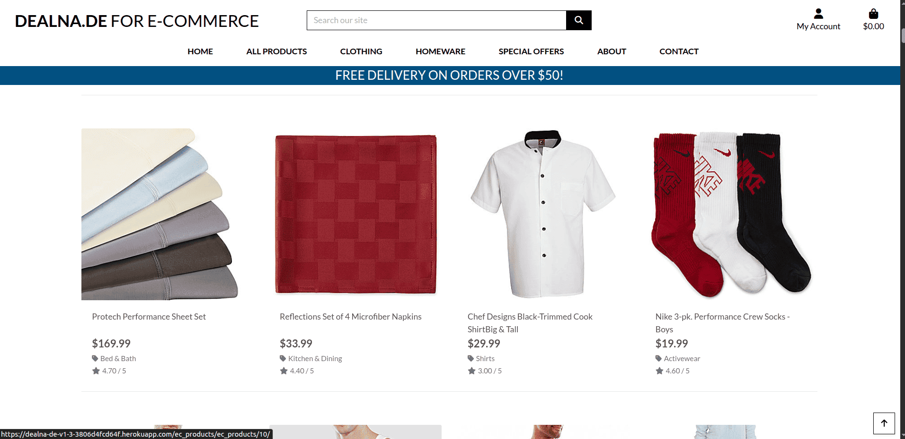  
     - **Mobile View:** 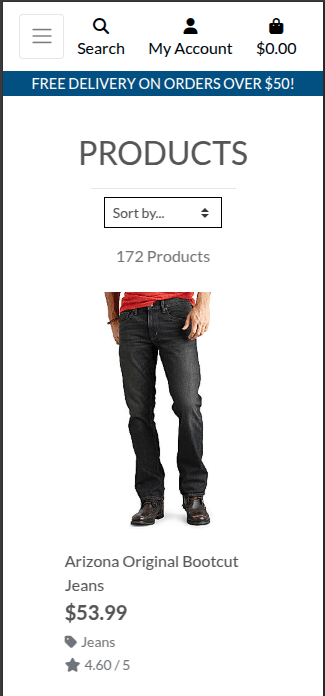  
 
4. **Shopping Cart and Checkout**  
   - Users can add products to their cart, adjust quantities, and proceed to a secure checkout process.  
   - The cart displays the total cost and allows users to review their order before payment.  
     - **Notebook/Desktop View:** 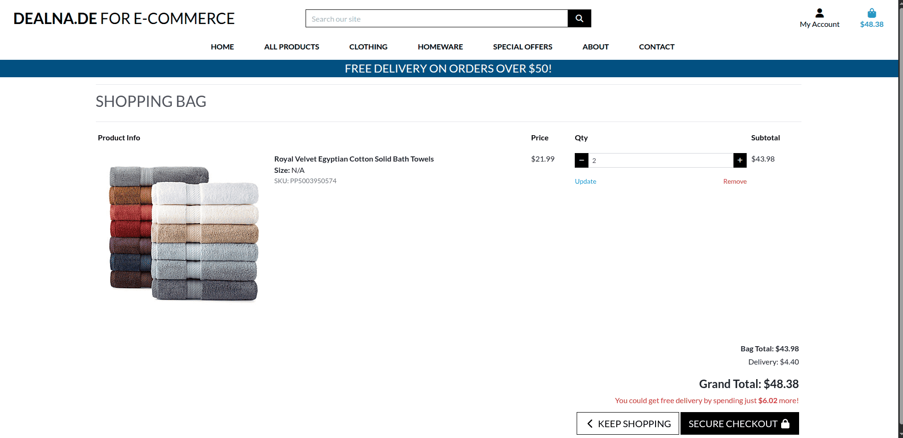  
     - **Mobile View:** 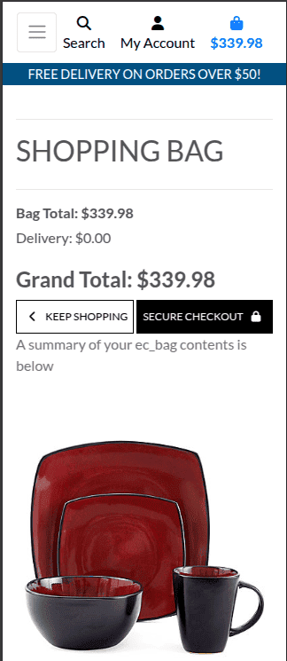  
     - **Notebook/Desktop View:** 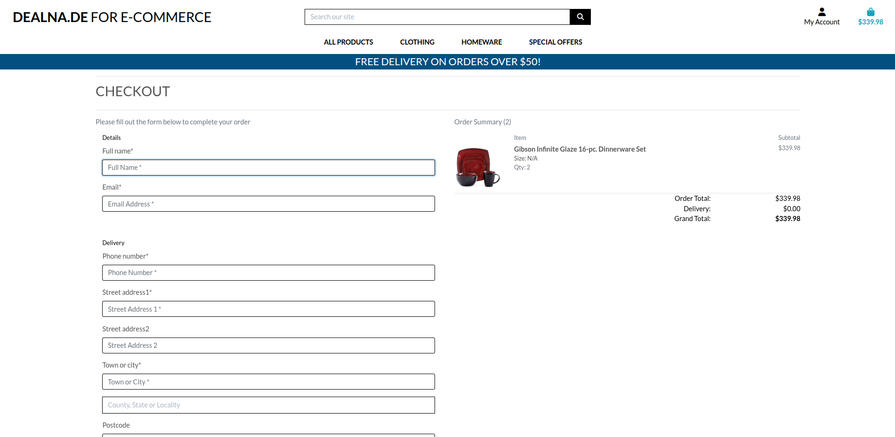  
     - **Mobile View:** 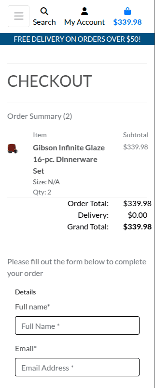  
 
5. **Order Confirmation and Email Notifications**  
   - After placing an order, users receive an on-screen confirmation and an email with order details.  
     - **Notebook/Desktop View:** 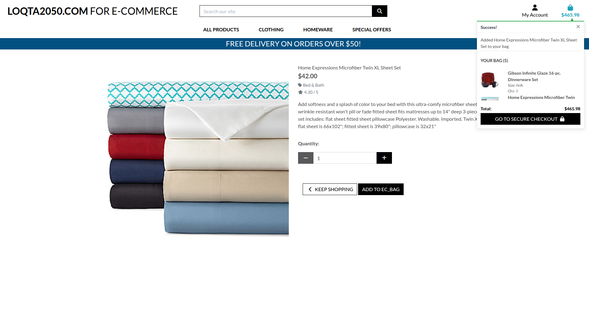  
     - **Mobile View:** 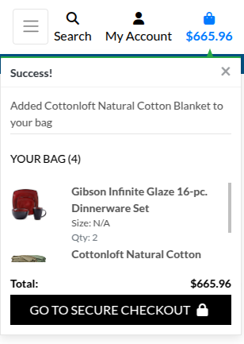  

6. **Admin Dashboard**  
   - Admin users can manage products, view orders, and update inventory through a dedicated dashboard.  
     - **Notebook/Desktop View:** 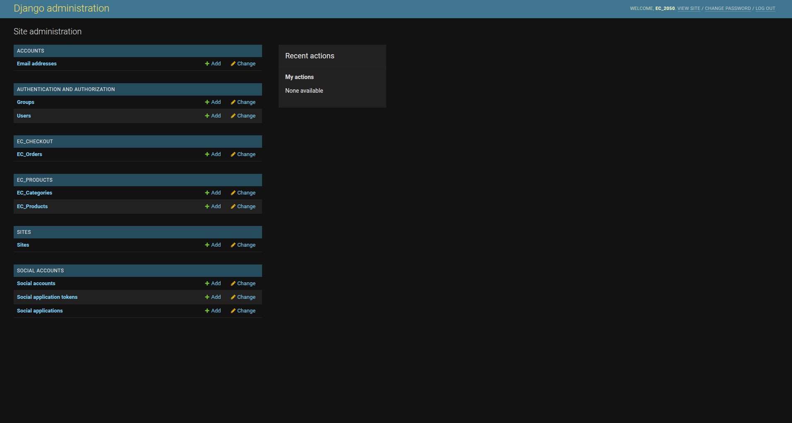  
     - **Mobile View:** 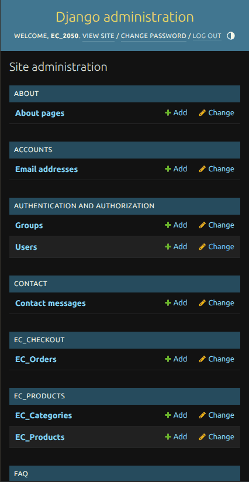  

---
 
### **Future Features**

1. **About Us Page**  
   - Provide information about the platform's mission, vision, and values, as well as the team behind **Dealna.de v1**.  

2. **Wishlist Functionality**  
   - Allow users to save products to a wishlist for future purchase.  

3. **Advanced Search and Filtering**  
   - Implement more advanced search and filtering options, such as price range, brand, and customer ratings.  

4. **Product Reviews and Ratings**  
   - Enable users to leave reviews and ratings for purchased products, fostering trust and engagement.  

5. **Newsletter Subscription**  
   - Allow users to subscribe to a newsletter for updates on new products, promotions, and exclusive deals.  

6. **Social Media Integration**  
   - Add social media sharing buttons for products and integrate social media feeds on the website.  

7. **Live Chat Support**  
   - Introduce a live chat feature for real-time customer support.  


---

 
  

## **Technologies Used**

### **Languages**

- **[HTML5](https://developer.mozilla.org/en-US/docs/Web/HTML):** Provides the foundational structure and semantic content for the **Dealna.de v1**, ensuring accessibility and compatibility across browsers.  
- **[CSS3](https://developer.mozilla.org/en-US/docs/Web/CSS):** Styles and layouts are meticulously crafted to deliver a responsive and visually appealing design that enhances user experience.  
- **[JavaScript](https://developer.mozilla.org/en-US/docs/Web/JavaScript):** Powers the interactive elements of the site, such as navigation menus, product filtering, and shopping cart functionality.  
- **[Python](https://www.python.org/):** The backend logic is implemented using Python, enabling robust data handling and seamless integration with the database.  

---

### **Frameworks & Libraries**

- **[Django](https://www.djangoproject.com/):** A high-level web framework used for building the server-side logic, managing models, views, templates, and user authentication efficiently.  
- **[Bootstrap5](https://getbootstrap.com/):** Provides a responsive grid system and pre-designed components, accelerating the design process and ensuring consistency across the site.  
- **[Django-Allauth](https://django-allauth.readthedocs.io/en/latest/overview.html):** Python user authentication and login plugin for Django.  
- **[Stripe](https://stripe.com/en-gb):** Online payments platform used for secure checkout functionality.  
- **[jQuery](https://jquery.com/):** Used for initializing Bootstrap5 components and enhancing shopping cart functionality.  
- **[Jinja](https://jinja.palletsprojects.com/en/2.11.x/):** Templating language for Python, used for dynamic HTML rendering.  

---

### **Database**

- **[PostgreSQL](https://www.postgresql.org/):** A powerful, open-source relational database system used to manage and store the site's data securely.  
- **[SQLite3](https://www.sqlitetutorial.net/sqlite-python/):** Default database created with Django, used for app development on localhost.  

---

### **Tools & Services**

- **[Heroku](https://www.heroku.com/):** The platform used for deploying the live site, offering scalability and reliable hosting for the project.  
- **[AWS S3](https://aws.amazon.com/s3/):** Amazon Simple Storage Service (S3), used to store and serve static and media files.  
- **[Cloudinary](https://cloudinary.com/):** Utilized for hosting and optimizing images, ensuring fast loading times and reduced server load.  
- **[VS Code](https://code.visualstudio.com/):** The primary code editor for development, offering a range of extensions for better productivity and code management.  
- **[Git](https://git-scm.com/):** Used for version control by committing to Git and pushing to GitHub.  
- **[GitHub](https://github.com/):** Used to store, host, and deploy the project files and source code.  
- **[Font Awesome](https://fontawesome.com/icons?d=gallery):** Used for icons to enhance headings and add emphasis to text.  
- **[Google Fonts](https://fonts.google.com/):** Provides a selection of web fonts used to ensure a clean and modern typography throughout the site.  
- **[Favicon Generator](https://favicon.io/):** Used to create the site's favicon, adding a professional touch to the browser tab display.  

---

### **Design Tools**

- **[Adobe XD](https://www.adobe.com/ie/products/xd.html):** Employed to design wireframes and prototypes, allowing the team to visualize and test user flows before development.  
- **[Adobe Illustrator](https://www.adobe.com/ie/products/illustrator.html):** Used to create the site's logo and social media graphics, maintaining a professional and consistent brand identity.  
- **[Adobe Photoshop](https://www.adobe.com/ie/products/photoshop.html):** Utilized to resize and optimize images for web use, enhancing the visual quality of the site while maintaining performance.  

 
 
---

## **Data Model**

This project uses Django’s Object-Relational Mapping (ORM) to handle data interactions between the application and PostgreSQL. The key models are as follows:

### **Core Models**

1. **User**  
   - Handles authentication and user profile information.  
   - Fields:  
     - `username` (CharField): Unique username for login.  
     - `email` (EmailField): User's email address.  
     - `password` (CharField): Hashed password for secure authentication.  
     - `first_name` (CharField): User's first name.  
     - `last_name` (CharField): User's last name.  
     - `is_staff` (BooleanField): Indicates if the user is an admin.  

2. **Product**  
   - Represents a product available for purchase.  
   - Fields:  
     - `name` (CharField): Name of the product.  
     - `description` (TextField): Detailed description of the product.  
     - `price` (DecimalField): Price of the product.  
     - `category` (ForeignKey): Category the product belongs to.  
     - `image` (ImageField): Product image.  
     - `rating` (DecimalField): Average rating based on user reviews.  
     - `stock` (IntegerField): Available stock quantity.  

3. **Category**  
   - Represents a grouping of products (e.g., Clothing, Electronics).  
   - Fields:  
     - `name` (CharField): Name of the category.  
     - `friendly_name` (CharField): User-friendly name for display.  

4. **Order**  
   - Represents a user's purchase order.  
   - Fields:  
     - `user` (ForeignKey): User who placed the order.  
     - `order_number` (CharField): Unique order identifier.  
     - `date` (DateTimeField): Date and time the order was placed.  
     - `total` (DecimalField): Total cost of the order.  
     - `status` (CharField): Current status of the order (e.g., Processing, Shipped).  

5. **OrderLineItem**  
   - Represents an individual item within an order.  
   - Fields:  
     - `order` (ForeignKey): Associated order.  
     - `product` (ForeignKey): Product purchased.  
     - `quantity` (IntegerField): Quantity of the product.  
     - `lineitem_total` (DecimalField): Total cost for this line item.  

6. **Review**  
   - Represents a user review for a product.  
   - Fields:  
     - `user` (ForeignKey): User who wrote the review.  
     - `product` (ForeignKey): Product being reviewed.  
     - `rating` (IntegerField): Rating given by the user (e.g., 1-5 stars).  
     - `comment` (TextField): User's review comment.  
     - `date` (DateTimeField): Date and time the review was posted.  

---

### **Relational Model**

- Each **Product** belongs to a **Category**.  
- Each **Order** is associated with a **User** and contains multiple **OrderLineItem** entries.  
- Each **OrderLineItem** is linked to a specific **Product**.  
- Each **Review** is associated with a **User** and a **Product**.  

---

### **Example Relationships**

1. **User → Order**  
   - A user can place multiple orders.  
   - Example: User "JohnDoe" places two orders, each containing multiple products.  

2. **Product → Category**  
   - A product belongs to a specific category.  
   - Example: Product "Smartphone" belongs to the "Electronics" category.  

3. **Order → OrderLineItem**  
   - An order contains multiple line items, each representing a product and its quantity.  
   - Example: Order #123 contains two products: "Smartphone" (quantity: 1) and "Headphones" (quantity: 2).  

4. **User → Review**  
   - A user can leave multiple reviews for different products.  
   - Example: User "JaneDoe" leaves a 5-star review for "Smartphone" and a 4-star review for "Headphones".  

---

### **Database Schema Diagram**

Below is a simplified representation of the database schema:

```
User
├── Order
│   ├── OrderLineItem
│   │   └── Product
│   │       └── Category
└── Review
    └── Product
```
 

## **Email Marketing Integration**

### **Mailchimp**  
Initially, we planned to integrate **Mailchimp** for email marketing to allow users to subscribe to newsletters and receive updates about new products, promotions, and exclusive deals. However, due to recent changes in Mailchimp's registration rules and pricing, this feature could not be implemented.  

- **Issue:**  
  - Mailchimp no longer offers a free plan beyond a 14-day trial.  
  - The paid plan starts at **$24/month**, which was beyond the project's budget.  

- **Alternative Solution:**  
  - For future implementation, we recommend exploring other email marketing services that offer free or more affordable plans, such as **Sendinblue** or **MailerLite**.  

### **Screenshot of Mailchimp Pricing**  
Below is a screenshot of Mailchimp's pricing page, highlighting the cost barrier:  

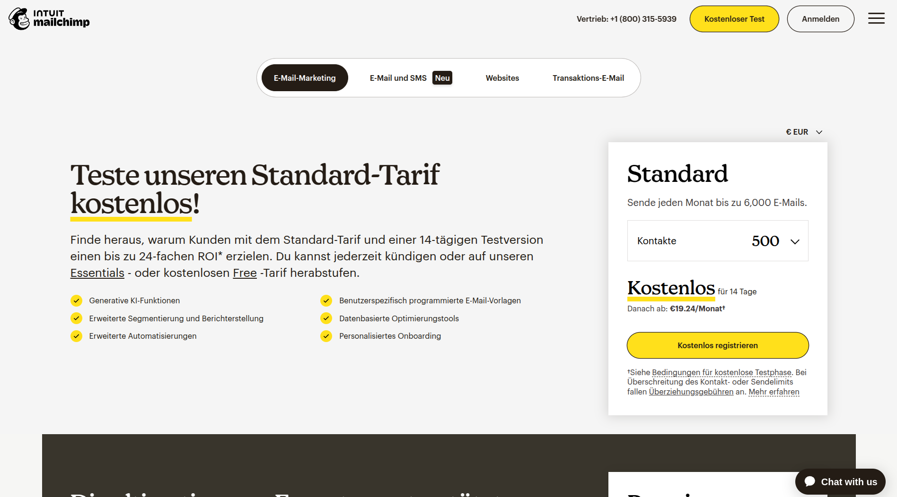  

 
---
 
 

## **Compliance and Trust**

### **Händlerbund Membership**  
We are proud members of **[Händlerbund](https://www.haendlerbund.de/de)**, the largest association for e-commerce and online retailers in Europe. This membership ensures that our platform, **Dealna.de v1**, adheres to the highest standards of legal compliance and consumer protection.  

### **Trusted Shops Seal**  
Our website has been awarded the **Trusted Shops** seal, a mark of trust and reliability in e-commerce. This certification demonstrates our commitment to:  
- Transparent business practices.  
- Secure payment processing.  
- Reliable customer service.  
- Compliance with European consumer protection laws.  

### **European Compliance**  
We strictly follow all European regulations, including:  
- **GDPR (General Data Protection Regulation):** Ensuring the privacy and security of user data.  
- **Consumer Rights Directive:** Providing clear information about products, prices, and return policies.  
- **E-Commerce Directive:** Ensuring transparency in online transactions and contracts.  

### **Screenshot of Trusted Shops Seal**  
Below is a screenshot of the **Trusted Shops** seal displayed on our website [Dealna.de](https://Dealna.de/):  

  

---


## Testing:

### Chrome Test


### Lighthouse Testing

#### Performance
The website was also put through Lighthouse testing via Chrome Devtools which tests a site under 4 different headings; Performance, Accessibility, Best Practices and it tests it under mobile and desktop criteria.

##### Desktop lighthouse Performance

 

##### Mobile lighthouse Performance

 
 
 


#### Accessibility Testing 

##### Lighthouse Accessibility Testing 


 

##### WAVE Web Accessibility Evaluation Tool

[WAVE Web Accessibility Evaluation Tool](https://wave.webaim.org/) was used to check the colour contrast on the website for accessibility purposes which it passed. 


 


### Fixing Accessibility issues:

Accessibility issues have been resolved, ensuring the link is now descriptive and user-friendly for all users, including those relying on screen readers.


**However, there are still some contrast issues to fix!**


### Adobe Color Accessibility Tool 

The [Adobe Color Accessibility Tool](https://color.adobe.com/create/color-accessibility) was used also to ensure the color palette met accessibility standards by testing contrast and simulating color blindness. This tool confirmed that the design maintains clarity and readability for users with visual impairments.
  


 

Here’s the updated **Responsive Testing** section, addressing the issue with **The Responsive Design Checker** and **The Viewport Resizer**:

---

## **Responsive Testing**

Responsiveness was tested manually using **Chrome DevTools** and by physically testing the website on various devices, including:  
- **Desktop** (1920x1080, 1440x900, 1366x768)  
- **Laptop** (1280x800)  
- **Tablet** (iPad Air, iPad Mini, Samsung Galaxy Tab)  
- **Mobile** (iPhone 12, iPhone SE, Samsung Galaxy S20, Google Pixel 5)  

### **Testing Tools**  
1. **Chrome DevTools**  
   - Used to simulate different screen sizes and resolutions.  
   - Tested breakpoints for responsiveness, including:  
     - Extra small devices (portrait phones, <576px)  
     - Small devices (landscape phones, ≥576px)  
     - Medium devices (tablets, ≥768px)  
     - Large devices (desktops, ≥992px)  
     - Extra large devices (large desktops, ≥1200px)  

2. **Physical Device Testing**  
   - The website was tested on actual devices to ensure responsiveness and usability across different screen sizes and operating systems.  

### **Issues with Online Tools**  
- **[The Responsive Design Checker](https://responsivedesignchecker.com/):** Unable to test due to access restrictions on the website.  
- **[The Viewport Resizer](https://chrome.google.com/webstore/detail/viewport-resizer-%E2%80%93-respon/kapnjjcfcncngkadhpmijlkblpibdcgm?hl=en):** Unable to test due to access restrictions on the website.  

 
---

### **Key Findings**  
- The website is fully responsive and adapts seamlessly to different screen sizes.  
- All interactive elements (e.g., buttons, forms, navigation menus) function correctly across devices.  
- Images and text scale appropriately without breaking the layout.  

---
 


### Manual Testing:
We conducted manual testing by simulating common user behaviors to ensure the system works as expected. The scenarios tested include:

- **Creating posts and comments**: We verified that logged-in users can successfully create, edit, and delete posts and comments, ensuring that these actions were handled correctly by the system.
- **Upvoting and downvoting posts**: We tested the voting functionality to confirm that users could only vote once per post and that votes were correctly recorded and displayed.
- **Filtering posts by category**: We checked the category filter functionality to ensure users could easily browse posts based on specific categories.
- **Handling valid and invalid inputs**: We tested the system's ability to handle both valid and invalid inputs, ensuring appropriate error messages were displayed when users submitted empty forms, invalid post data, or attempted duplicate votes.

### Automated Unit Testing:
We also wrote and ran unit tests using Django’s `unittest` framework to verify the core functionalities of the website. Below is a summary of the unit tests we implemented:

1. **Post Creation and Retrieval:**
   - We wrote tests to verify that logged-in users can create new posts and that required fields are validated.
   - We ensured that posts were correctly displayed on both the homepage and individual post pages.
   - We tested the pagination feature to confirm that posts were properly divided into pages.

2. **Comment Submission:**
   - We confirmed that logged-in users could submit comments on posts and that these comments were correctly linked to the relevant posts and displayed in the right order.
   - We ensured non-logged-in users were restricted from submitting comments.

3. **User Authentication:**
   - We created unit tests to verify that users could successfully register, log in, and log out.
   - We tested that only authenticated users could create, edit, or delete posts and comments.
   - We ensured that password reset and account management features functioned as expected.

4. **Post Voting System:**
   - We wrote tests to confirm that the upvoting and downvoting functionality worked correctly, ensuring users could only vote once per post.
   - We ensured that vote counts were updated in real-time and accurately reflected user inputs.

5. **Category Filtering:**
   - We tested the category filtering functionality to confirm that posts were correctly filtered and displayed based on the category selected.
   - We ensured users could navigate between categories without any errors.

6. **Error Handling:**
   - We validated that the system properly handled invalid inputs, such as attempts to create posts or comments with missing data or invalid forms.
   - We checked that the system displayed helpful error messages when users performed invalid actions.

### Running Tests:
To run the unit tests we created, you can use the following command in the project directory:

```bash
python manage.py test
```

This command will execute all the tests we implemented, allowing you to confirm that each core functionality works as intended. Running these tests ensures that the site remains robust and stable throughout development.

 

  

 

## Validator Testing - Bugs Fixed:

## HTML Validation

Validation errors occur when HTML code does not adhere to the established standards, which can lead to browser inconsistencies or inaccessible content. It is crucial to test your code against validators like the [W3C HTML Validator](https://validator.w3.org/) to ensure compliance with best practices and maintain cross-browser functionality. Below are two examples of common validation errors, their causes, and fixes.

 

### **Example 1: Invalid Attribute in an Element**

#### **Error**: 
`Error: Attribute comment_id not allowed on element button at this point.`

#### **Cause**:  
HTML5 does not allow custom attributes directly on elements like `<button>`. Attributes that are not globally recognized or specific to the element type will result in validation errors.


#### **Fix**:  
Use `data-*` attributes to store custom data. These attributes are valid in HTML5 and can be accessed programmatically.

 


#### **Code Example**:  
**Before**:
```html
<button class="btn btn-delete" comment_id="13">Delete</button>
```

**After**:
```html
<button class="btn btn-delete" data-comment-id="13">Delete</button>
```

#### **JavaScript Access**:  
```javascript
const button = document.querySelector('.btn-delete');
console.log(button.dataset.commentId); // Outputs: "13"
```

---

### **Example 2: Invalid Width Attribute Value**

#### **Error**:  
`Error: Bad value 75% for attribute width on element img: Expected a digit but saw % instead.`


 

#### **Cause**:  
The `width` attribute in HTML expects a numeric value in pixels, not a percentage. Using a percentage value causes a validation error.

#### **Fix**:  
Use CSS for percentage-based widths, as this is the appropriate method for responsive designs.


#### **Code Example**:  
**Before**:
```html

```

**After**:
```html

```

---

### **Key Takeaways**:
- Validation errors often arise from using non-standard attributes or incorrect syntax.
- Use `data-*` attributes for custom data to comply with HTML5 standards.
- Shift layout and styling tasks to CSS for better maintainability and validation compliance.
- Regularly test your HTML with validators to ensure quality, accessibility, and browser compatibility. 

 
## CSS Validation

No CSS errors found.


## JS Validation


 

### Fixes Applied
1. **ESLint and JSHint Configuration:**
   - Added `/* eslint-env es6 */` and `/* jshint esversion: 6 */` to support ES6.
   - This explicitly tells linters that the script uses ES6 syntax.

2. **Replaced `for...of` with `Array.from().forEach`:**
   - `Array.from()` converts the `HTMLCollection` to an array, enabling the use of `forEach`.
   - Ensures compatibility with environments that may not support `for...of`.

3. **Changed `let` to `const` where variables are not reassigned:**
   - Ensures better readability and avoids unnecessary reassignments.

4. **Used `const` or `let` instead of `var`:**
   - To adhere to modern JavaScript standards.

5. **Ensured ES6 Compatibility for Template Literals and Arrow Functions:**
   - Verified ES6-compatible tools/environment usage.
   - Added notes to indicate the ES6 usage for future reference.

 


## Py Validation

No py errors remains.


## Getting Started:

To set up **Un2050** locally for development or testing purposes, follow these steps:

1. Clone this repository to your local machine.
2. Create a virtual environment and install the dependencies using:
   ```
   pip install -r requirements.txt
   ```
3. Set up the PostgreSQL database and configure environment variables in `.env` (use `.env.example` for reference).
4. Run migrations:
   ```
   python manage.py migrate
   ```
5. Create a superuser:
   ```
   python manage.py createsuperuser
   ```
6. Start the Django development server:
   ```
   python manage.py runserver
   ```
7. Access the site locally at [http://localhost:8000](http://localhost:8000).


## Deployment:

This project can be deployed on platforms such as **Heroku** using the following steps:

1. Create a Heroku app and set the buildpacks to:
   1. `heroku/python`
   2. `heroku/nodejs` (if using front-end dependencies)
   
2. Set the required environment variables:
   - `DATABASE_URL`
   - `SECRET_KEY`
   - `DEBUG` (set to `False` in production)
   
3. Push your project to Heroku:
   ```
   git push heroku main
   ```


## Credits  

- **[Django Documentation](https://docs.djangoproject.com/):** For providing comprehensive guidance on the framework's features, concepts, and best practices.  
- **[Unsplash](https://unsplash.com/):** For the high-quality, free images used to enhance the visual appeal of the website.  
- **[Pexels](https://www.pexels.com/):** For additional media resources, providing free-to-use images and videos.  
- **[FontAwesome](https://fontawesome.com/):** For the icons used throughout the site to improve navigation and visual clarity.  
- **[Coolors](https://coolors.co/):** For creating a harmonious and accessible color palette for the site’s design.  
- **[W3Schools](https://www.w3schools.com/):** For quick references and examples of CSS and HTML techniques used in the project.  
- **[Bootstrap Documentation](https://getbootstrap.com/docs/):** For detailed explanations of components and utilities used to style and layout the site.  
- **[TinyPNG](https://tinypng.com/):** For compressing images, ensuring faster load times and better performance.  
- **[Google Fonts](https://fonts.google.com/):** For providing a modern and clean typography for the site's content.  
- **[Heroku Documentation](https://devcenter.heroku.com/):** For assistance with deploying the project and configuring server settings.  
- **[Cloudinary Documentation](https://cloudinary.com/documentation):** For image hosting and optimization, ensuring efficient and responsive performance.  
- **[Traversy Media](https://www.youtube.com/user/TechGuyWeb):** For video tutorials on Django, Bootstrap, and web development best practices.  
- **[Code Institute Course Material](https://codeinstitute.net/):** For foundational knowledge and guidance throughout the development of the project.
- **[Word_adventure](https://github.com/MohamedMesto/Word_adventure)**: From it the README template was sourced.

You can view the live site here also: [Dealna.de For E-Commerce v1.3]( https://dealna-de-v1-3-3806d4fcd64f.herokuapp.com/).


---


Stage 2: Add Product-Specific FAQ System

- Created new `faq` app with `FAQ` model linked to `EC_Product`
- Added views to:
  - List FAQs for a specific product
  - Add FAQs per product using a form
- Updated templates:
  - `faq_list.html` styled using Bootstrap 4.6 Accordion
  - `add_faq.html` for submitting product-specific FAQs
- Linked FAQ view to `ec_product_detail` via `ec_product.id`
- Ensured FAQs are shown under each product detail page
- Cleaned and tested routes and template blocks


<h1 style="color:red;">Stage 2: Review Model Enhancements</h1>

<h2 style="color:#149ed9;">Overview</h2>

This section introduces enhancements to the `Review` model:

- Add a timestamp to reviews
- Enforce recent-first display
- Prevent duplicate reviews per user-product pair

<h2 style="color:#149ed9;">Updated Model</h2>

```python
from django.db import models
from django.contrib.auth.models import User
from django.core.exceptions import ValidationError
from ec_products.models import EC_Product

class Review(models.Model):
    ec_product = models.ForeignKey(
        EC_Product, related_name='reviews', on_delete=models.CASCADE)
    user = models.ForeignKey(
        User, on_delete=models.CASCADE)
    content = models.TextField()
    created_on = models.DateTimeField(auto_now_add=True)

    def __str__(self):
        return f"Review by {self.user.username} on {self.ec_product.name}"

    def clean(self):
        # Prevent duplicate reviews per user per product
        if Review.objects.filter(ec_product=self.ec_product, user=self.user).exclude(pk=self.pk).exists():
            raise ValidationError("You have already reviewed this product.")

    class Meta:
        ordering = ['-id']
        unique_together = ('ec_product', 'user')
