<a href="https://dealna-de-v1-7-48a0c9a14b06.herokuapp.com/" target="_blank">
  
</a>

<a href="https://dealna-de-v1-7-48a0c9a14b06.herokuapp.com/" target="_blank">
  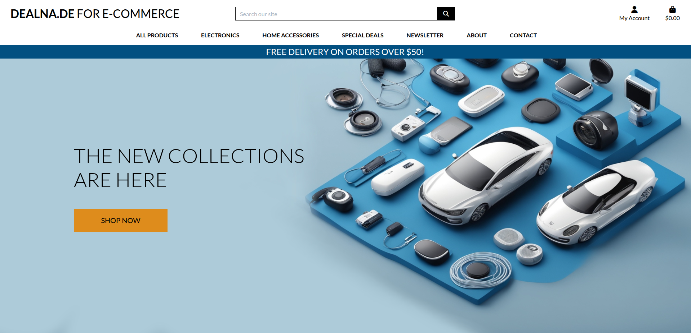
</a>

<a href="https://Dealna.de" target="_blank">
  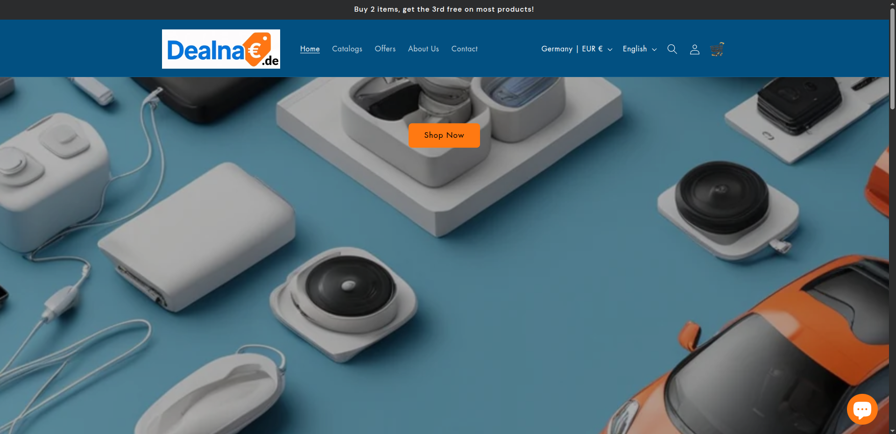
</a>

<a href="https://Dealna.de" target="_blank">
  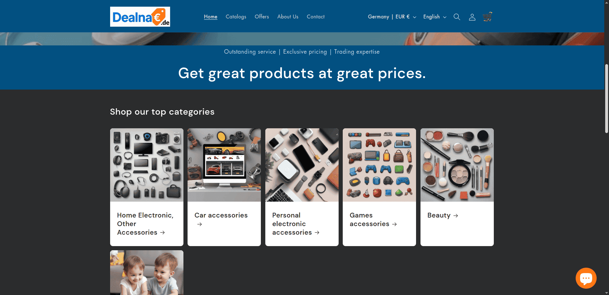
</a>

<a href="https://dealna-de-v1-7-48a0c9a14b06.herokuapp.com/" target="_blank">
  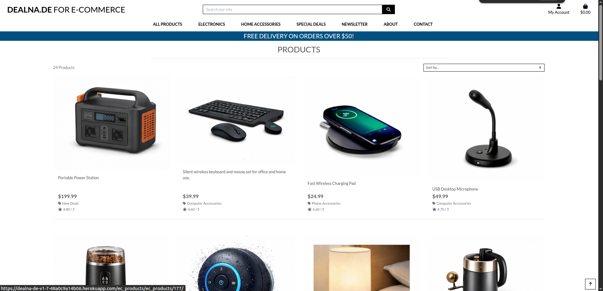
</a>

<a href="https://dealna-de-v1-7-48a0c9a14b06.herokuapp.com/" target="_blank">
  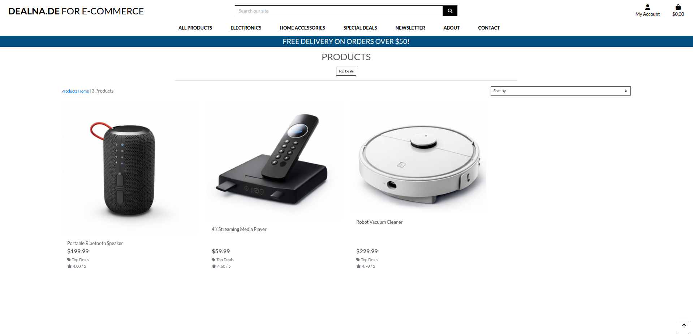
</a>

 

---
 
# **_Dealna.de E-Commerce V1.7_**

## Dealna.de v1.7 (Shop Smart, Live Better) - Portfolio Project 5 - Full Stack Toolkit Project.

**Dealna.de v1.7:** A Gateway to Seamless Online Shopping  

The **Dealna.de E-Commerce Platform** is designed to provide users with a modern, intuitive, and secure online shopping experience. Powered by Django, this dynamic platform delivers a seamless experience for browsing, purchasing, and managing products across diverse categories, reflecting a commitment to quality, reliability, and user satisfaction.

### A Platform for Smart Shopping  

At its core, **Dealna.de v1.7** offers users a curated selection of products, from fashion and electronics to home goods and lifestyle essentials. The intuitive navigation and categorization make it easy for shoppers to discover products tailored to their needs. Each product listing includes detailed descriptions, high-quality images, and customer reviews, creating a sense of trust and connection between buyers and sellers.

### A User-Centric Experience  

The platform is designed with usability in mind, featuring:  
- **Dynamic Product Listings:** Easily browse products by category, price, or rating.  
- **Secure Checkout:** A seamless and secure payment process ensures a hassle-free shopping experience.  
- **Personalized Profiles:** Registered users can view order history, save payment information, and track deliveries.  
- **Mobile Responsiveness:** The site ensures accessibility across devices, making it convenient for users on the go.  

### A Tool for Informed Decisions  

By presenting detailed product information, customer reviews, and competitive pricing, **Dealna.de v1.7** empowers users to make informed purchasing decisions. Whether shopping for everyday essentials or unique finds, users are encouraged to explore and engage with the platform, ensuring a satisfying shopping experience.

### Continuous Innovation and Growth  

The **Dealna.de v1.7** reflects the iterative evolution of a robust platform. Features such as advanced search filters, personalized recommendations, and seamless social sharing are just the beginning of a roadmap aimed at enhancing the user experience. Each iteration is a step closer to making this platform a go-to destination for online shoppers worldwide.

### Newsletter and Email Marketing

Users can subscribe using the newsletter signup form.
New subscribers may receive discount codes.
Secure unsubscribe process using unique tokens.
Future improvements include automated welcome emails and personalised product suggestions.


### Conclusion  

In an era of rapid digital transformation, **Dealna.de v1.7** stands out as a reliable and engaging online shopping destination. It goes beyond simply selling products; it fosters trust, inspires confidence, and creates connections among its users. The live site invites you to explore this vibrant e-commerce hub and experience the future of online shopping.

**You can view the live site here - [Dealna.de For E-Commerce v1.7]( https://dealna-de-v1-7-48a0c9a14b06.herokuapp.com/).**  


---

**You can view Dealna.de live site here - [Dealna.de](https://Dealna.de).**  


---

[]( https://dealna-de-v1-7-48a0c9a14b06.herokuapp.com/)

--- 


# Contents

- [**_Dealna.de E-Commerce V1.7_**](#dealnade-e-commerce-v17)
  - [Dealna.de v1.7 (Shop Smart, Live Better) - Portfolio Project 5 - Full Stack Toolkit Project.](#dealnade-v17-shop-smart-live-better---portfolio-project-5---full-stack-toolkit-project)
    - [A Platform for Smart Shopping](#a-platform-for-smart-shopping)
    - [A User-Centric Experience](#a-user-centric-experience)
    - [A Tool for Informed Decisions](#a-tool-for-informed-decisions)
    - [Continuous Innovation and Growth](#continuous-innovation-and-growth)
    - [Newsletter and Email Marketing](#newsletter-and-email-marketing)
    - [Conclusion](#conclusion)
- [Contents](#contents)
  - [Purpose of the Project – **Dealna.de E-Commerce v1.7**](#purpose-of-the-project--dealnade-e-commerce-v17)
  - [User Stories:](#user-stories)
    - [**User Stories**](#user-stories-1)
    - [**Additional User Stories for Site Admin and Site Owner**](#additional-user-stories-for-site-admin-and-site-owner)
    - [**Additional User Stories for New Apps**](#additional-user-stories-for-new-apps)
  - [**Site Structure**](#site-structure)
    - [**1. Home Page**](#1-home-page)
    - [**2. Product Categories**](#2-product-categories)
    - [**3. Product Page**](#3-product-page)
    - [**4. Shopping Cart**](#4-shopping-cart)
    - [**5. Checkout Page**](#5-checkout-page)
    - [**6. User Account**](#6-user-account)
    - [**7. Admin Dashboard**](#7-admin-dashboard)
    - [**8. User Interaction Features**](#8-user-interaction-features)
    - [Dealna.de v1.7 Site Structure](#dealnade-v17-site-structure)
  - [Design Choices](#design-choices)
    - [**Typography**](#typography)
  - [**Features**](#features)
    - [**Existing Features**](#existing-features)
    - [**Future Features**](#future-features)
  - [**Technologies Used**](#technologies-used)
  - [Tools \& Technologies](#tools--technologies)
  - [**Data Model**](#data-model)
    - [**Core Models**](#core-models)
    - [**New App Models**](#new-app-models)
    - [**Relational Model**](#relational-model)
    - [**Example Relationships**](#example-relationships)
    - [**Generating the ERD**](#generating-the-erd)
  - [**Email Marketing Integration**](#email-marketing-integration)
    - [**SEO \& Newsletter Integration**](#seo--newsletter-integration)
  - [**Compliance and Trust**](#compliance-and-trust)
    - [**Händlerbund Membership**](#händlerbund-membership)
    - [**Trusted Shops Seal**](#trusted-shops-seal)
    - [**European Compliance**](#european-compliance)
    - [**Screenshot of Trusted Shops Seal**](#screenshot-of-trusted-shops-seal)
  - [Testing:](#testing)
    - [Chrome Test](#chrome-test)
    - [Lighthouse Testing](#lighthouse-testing)
      - [Performance](#performance)
        - [Desktop lighthouse Performance](#desktop-lighthouse-performance)
        - [Mobile lighthouse Performance](#mobile-lighthouse-performance)
        - [Lighthouse Accessibility Testing](#lighthouse-accessibility-testing)
        - [Lighthouse Best Practices Testing](#lighthouse-best-practices-testing)
        - [Lighthouse SEO Testing](#lighthouse-seo-testing)
        - [WAVE Web Accessibility Evaluation Tool](#wave-web-accessibility-evaluation-tool)
    - [Fixing Accessibility issues:](#fixing-accessibility-issues)
      - [The Problem:](#the-problem)
      - [Solutions:](#solutions)
        - [**Add `aria-label` (no visible text)**](#add-aria-label-no-visible-text)
    - [Adobe Color Accessibility Tool](#adobe-color-accessibility-tool)
  - [**Responsive Testing**](#responsive-testing)
    - [**Testing Tools**](#testing-tools)
    - [**Issues with Online Tools**](#issues-with-online-tools)
    - [**Issues with Checkout Page**](#issues-with-checkout-page)
    - [**Key Findings**](#key-findings)
    - [Manual Testing:](#manual-testing)
    - [Automated Unit Testing:](#automated-unit-testing)
    - [Running Tests:](#running-tests)
  - [Validator Testing - Bugs Fixed:](#validator-testing---bugs-fixed)
  - [HTML Validation](#html-validation)
    - [HTML Validation Issues (Nu Html Checker)](#html-validation-issues-nu-html-checker)
  - [](#)
  - [CSS Validation](#css-validation)
  - [](#-1)
    - [JavaScript Validation](#javascript-validation)
    - [Fixes Applied](#fixes-applied)
  - [Py Validation](#py-validation)
    - [**Key Takeaways**:](#key-takeaways)
  - [Getting Started:](#getting-started)
  - [Deployment](#deployment)
    - [🔹 Step 1: Create a Heroku App](#-step-1-create-a-heroku-app)
    - [🔹 Step 2: Add Environment Variables](#-step-2-add-environment-variables)
    - [🔹 Step 3: AWS S3 Bucket Configuration](#-step-3-aws-s3-bucket-configuration)
    - [🔹 Step 4: Prepare Project for Deployment](#-step-4-prepare-project-for-deployment)
    - [🔹 Step 5: Deploy to Heroku](#-step-5-deploy-to-heroku)
    - [🔹 Step 6: Stripe Payments \& Webhooks](#-step-6-stripe-payments--webhooks)
    - [🔹 Step 7: Gmail Notifications](#-step-7-gmail-notifications)
    - [🔹 Step 8: Access the App](#-step-8-access-the-app)
- [Dealna (Live site)](#dealna-live-site)
  - [UX](#ux)
    - [The 5 Planes of UX](#the-5-planes-of-ux)
      - [1. Strategy](#1-strategy)
      - [1.1 Business Model](#11-business-model)
      - [1.2 Marketing Strategy](#12-marketing-strategy)
      - [1. Scope](#1-scope)
    - [CRUD Functionality](#crud-functionality)
    - [Products (Admin Only)](#products-admin-only)
    - [Shopping Bag](#shopping-bag)
    - [Checkout and Orders](#checkout-and-orders)
    - [User Profiles](#user-profiles)
    - [Newsletter Subscriptions](#newsletter-subscriptions)
    - [FAQs (Admin Only)](#faqs-admin-only)
  - [| Delete | Admin users can delete FAQs. | Admin |](#-delete--admin-users-can-delete-faqs--admin-)
    - [Future Features](#future-features-1)
    - [MoSCoW Prioritization](#moscow-prioritization)
  - [Ecommerce Business Model](#ecommerce-business-model)
    - [Robots](#robots)
    - [Newsletter Marketing](#newsletter-marketing)
  - [📬 Newsletter Feature Implementation -- Dealna Website](#-newsletter-feature-implementation----dealna-website)
    - [🔧 Step-by-Step Implementation](#-step-by-step-implementation)
      - [1. **Creating the Newsletter App**](#1-creating-the-newsletter-app)
      - [2. **Defining the Custom Model**](#2-defining-the-custom-model)
      - [3. **Admin Configuration**](#3-admin-configuration)
      - [4. **Newsletter Form \& Frontend Integration**](#4-newsletter-form--frontend-integration)
      - [5. **Sending Emails (Optional Enhancement)**](#5-sending-emails-optional-enhancement)
  - [Deployment](#deployment-1)
    - [Heroku Deployment](#heroku-deployment)
    - [🔧 Step-by-Step Deployment](#-step-by-step-deployment)
    - [1. **Create a New Heroku App**](#1-create-a-new-heroku-app)
    - [2. **Set Environment Variables**](#2-set-environment-variables)
    - [3. **Prepare for Deployment**](#3-prepare-for-deployment)
    - [4. **Final Touches**](#4-final-touches)
  - [To tell Heroku how to run the app, I created a Procfile at the root of mRequirements \& Deployment Configuration (Steps I Took)](#to-tell-heroku-how-to-run-the-app-i-created-a-procfile-at-the-root-of-mrequirements--deployment-configuration-steps-i-took)
    - [1. ✅ Installed Project Requirements](#1--installed-project-requirements)
    - [2. ✅ Created the Procfile](#2--created-the-procfile)
    - [3. ✅ Specified the Python Version](#3--specified-the-python-version)
    - [4. 🚀 Deployed to Heroku](#4--deployed-to-heroku)
    - [PostgreSQL](#postgresql)
    - [Stripe API (Payments Integration)](#stripe-api-payments-integration)
    - [Gmail API (Email Notifications)](#gmail-api-email-notifications)
    - [WhiteNoise Static File Handling](#whitenoise-static-file-handling)
    - [Local Development](#local-development)
      - [Cloning](#cloning)
      - [Forking](#forking)
    - [Local VS Deployment](#local-vs-deployment)
  - [Credits](#credits)
    - [Project Idea \& Design](#project-idea--design)
    - [Content](#content)
    - [Media](#media)
    - [Acknowledgements](#acknowledgements)


## Purpose of the Project – **Dealna.de E-Commerce v1.7**  

The goal of **Dealna.de** is to create a modern, user-friendly e-commerce platform that offers a seamless shopping experience. Built with Django and PostgreSQL, this platform is designed to support a wide range of products, including electronics, electronics, homeware, and special offers.  

With features such as advanced search, secure checkout, product categorization, and personalized user accounts, **Dealna.de** aims to provide an intuitive and efficient marketplace for both buyers and sellers. Customers can easily browse, purchase, and track their orders, while vendors can manage their inventory and sales through a robust backend system.  

Whether you're a shopper looking for the best deals or a seller aiming to expand your reach, **Dealna.de** offers a powerful and scalable solution to meet your e-commerce needs.


---

**Facebook Business Page for Dealna.de v1**  
As part of our project requirements, we have created a dedicated Facebook business page for our e-commerce platform, **Dealna.de v1**. This page serves as a marketing and engagement tool to connect with potential customers, showcase our products, and promote special offers. The page includes essential details about our platform, such as the website link, contact information, and a brief description of our mission to provide a seamless shopping experience. Screenshots of the Facebook business page have been included in this documentation to verify its creation and authenticity.**You can visit our Facebook business page using the following link:** [Dealna.de v1 Facebook Page](https://www.facebook.com/share/1B8bq6A3Jw/).  


[](https://www.facebook.com/share/1B8bq6A3Jw/)


[](https://www.facebook.com/share/1B8bq6A3Jw/)


[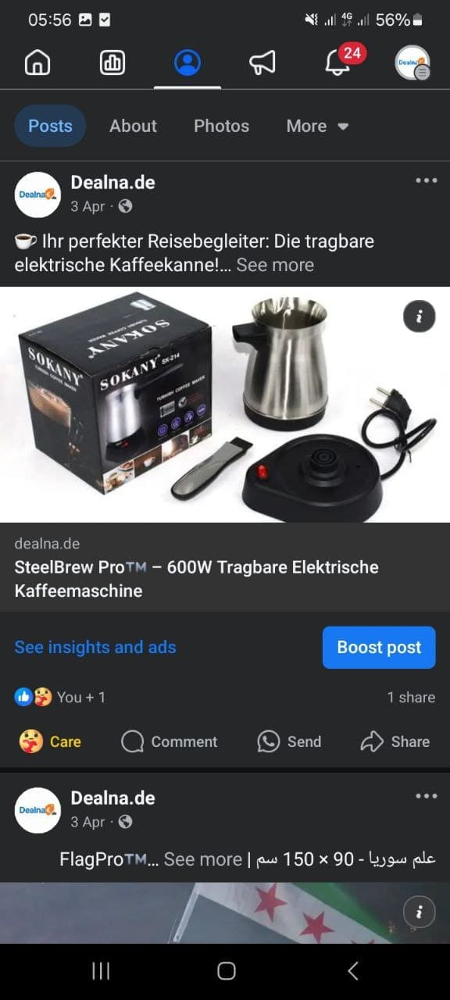](https://www.facebook.com/share/1B8bq6A3Jw/)

--- 
 


[Back to top](<#contents>)


 
## User Stories:
<details><summary><span style="font-size:1.7em; font-weight:bold;">More Details</span></summary>


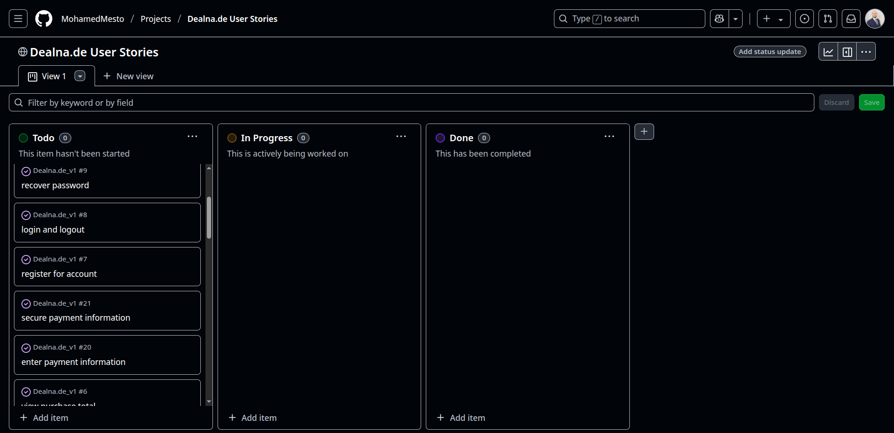
  


 
 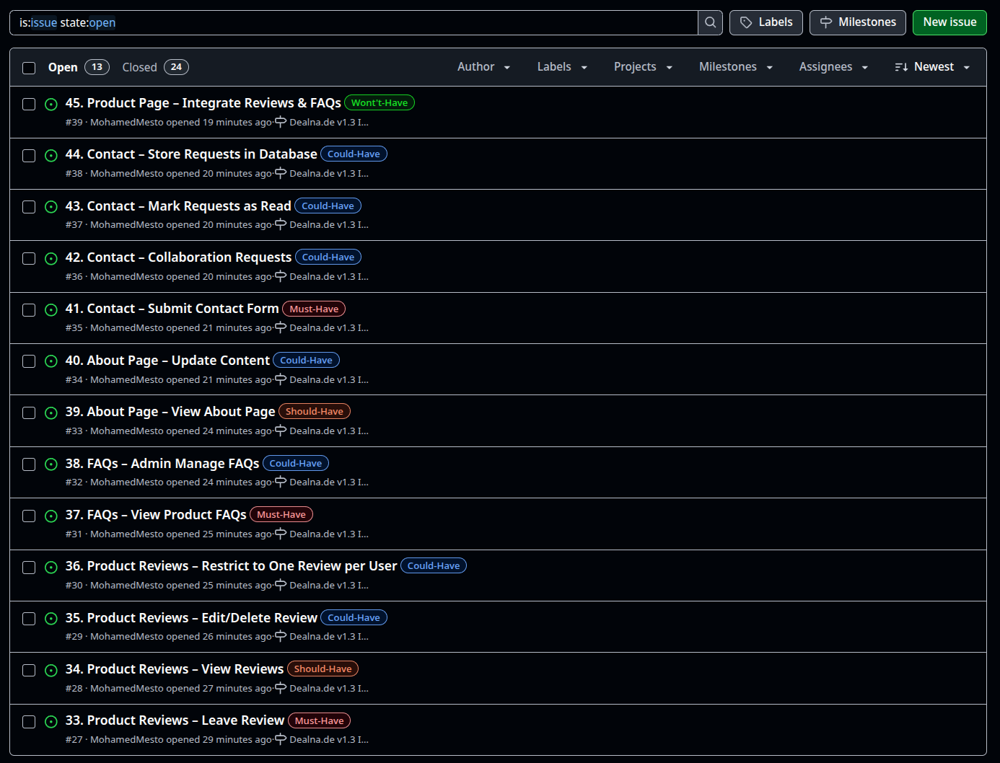


### **User Stories**

| User Story ID | AS A / AN | I WANT TO BE ABLE TO... | SO THAT I CAN... |
| --- | --- | --- | --- |
| | | ***Viewing and Navigation*** | | 
| 1 | Shopper | View a list of products | Select some to purchase and identify the price, description, and product rating |
| 2 | Shopper | View individual product details | See the product image and available sizes |
| 3 | Shopper | Quickly identify deals, clearance items, and special offers | Take advantage of special savings on products I'd like to purchase |
| 4 | Shopper | Easily view the total of my purchases at any time | Avoid spending too much |
| | | ***Registration & User Accounts*** | | 
| 5 | Site User | Easily register for an account | Have a personal account and view my profile |
| 6 | Site User | Easily login or logout | Access my personal account information |
| 7 | Site User | Easily recover my password in case I forget it | Recover access to my account |
| 8 | Site User | Receive an email confirmation after registering | Verify that my account registration was successful |
| 9 | Site User | Have a personalized user profile | View my personal order history, order confirmations, and save my payment information |
| | | ***Sorting & Searching*** | | 
| 10 | Shopper | Sort the list of available products | Easily identify the best-rated, best-priced, and categorically sorted products |
| 11 | Shopper | Sort a specific category of product | Find the best-priced or best-rated product in a specific category, or sort the products in that category by name |
| 12 | Shopper | Sort multiple categories of products simultaneously | Find the best-priced or best-rated products across broad categories, such as "electronics" or "homeware" |
| 13 | Shopper | Search for a product by name or description | Find a specific product I'd like to purchase |
| 14 | Shopper | Easily see what I've searched for and the number of results | Quickly decide whether the product I want is available |
| | | ***Purchasing & Checkout*** | | 
| 15 | Shopper | Easily select the size and quantity of a product when purchasing it | Ensure I don't accidentally select the wrong product, quantity, or size |
| 16 | Shopper | View items in my bag to be purchased | Identify the total cost of my purchase and all items I will receive |
| 17 | Shopper | Adjust the quantity of individual items in my bag | Easily make changes to my purchase before checkout |
| 18 | Shopper | Easily enter my payment information | Check out quickly and with no hassles |
| 19 | Shopper | Feel my personal and payment information is safe and secure | Confidently provide the needed information to make a purchase |
| 20 | Shopper | View an order confirmation after checkout | Verify that I haven't made any mistakes |
| 21 | Shopper | Receive an email confirmation after checking out | Keep the confirmation of what I've purchased for my records |
| | | ***Admin & Store Management*** | | 
| 22 | Store Owner | Add a product | Add new items to my store |
| 23 | Store Owner | Edit/update a product | Change product prices, descriptions, images, and other product criteria |
| 24 | Store Owner | Delete a product | Remove items that are no longer for sale |

---

### **Additional User Stories for Site Admin and Site Owner**

| User Story ID | AS A / AN | I WANT TO BE ABLE TO... | SO THAT I CAN... |
| --- | --- | --- | --- |
| | | ***Site Admin*** | | 
| 25 | Site Admin | Moderate user posts and comments | Manage inappropriate content |
| 26 | Site Admin | Create, read, update, and delete posts | Manage blog content |
| 27 | Site Admin | Create draft posts | Finish writing the content later |
| 28 | Site Admin | Manage categories | Keep the content organized |
| 29 | Site Admin | View all user activities | Ensure compliance with community guidelines |
| 30 | Site Admin | Update About page content | Keep the About page up-to-date |
| | | ***Site Owner*** | | 
| 31 | Site Owner | Mark collaboration requests as "read" | Track which requests I still need to process |
| 32 | Site Owner | Store collaboration requests in the database | Review them later |
| 33 | Site Owner | Add a contact form for collaboration requests | Allow users to submit collaboration requests |

### **Additional User Stories for New Apps**
 
| User Story ID | AS A / AN  | I WANT TO BE ABLE TO...                       | SO THAT I CAN...                                              |
| ------------- | ---------- | --------------------------------------------- | ------------------------------------------------------------- |
|               |            | ***Reviews App***                             |                                                               |
| 34            | Shopper    | Leave a review for a product                  | Share my experience and help other shoppers decide            |
| 35            | Shopper    | View reviews from other users                 | Make better-informed purchasing decisions                     |
| 36            | Shopper    | Edit or delete my own review                  | Correct mistakes or remove feedback I no longer want to share |
| 37            | System     | Restrict each user to one review per product  | Ensure fair and balanced feedback                             |
|               |            | ***FAQ App***                                 |                                                               |
| 38            | Shopper    | View frequently asked questions for a product | Quickly find answers without contacting support               |
| 39            | Site Admin | Add, edit, or delete FAQs                     | Keep product information accurate and up to date              |
|               |            | ***About App***                               |                                                               |
| 40            | Shopper    | View an About page                            | Learn more about the store, its mission, and values           |
| 41            | Site Admin | Update the About page content                 | Keep the information current                                  |
|               |            | ***Contact App***                             |                                                               |
| 42            | Shopper    | Submit a contact form                         | Ask questions or request help                                 |
| 43            | Site Owner | Receive collaboration requests                | Explore opportunities with potential partners                 |
| 44            | Site Owner | Mark collaboration requests as “read”         | Track which requests I still need to process                  |
| 45            | Site Owner | Store collaboration requests in the database  | Review them later                                             |


| User Story ID | AS A / AN  | I WANT TO BE ABLE TO...                | SO THAT I CAN...                                    |
| ------------- | ---------- | -------------------------------------- | --------------------------------------------------- |
|               |            | ***Newsletter App***                   |                                                     |
| 46            | Shopper    | Subscribe to the newsletter            | Receive updates, promotions, and new product alerts |
| 47            | Shopper    | Unsubscribe from the newsletter        | Stop receiving unwanted emails                      |
| 48            | Site Admin | View newsletter subscribers            | Manage and target email campaigns                   |
| 49            | Site Admin | Export subscriber email addresses      | Use them in email marketing tools like Mailchimp    |
| 50            | Site Admin | Remove inactive or invalid subscribers | Keep the mailing list clean and up to date          |


[Back to top](<#contents>)


---

## **Site Structure**

**Dealna.de v1** is designed as a modern e-commerce platform with a user-friendly interface and seamless navigation. Here's an updated overview of its structure:

---

### **1. Home Page**

* A visually appealing landing page showcasing featured products, special offers, and categories.
* Includes a navigation bar with links to key sections: **Shop, Deals, About, Contact, and User Account**.

---

### **2. Product Categories**

* **Shop by Category:** Products organized into categories (e.g., Electronics, Homeware, Electronics).
* **Deals & Offers:** Highlights discounted products, clearance items, and promotions.
* **New Arrivals:** Displays the latest products added to the platform.

---

### **3. Product Page**

* **Product Details:** Images, price, description, available sizes, and ratings.
* **Add to Cart:** Select size/quantity and add products to cart.
* **Product Reviews (Review App):**

  * Shows ratings and comments.
  * Logged-in users can leave, edit, or delete reviews.
* **FAQs (FAQ App):**

  * Displays product-related questions and answers.
  * Admins can add/edit/delete FAQs.

---

### **4. Shopping Cart**

* **Cart Summary:** All items, quantities, price, and total cost.
* **Edit Cart:** Adjust quantities or remove items.
* **Proceed to Checkout:** Redirects to secure checkout page.

---

### **5. Checkout Page**

* **Shipping Details:** Enter shipping address and delivery options.
* **Payment Information:** Secure form for card/PayPal.
* **Order Summary:** Final breakdown of items and costs.
* **Place Order:** Completes purchase and shows confirmation.

---

### **6. User Account**

* **Registration & Login:** Create or log into account.
* **Order History:** View previous orders with details.
* **Saved Payment Methods:** Manage saved cards/payment info.
* **Profile Management:** Update personal info and preferences.
* **My Reviews (Review App):** Manage submitted product reviews.

---

### **7. Admin Dashboard**

* **Product Management:** Add, edit, or delete products.
* **Order Management:** View and manage customer orders.
* **User Management:** Manage user accounts and permissions.
* **FAQ Management (FAQ App):** Add/edit/delete product FAQs.
* **Review Moderation (Review App):** Monitor and remove inappropriate reviews.
* **About Page Management (About App):** Update company details/vision.
* **Contact Management (Contact App):** Review contact/collaboration form submissions.

---

### **8. User Interaction Features**

* **Wishlist:** Save products for future purchase.
* **Product Reviews (Review App):** Submit and read reviews.
* **FAQs (FAQ App):** Quick answers to product-related questions.
* **Newsletter Subscription:** Get updates and promotions.
* **Contact Form (Contact App):**

  * Users send support, inquiry, or collaboration requests.
  * Submissions stored in database for admin follow-up.
* **About Page (About App):**

  * Displays company mission, vision, and values.
  * Managed by admin for credibility and transparency.

### Dealna.de v1.7 Site Structure
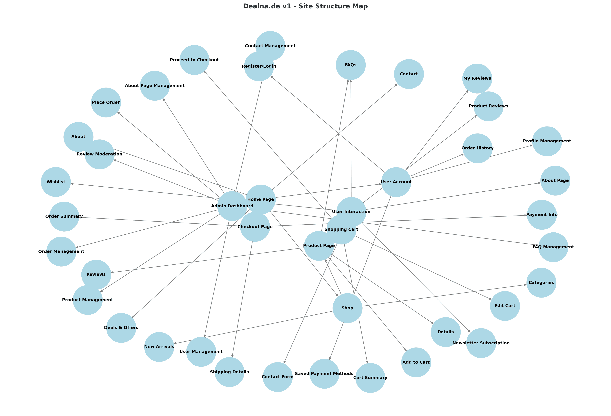


 

 
[Back to top](<#contents>)
</details>

---

 
 
The **Dealna.de For E-Commerce v1.7** is accessible at [Dealna.de For E-Commerce v1.7]( https://dealna-de-v1-7-48a0c9a14b06.herokuapp.com/), offering an intuitive layout with seamless access to all sections via the navigation bar.  


 


## Design Choices

 
<details><summary><span style="font-size:1.7em; font-weight:bold;">Colour Scheme</span></summary>


The color scheme of **Dealna.de v1** is designed to create a modern, engaging, and user-friendly experience. The interface features a clean and professional look with a primary color of **#04668C** (a deep blue) for headings and key elements, complemented by **#A7C3D1** (a soft blue) for secondary accents and backgrounds. To draw attention to important actions and highlights, **#DE8C1C** (a warm orange) is used for buttons and interactive elements. The text is displayed in **#000000** (black) for readability, while **#FFFFFF** (white) is used for backgrounds and contrast. This cohesive color palette ensures a visually appealing and intuitive experience for users, enhancing both functionality and aesthetics.

The palette was generated using **[Adobe Color Wheel](https://color.adobe.com/create/image)**, ensuring a professional and harmonious selection of shades.

 

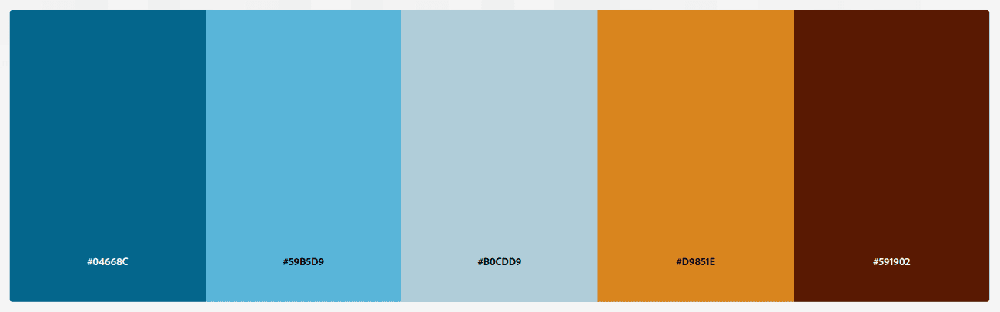


  
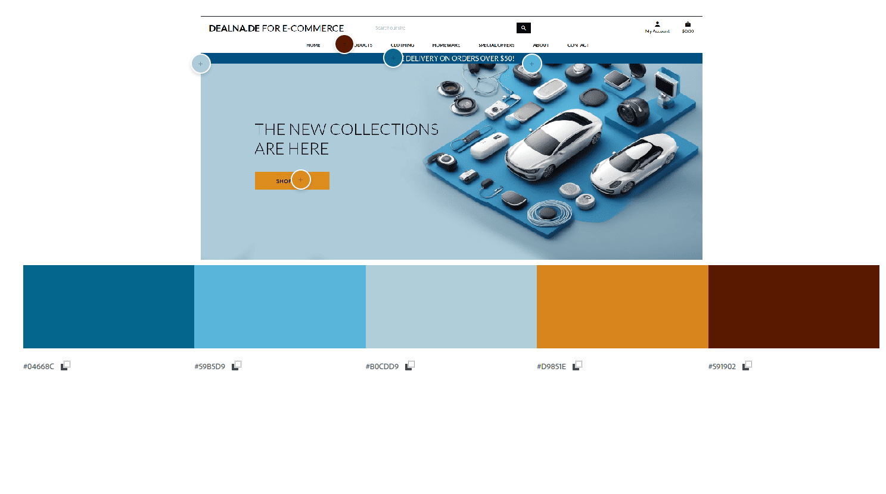

 

 

### **Typography**

The typography of **Dealna.de v1** is designed for clarity, readability, and a modern aesthetic:

* **Font Family:** The site uses the **Poppins** font (via Google Fonts), delivering an elegant, approachable, and consistent look across devices.
* **Primary Text Color:** **#000000** (black) ensures high readability for most content.
* **Text on Dark Backgrounds:** **#FFFFFF** (white) maintains strong contrast and accessibility.
* **Headings & Key UI Elements:** Styled in **#04668C** (deep blue) to reinforce brand identity and draw attention.
* **Secondary Visual Accents:** **#59B5D9** (bright aqua blue) and **#B0CDD9** (soft pastel blue) are used for subtle section highlights, background tints, and less prominent elements.
* **Interactive & Action Elements:** **#D9851E** (warm orange) highlights buttons, links, and CTAs to guide user engagement.
* **Emphasis & Contrast Accents:** **#591902** (dark burgundy) is used sparingly for alerts, strong highlights, or emphasis within content.

This design system ensures a clear typographic hierarchy, enhances user navigation, and aligns with the visual branding already in place—especially with the Poppins font providing a polished and cohesive feel.


 
 


[Back to top](<#contents>)

</details>


 
---

## **Features**

### **Existing Features**

The **Dealna.de v1** offers a range of features designed to enhance the user experience and streamline the shopping process:
 
<details><summary><span style="font-size:1.7em; font-weight:bold;">Features Details</span></summary>

 
1. **Navigation**

   * The navigation menu is prominently featured at the top of the page, providing easy access to key sections such as **Shop**, **Deals**, **About**, **FAQ**, **Contact**, **Account**, and **Cart**.
   * **Responsive Design:** The navigation bar adapts seamlessly to different screen sizes, ensuring a smooth user experience across devices.

     * **Notebook/Desktop View:** 
  
     * **Mobile View:**     <br>   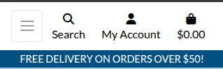

2. **User Registration and Authentication**

   * Users can create accounts, log in, and log out securely. Registered users can access personalized features such as order history and saved payment information.

     * **Notebook/Desktop View:** 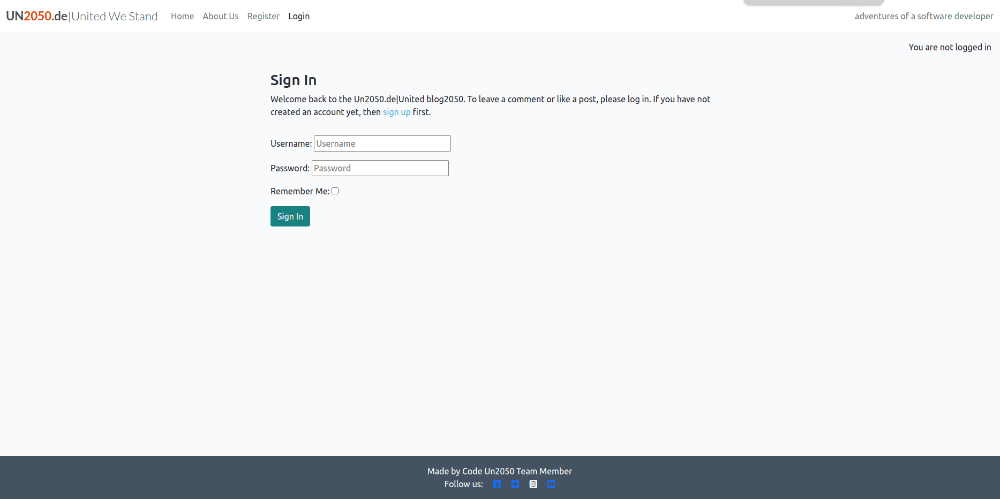
     * **Mobile View:** <br>  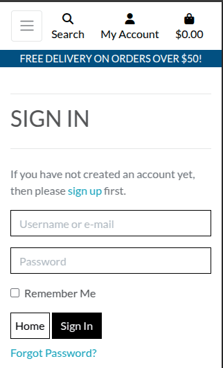
     * **Notebook/Desktop View:** 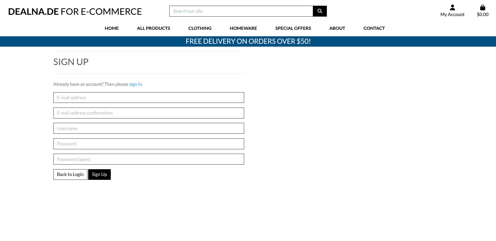 
     * **Mobile View:** <br>  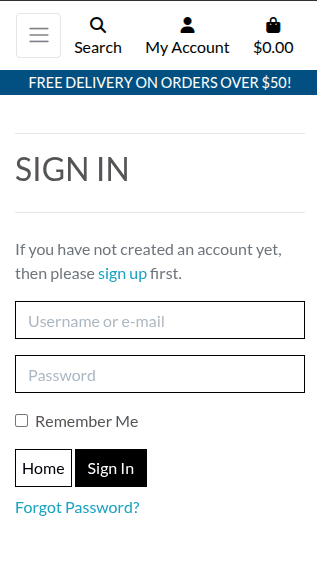

3. **Product Browsing and Filtering**

   * Users can browse products by category, sort by price, rating, or name, and filter by deals or special offers.
   * Each product page includes detailed information, images, available sizes, and user reviews.

     * **Notebook/Desktop View:** 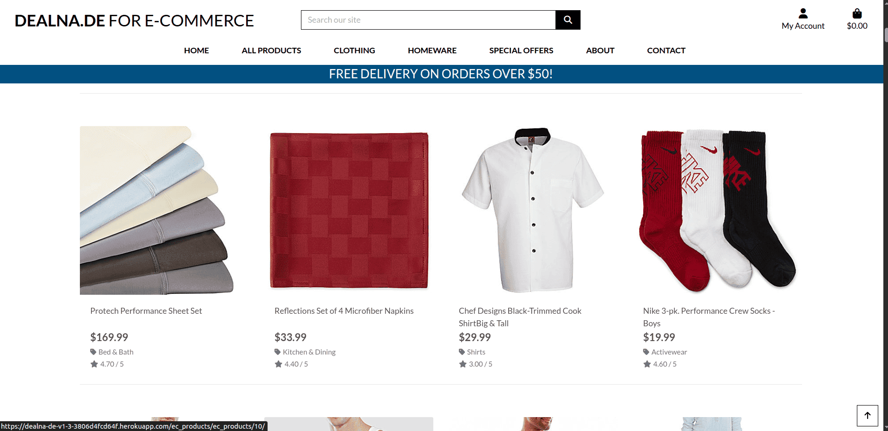
     * **Mobile View:** <br> 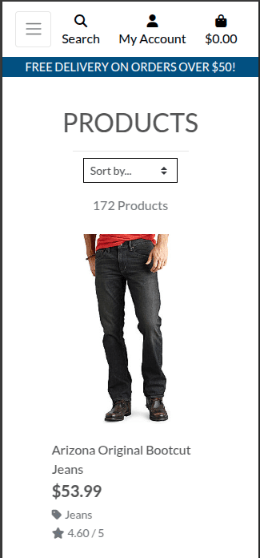

4. **Shopping Cart and Checkout**

   * Users can add products to their cart, adjust quantities, and proceed to a secure checkout process.
   * The cart displays the total cost and allows users to review their order before payment.

     * **Notebook/Desktop View:** 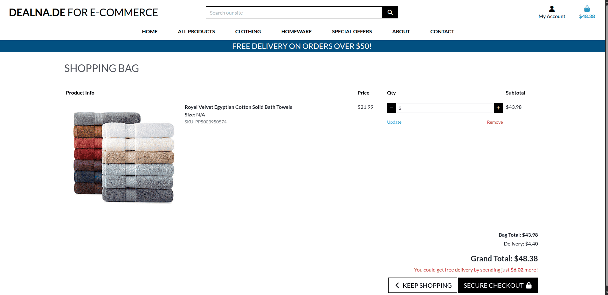
     * **Mobile View:** <br> 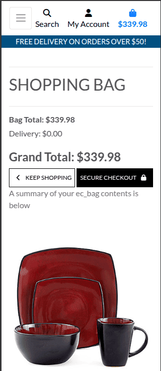


     * **Notebook/Desktop View:** 
         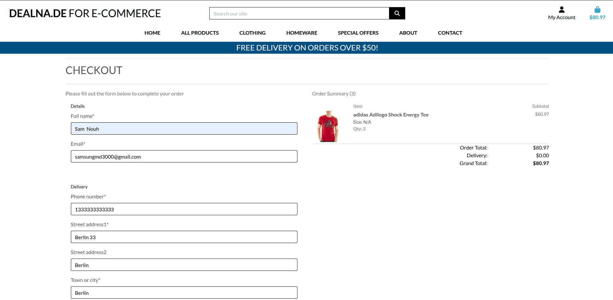
         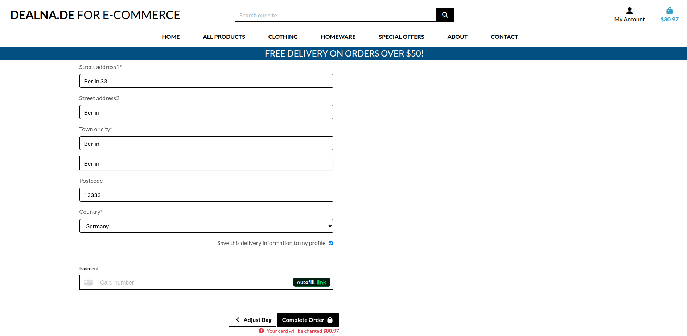

      
     * **Mobile View:**  <br>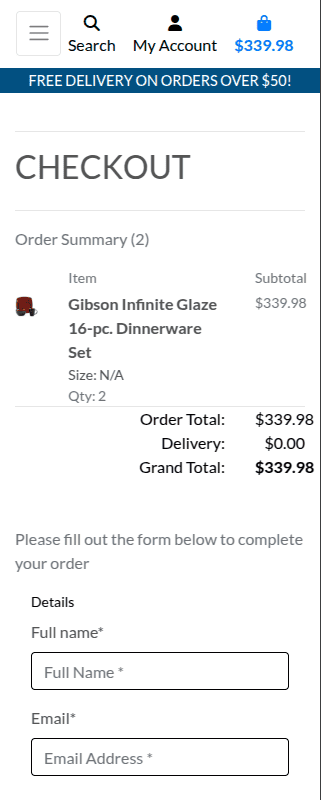

1. **Order Confirmation and Email Notifications**

   * After placing an order, users receive an on-screen confirmation and an email with order details.


     * **Notebook/Desktop View:** 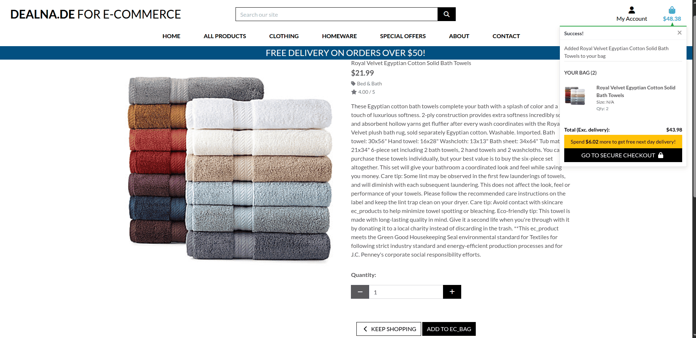
     * **Mobile View:**<br> 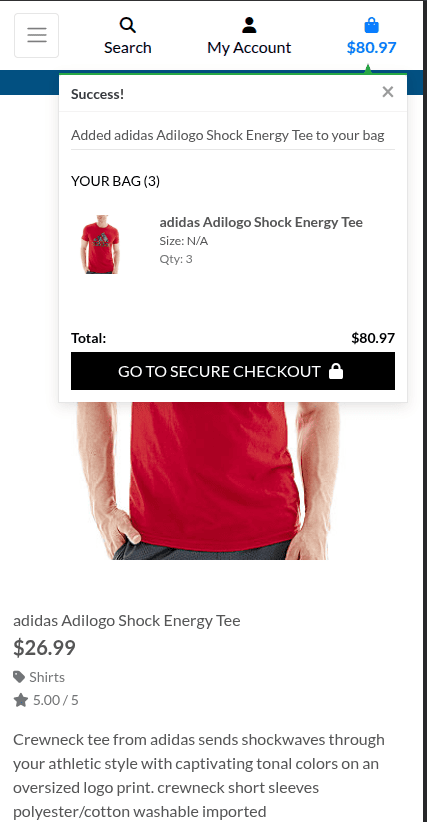


     * **Notebook/Desktop View:** 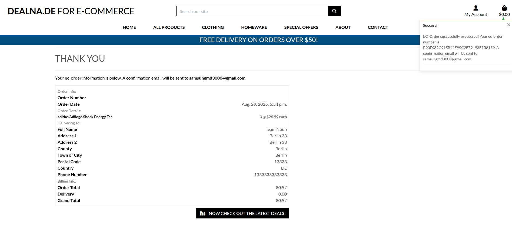
      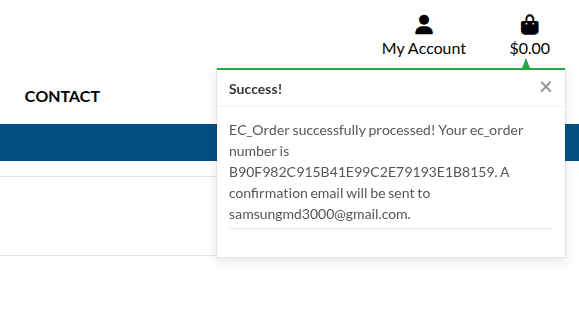
     * **Mobile View:**<br> 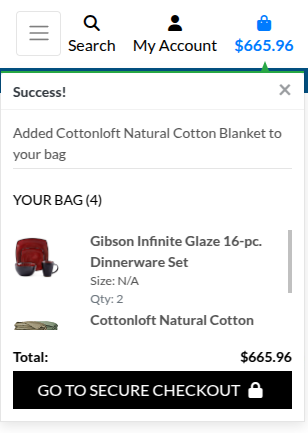

2. **Reviews**

   * Shoppers can read product reviews from other users and leave their own ratings and feedback.
   * Reviews help build trust and support better purchase decisions.
    * **Notebook/Desktop View:** 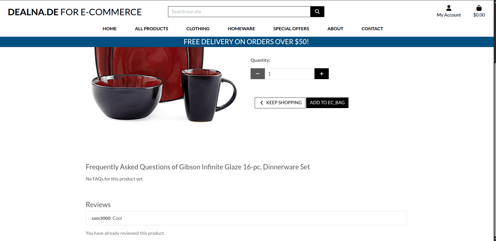
      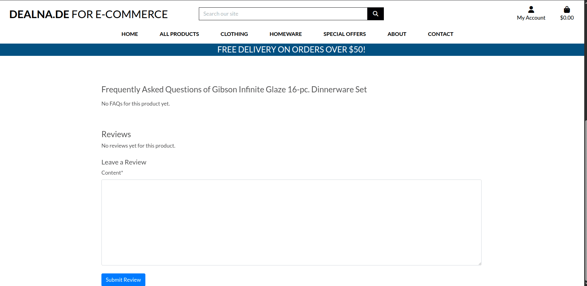

3. **About Page**

   * A dedicated page that introduces **Dealna.de**, including mission, vision, and values.
   * Enhances brand trust by sharing more about the team and purpose behind the platform.

4. **FAQ Page**

   * Provides answers to frequently asked questions about shopping, shipping, returns, and account management.
   * Improves customer support by reducing repetitive queries.
   *  **Notebook/Desktop View:** 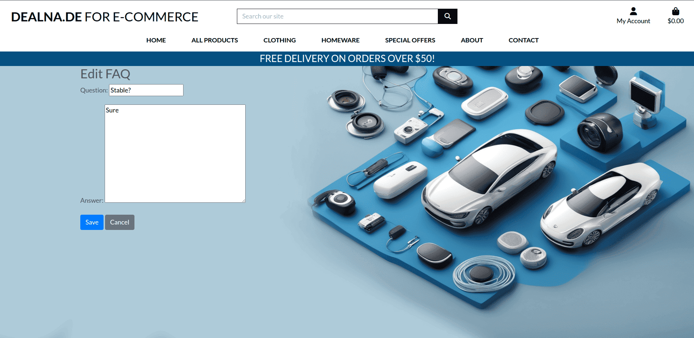
      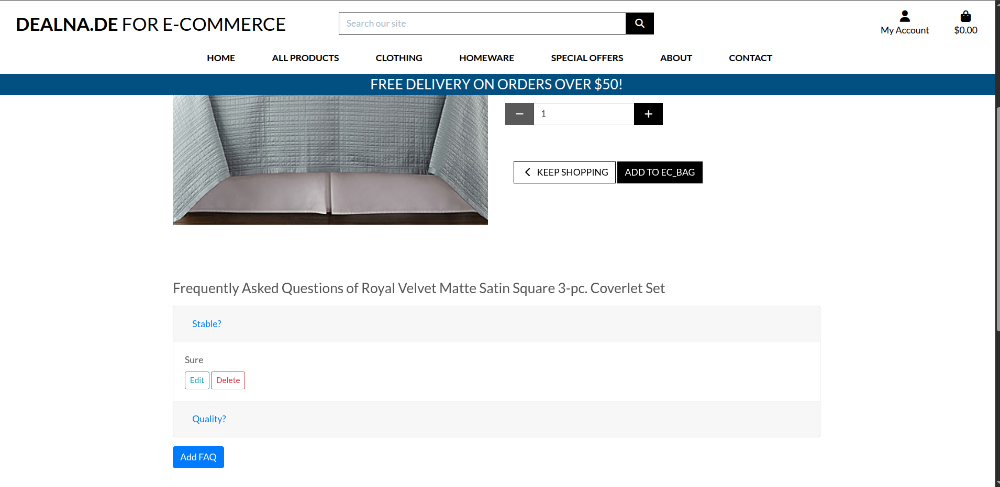


      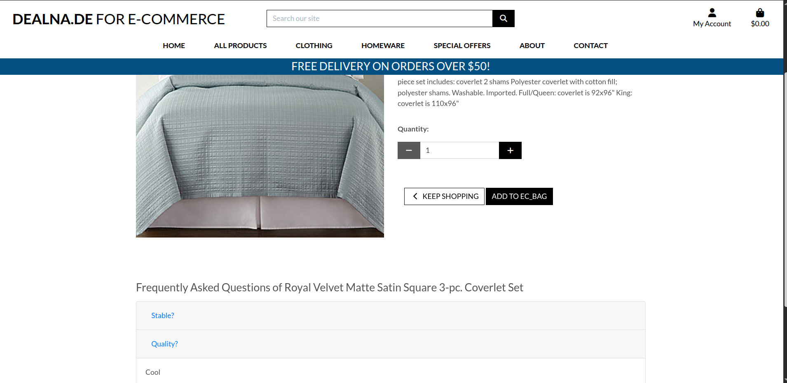


 


     * **Mobile View:**<br> 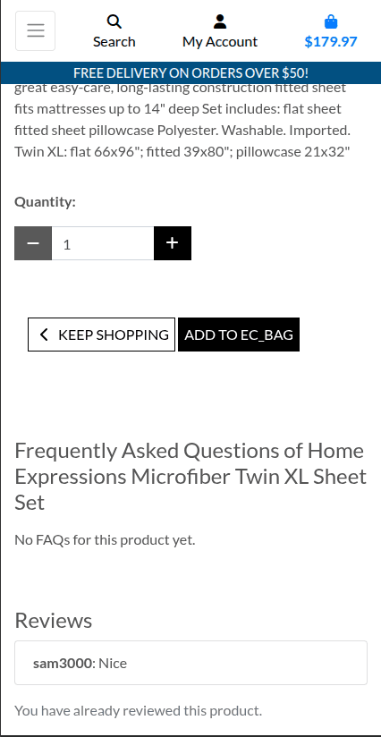

5. **Contact Page**

   * Users can easily reach out to the store via a simple and intuitive contact form.
   * Messages are stored in the database, allowing the admin to track and respond to collaboration or support requests.
     * **Notebook/Desktop View:** 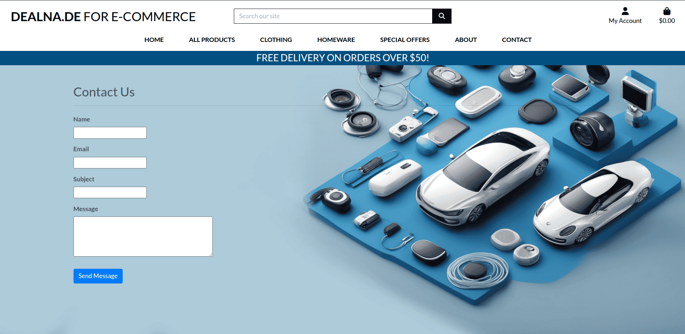

     * **Mobile View:**<br> 


6.  **Admin Dashboard**

    * Admin users can manage products, view orders, respond to contact messages, and update inventory through a dedicated dashboard.

      * **Notebook/Desktop View:** 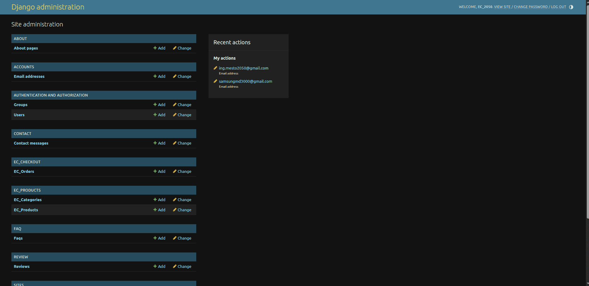
         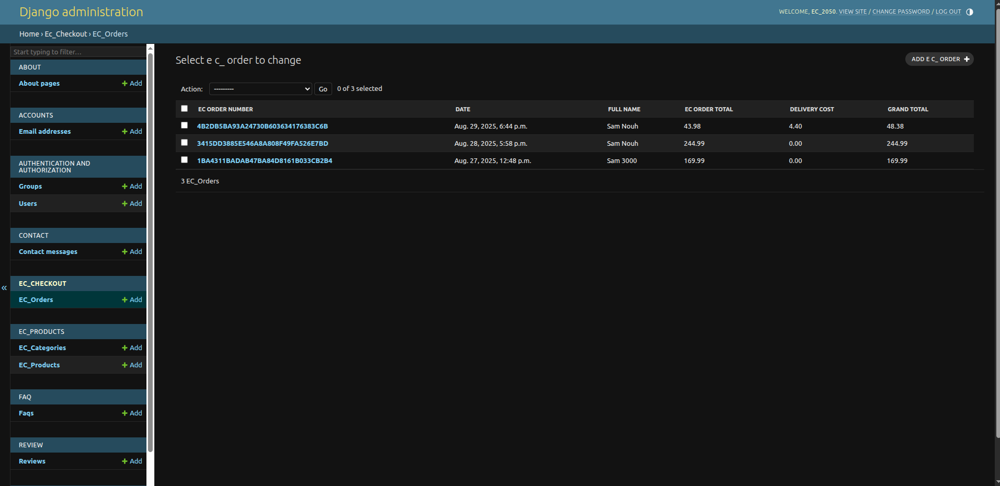
      * **Mobile View:** <br> 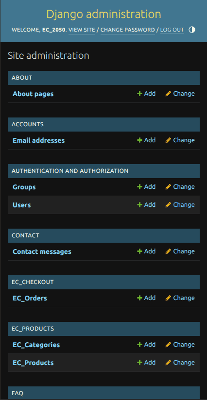

---

### **Future Features**

1. **Wishlist Functionality**

   * Allow users to save products to a wishlist for future purchase.

2. **Advanced Search and Filtering**

   * Implement more advanced search and filtering options, such as price range, brand, and customer ratings.

3. **Newsletter Subscription**

   * Allow users to subscribe to a newsletter for updates on new products, promotions, and exclusive deals.

4. **Social Media Integration**

   * Add social media sharing buttons for products and integrate social media feeds on the website.

5. **Live Chat Support**

   * Introduce a live chat feature for real-time customer support.

---
 
[Back to top](<#contents>)
 

</details>


  

## **Technologies Used**

 

<details><summary><span style="font-size:1.7em; font-weight:bold;">Languages</span></summary>


## Tools & Technologies

| Tool / Tech | Use |
| --- | --- |
| [](https://markdown.2bn.dev) | Generate README and TESTING templates. |
| [](https://git-scm.com) | Version control. (`git add`, `git commit`, `git push`) |
| [](https://github.com) | Secure online code storage. |
| [](https://code.visualstudio.com) | Local IDE for development. |
| [](https://developer.mozilla.org/en-US/docs/Web/HTML) | Main site structure and semantic content. |
| [](https://developer.mozilla.org/en-US/docs/Web/CSS) | Styles, layouts, and responsive design. |
| [](https://developer.mozilla.org/en-US/docs/Web/JavaScript) | Adds interactivity (navigation menus, cart, filters). |
| [](https://www.python.org) | Backend logic, data handling, integration. |
| [](https://www.djangoproject.com) | Python framework for server-side logic and templates. |
| [](https://getbootstrap.com) | Front-end framework for responsive design and components. |
| [](https://django-allauth.readthedocs.io/en/latest/) | User authentication and login plugin for Django. |
| [](https://jquery.com/) | Bootstrap component initialization and cart functionality. |
| [](https://www.heroku.com) | Hosting the deployed back-end site. |
| [](https://www.postgresql.org) | Relational database management. |
| [](https://www.sqlite.org) | Default development database for local testing. |
| [](https://aws.amazon.com/s3/) | Cloud storage for static and media files. |
| [](https://cloudinary.com) | Hosting and optimizing images for faster load. |
| [](https://whitenoise.readthedocs.io) | Serve static files in production with Heroku. |
| [](https://stripe.com) | Secure online payment integration. |
| [](https://mail.google.com) | Sending transactional emails from the application. |
| [](https://fontawesome.com) | Icons for UI elements and headings. |
| [](https://fonts.google.com/) | Web fonts for modern typography. |
| [](https://favicon.io/) | Generate professional favicons for all devices. |
| [](https://www.adobe.com/ie/products/xd.html) | Design wireframes, UI prototypes, and user flows. |
| [](https://www.gimp.org/) | Image editing, resizing, and optimization for web. |
| [](https://chat.openai.com) | Help debug, troubleshoot, and explain things. |


[Back to top](<#contents>)  

</details>

---


## **Data Model**

 
This project uses Django’s **Object-Relational Mapping (ORM)** to manage interactions between the application and **PostgreSQL**. The updated key models include the new apps.
 

<details><summary><span style="font-size:1.7em; font-weight:bold;">More Details</span></summary>


 

### **Core Models**

1. **User**

   * Handles authentication and user profile information.
   * Fields:

     * `username`, `email`, `password`, `first_name`, `last_name`, `is_staff`

2. **Product**

   * Represents a product available for purchase.
   * Fields:

     * `name`, `description`, `price`, `category` (FK), `image`, `rating`, `stock`

3. **Category**

   * Represents a grouping of products.
   * Fields: `name`, `friendly_name`

4. **Order**

   * Represents a user's purchase order.
   * Fields: `user` (FK), `order_number`, `date`, `total`, `status`

5. **OrderLineItem**

   * Represents an individual item within an order.
   * Fields: `order` (FK), `product` (FK), `quantity`, `lineitem_total`

6. **Review**

   * Represents a user review for a product.
   * Fields: `user` (FK), `product` (FK), `rating`, `comment`, `date`

---

### **New App Models**

1. **FAQ**

   * Stores frequently asked questions related to products or general site queries.
   * Fields: `question` (CharField), `answer` (TextField), `product` (FK, optional), `created_at`, `updated_at`

2. **About**

   * Contains information about the company or store.
   * Fields: `title` (CharField), `content` (TextField), `updated_at`

3. **Contact**

   * Stores messages submitted through the contact form.
   * Fields: `name` (CharField), `email` (EmailField), `subject` (CharField), `message` (TextField), `created_at`, `is_read` (BooleanField)

---

### **Relational Model**

* **Product → Category**: Each product belongs to a category.
* **Order → User**: Each order is placed by a user.
* **Order → OrderLineItem → Product**: Orders contain multiple line items, each referencing a product.
* **Review → User, Product**: Users can leave reviews for products.
* **FAQ → Product**: Optional, relates questions to specific products.
* **About**: Single model for company/store info.
* **Contact → Admin/User**: Contact messages are stored in the database and can be flagged as read.

---

### **Example Relationships**

1. **User → Order**

   * A user can place multiple orders.

2. **Product → Category**

   * Products belong to a category.

3. **Order → OrderLineItem → Product**

   * An order can contain multiple line items, each representing a product.

4. **User → Review → Product**

   * A user can leave multiple reviews on different products.

5. **Product → FAQ**

   * A product can have multiple FAQs.

6. **Contact Messages**

   * Each message is stored for admin review.

---
 

---

### **Generating the ERD**

To create a visual diagram of the models, use **Django Extensions**:

```bash
./manage.py graph_models -a -g -o Dealna_de_v1_7_diagram.png
```

* `-a`: Include all apps
* `-g`: Group models by app
* `-o`: Output file name

The generated **ERD** will be saved as:
**[Dealna\_de\_v1\_7\_diagram.png](Dealna_de_v1_7_diagram.png)**

This diagram includes **core models** and **new apps** for a complete overview of your project schema.

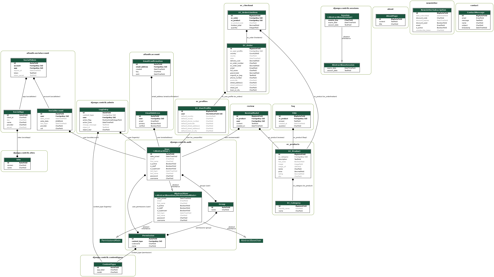  


[Back to top](<#contents>)
 
</details>


 

## **Email Marketing Integration**

<details><summary><span style="font-size:1.7em; font-weight:bold;">More Details</span></summary>

 
 

### **SEO & Newsletter Integration**

The **Dealna.de** website now includes a fully functional **newsletter subscription** feature, powered by **Mailchimp**, allowing users to subscribe and receive updates about **new products, promotions, and exclusive deals**.

* **Newsletter Implementation:**

  * Fully integrated into the website’s frontend and backend using **Mailchimp**.
  * Users can easily enter their email to subscribe.
  * Subscriber emails are securely stored and managed via Mailchimp for automated campaigns and analytics.
  * Keeps users engaged with new products and special offers, building a loyal customer base.

* **XML Sitemap:**

  * To enhance SEO and ensure search engines can efficiently crawl all pages, an **XML sitemap** was generated using [Crawlino XML Sitemap Generator](https://www.crawlino.com/tools/xml-sitemap-generator?utm_source=chatgpt.com).
  * Includes all key pages: homepage, account pages, product pages, categories, and the newsletter page.
  * Each entry has `<lastmod>`, `<changefreq>`, and `<priority>` tags, helping search engines understand page importance and update frequency.
  * `<lastmod>` timestamps updated to **2026-01-20**, ensuring all pages appear fresh to search engines.

* **Benefits of Sitemap & Newsletter:**

  * Makes the website **SEO-ready** and ready for submission to **Google Search Console**.
  * Combines marketing and search optimization, improving visibility and user engagement.


[Back to top](<#contents>)


 </details>


---
 


## **Compliance and Trust**

<details><summary><span style="font-size:1.7em; font-weight:bold;">More Details</span></summary>


### **Händlerbund Membership**  
We are proud members of **[Händlerbund](https://www.haendlerbund.de/de)**, the largest association for e-commerce and online retailers in Europe. This membership ensures that our platform, **Dealna.de v1**, adheres to the highest standards of legal compliance and consumer protection.  

### **Trusted Shops Seal**  
Our website has been awarded the **Trusted Shops** seal, a mark of trust and reliability in e-commerce. This certification demonstrates our commitment to:  
- Transparent business practices.  
- Secure payment processing.  
- Reliable customer service.  
- Compliance with European consumer protection laws.  

### **European Compliance**  
We strictly follow all European regulations, including:  
- **GDPR (General Data Protection Regulation):** Ensuring the privacy and security of user data.  
- **Consumer Rights Directive:** Providing clear information about products, prices, and return policies.  
- **E-Commerce Directive:** Ensuring transparency in online transactions and contracts.  

### **Screenshot of Trusted Shops Seal**  
Below is a screenshot of the **Trusted Shops** seal displayed on our website [Dealna.de](https://Dealna.de/):  

  


[Back to top](<#contents>)


 </details>


---


## Testing:

<details><summary><span style="font-size:1.7em; font-weight:bold;">More Details</span></summary>

### Chrome Test


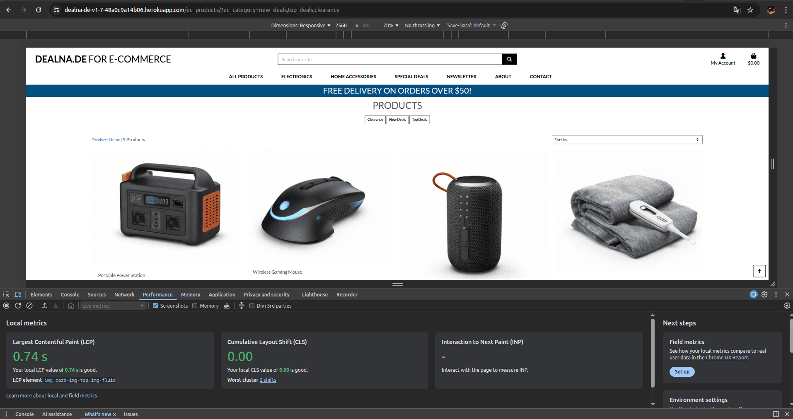


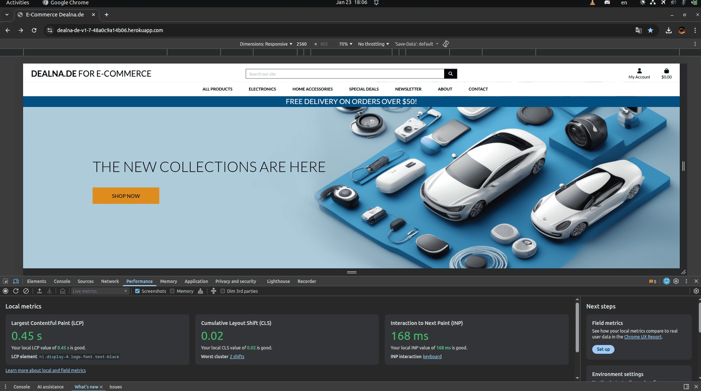


### Lighthouse Testing

 

 


#### Performance
The website was also put through Lighthouse testing via Chrome Devtools which tests a site under 4 different headings; Performance, Accessibility, Best Practices and it tests it under mobile and desktop criteria.

##### Desktop lighthouse Performance
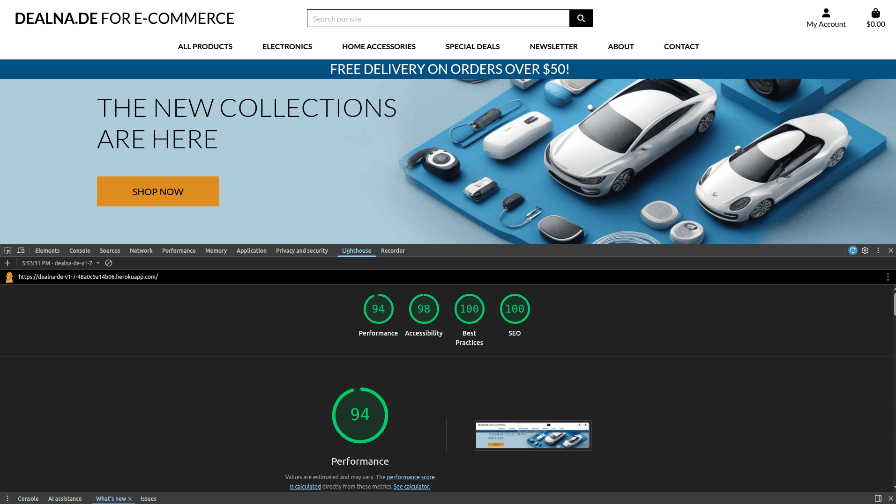
 

##### Mobile lighthouse Performance
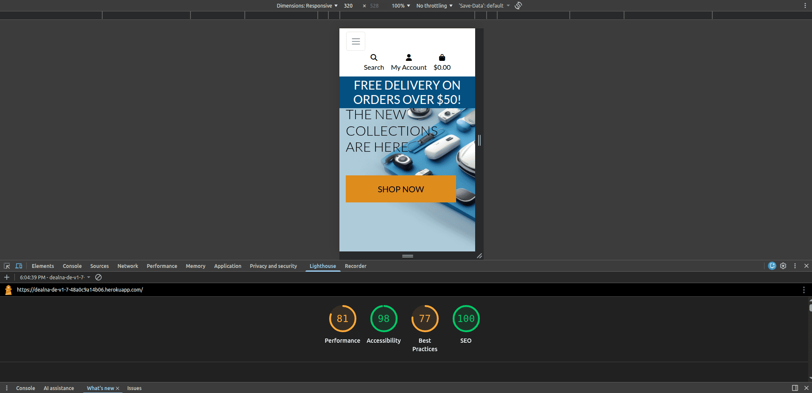
 
 
 

##### Lighthouse Accessibility Testing 
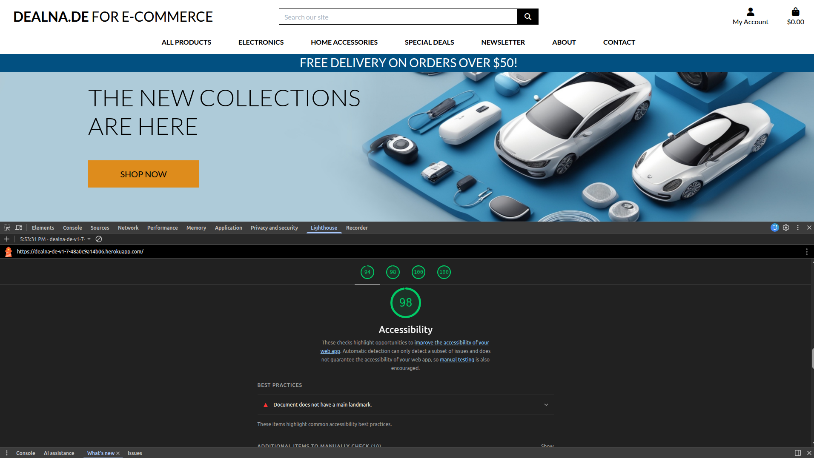


##### Lighthouse Best Practices Testing 
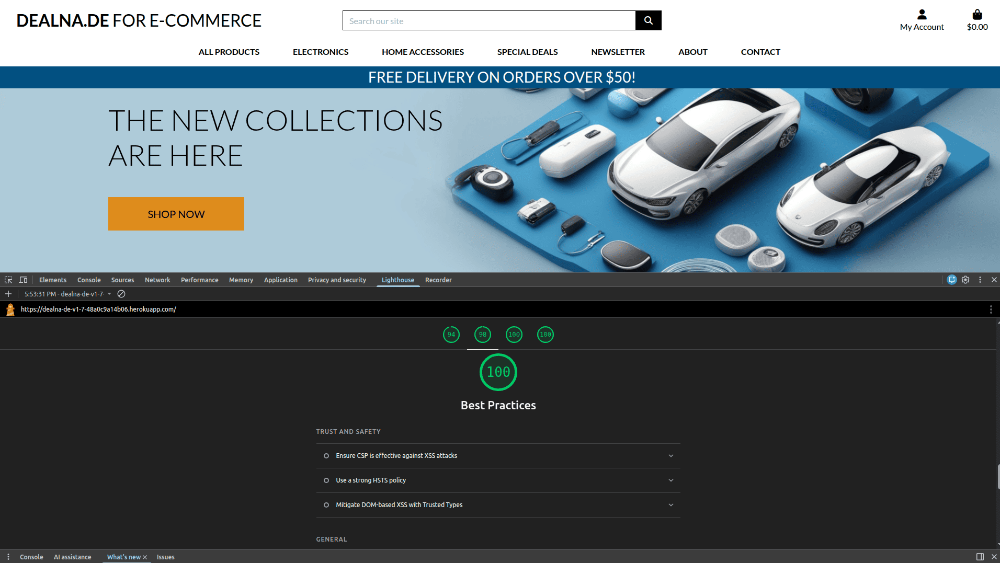


##### Lighthouse SEO Testing 

 

##### WAVE Web Accessibility Evaluation Tool

[WAVE Web Accessibility Evaluation Tool](https://wave.webaim.org/) was used to check the colour contrast on the website for accessibility purposes which it passed. 


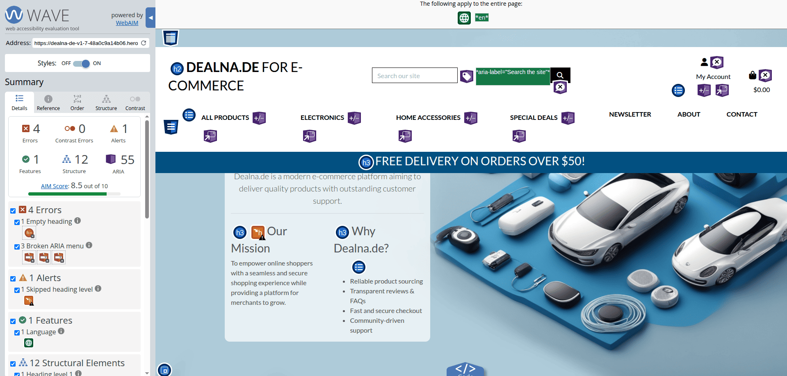


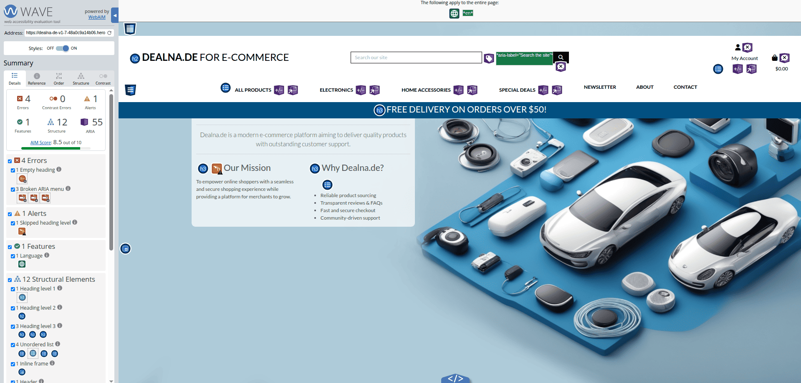


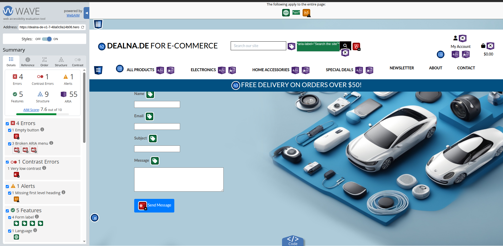


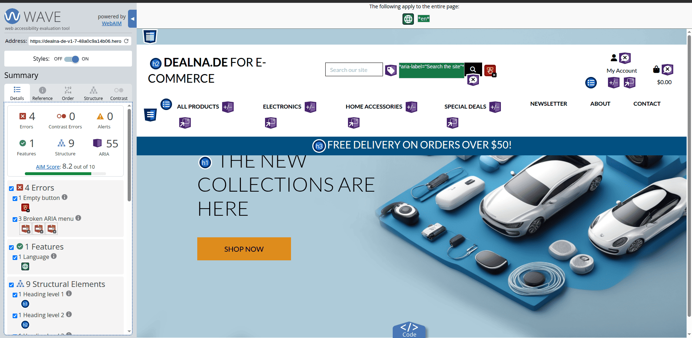


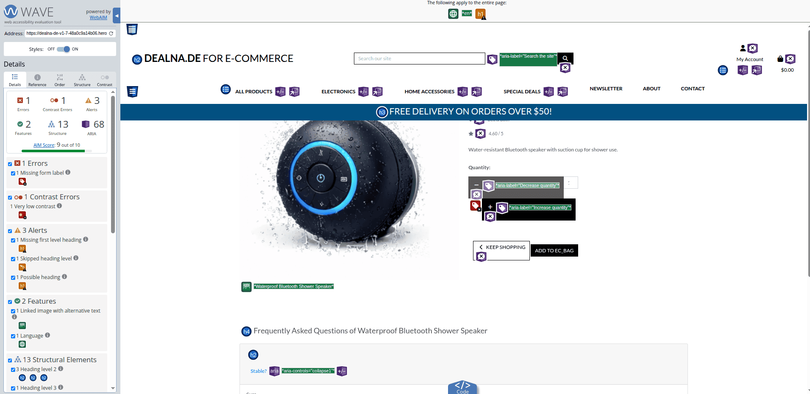


 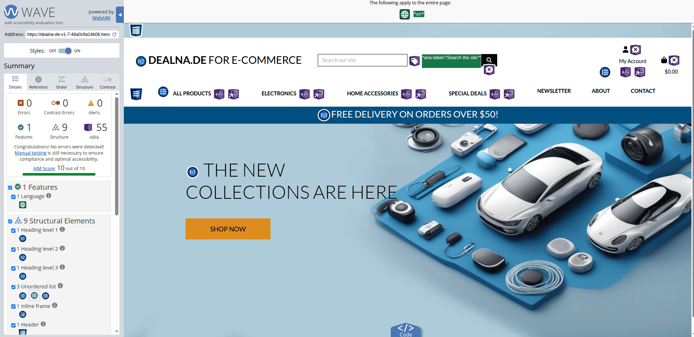


 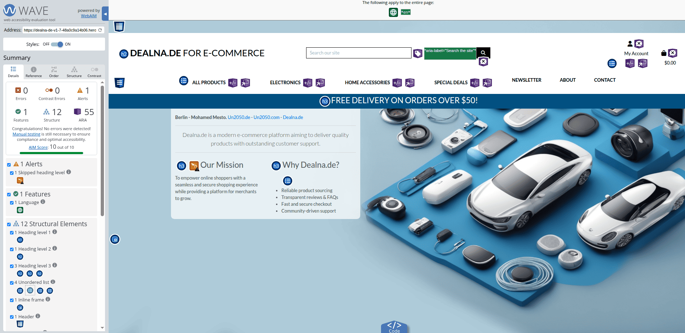


 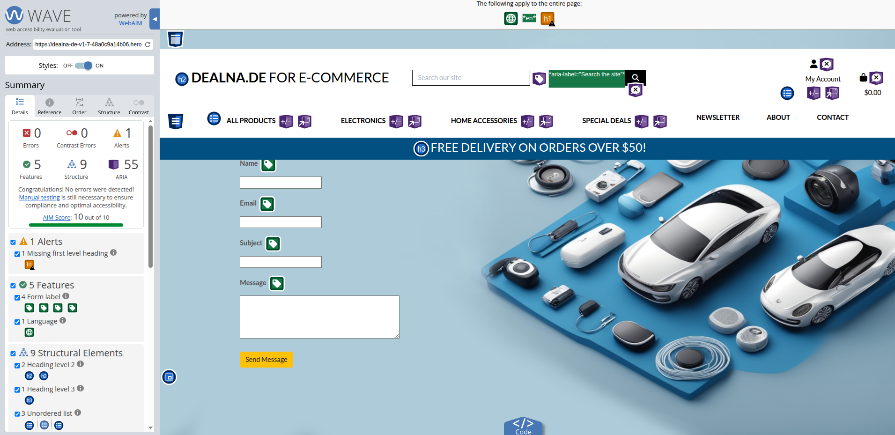


### Fixing Accessibility issues:

Accessibility issues have been resolved, ensuring the link is now descriptive and user-friendly for all users, including those relying on screen readers.


1. **Accessibility Issue1:**
      The error you’re seeing is an **accessibility issue**. It indicates that a form control `<input>` **doesn’t have an associated `label`**, which makes it harder for screen reader users to understand the purpose of the input.

      In your code, the relevant form is the **search field in the header**:

 

      ### The Problem:

      * The `<input>` **does not have a `label`**.
      * It only has a `placeholder`.
      * A placeholder **is not a substitute for a label** in terms of accessibility.

      ---

      #### Solutions:

      

      #### ** Use `aria-label` (no visible label)**
      ```
      <input class="form-control border border-black rounded-0" type="text" name="q"
            placeholder="Search our site" aria-label="Search the site">
      ```
      

      * This gives screen readers a description of the input without showing a visible label.
      * Useful if you don’t want to add a visible label.
      
      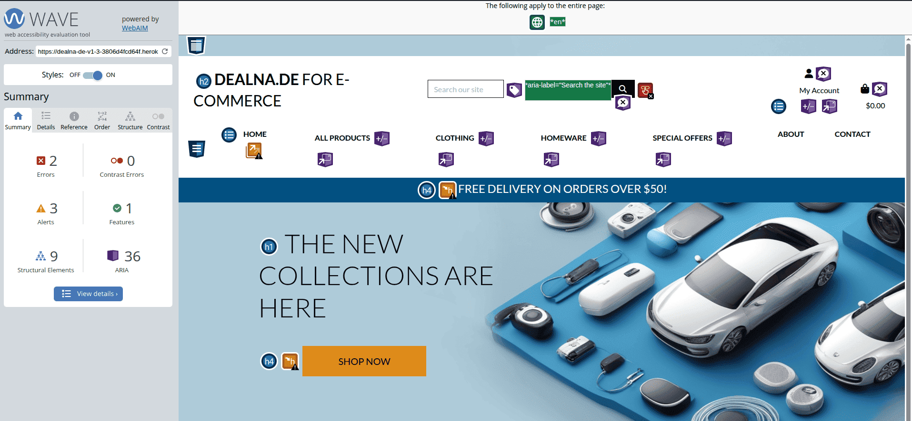
      


2. **Accessibility Issue2:**
   
   The new error is about **search button being “empty”**, which is another **accessibility issue**. Screen readers cannot tell what the button does because it has **no visible or textual label**.

   #### The Problem:

   * The `<button>` only contains an icon (`<i class="fas fa-search">`).
   * Screen readers **cannot interpret an icon** as meaningful text.
   * This is considered an “empty button” from an accessibility perspective.

   ---

   #### Solutions:
   
   ##### **Add `aria-label` (no visible text)**

   ```html
   <button class="form-control btn btn-black border border-black rounded-0" type="submit" aria-label="Search">
      <i class="fas fa-search"></i>
   </button>
   ```
 
   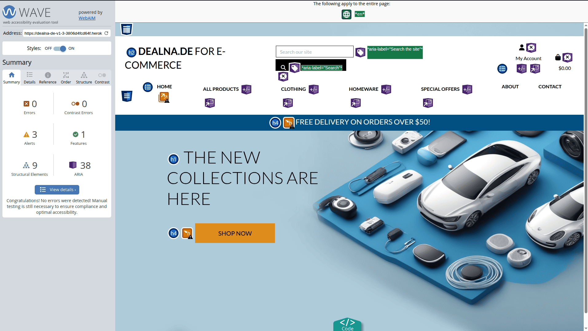
 


 
  

### Adobe Color Accessibility Tool 

The [Adobe Color Accessibility Tool](https://color.adobe.com/create/color-accessibility) was used also to ensure the color palette met accessibility standards by testing contrast and simulating color blindness. This tool confirmed that the design maintains clarity and readability for users with visual impairments.


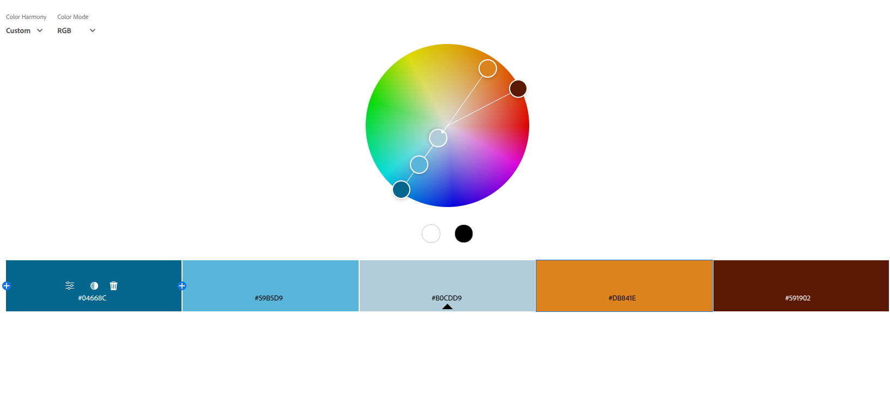


---


  
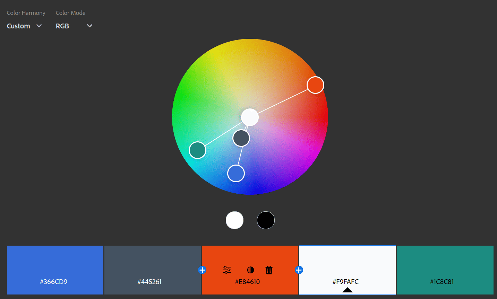


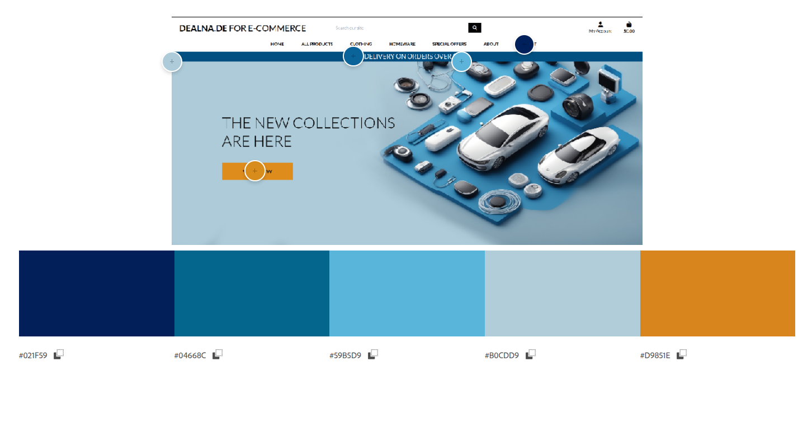


 


 
---

## **Responsive Testing**

Responsiveness was tested manually using **Chrome DevTools** and by physically testing the website on various devices, including:  
- **Desktop** (1920x1080, 1440x900, 1366x768)  
- **Laptop** (1280x800)  
- **Tablet** (iPad Air, iPad Mini, Samsung Galaxy Tab)  
- **Mobile** (iPhone 12, iPhone SE, Samsung Galaxy S20, Google Pixel 5)  

### **Testing Tools**  
1. **Chrome DevTools**  
   - Used to simulate different screen sizes and resolutions.  
   - Tested breakpoints for responsiveness, including:  
     - Extra small devices (portrait phones, <576px)  
     - Small devices (landscape phones, ≥576px)  
     - Medium devices (tablets, ≥768px)  
     - Large devices (desktops, ≥992px)  
     - Extra large devices (large desktops, ≥1200px)  

2. **Physical Device Testing**  
   - The website was tested on actual devices to ensure responsiveness and usability across different screen sizes and operating systems.  

### **Issues with Online Tools**  
- **[The Responsive Design Checker](https://responsivedesignchecker.com/):** Unable to test due to access restrictions on the website.  
- **[The Viewport Resizer](https://chrome.google.com/webstore/detail/viewport-resizer-%E2%80%93-respon/kapnjjcfcncngkadhpmijlkblpibdcgm?hl=en):** Unable to test due to access restrictions on the website.  

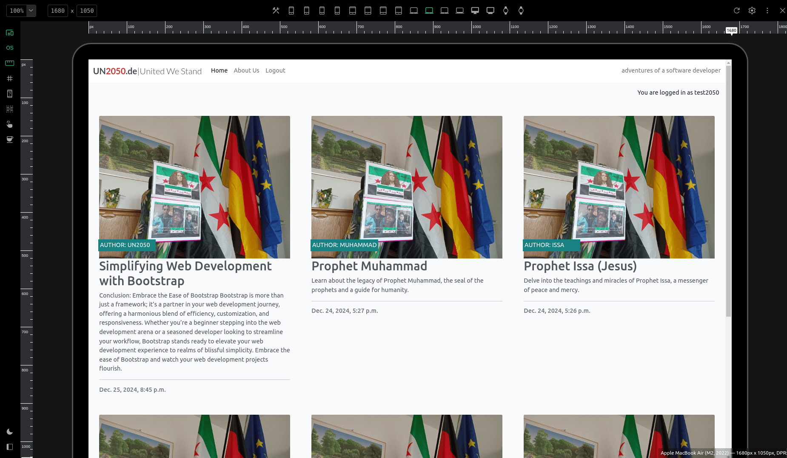

### **Issues with Checkout Page**  
- Unable to visit the Checkout page:
  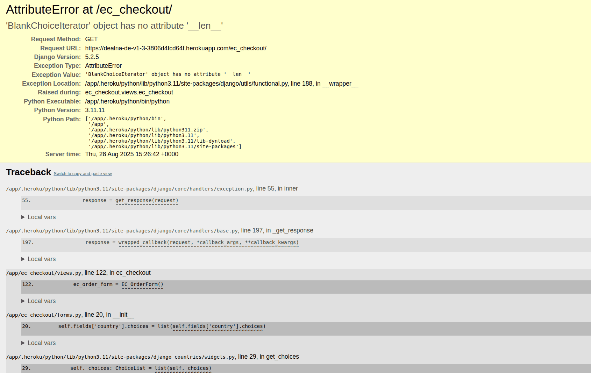
  
- We add the `django==4.2` to the `requirements.tx`t in order to make Heroku run the right Django version. Therefore the issue solved
  

---

### **Key Findings**  
- The website is fully responsive and adapts seamlessly to different screen sizes.  
- All interactive elements (e.g., buttons, forms, navigation menus) function correctly across devices.  
- Images and text scale appropriately without breaking the layout.  

---

 
 
 


### Manual Testing:
We conducted manual testing by simulating common user behaviors to ensure the system works as expected. The scenarios tested include:

- **Creating posts and comments**: We verified that logged-in users can successfully create, edit, and delete posts and comments, ensuring that these actions were handled correctly by the system.
- **Upvoting and downvoting posts**: We tested the voting functionality to confirm that users could only vote once per post and that votes were correctly recorded and displayed.
- **Filtering posts by category**: We checked the category filter functionality to ensure users could easily browse posts based on specific categories.
- **Handling valid and invalid inputs**: We tested the system's ability to handle both valid and invalid inputs, ensuring appropriate error messages were displayed when users submitted empty forms, invalid post data, or attempted duplicate votes.

### Automated Unit Testing:
We also wrote and ran unit tests using Django’s `unittest` framework to verify the core functionalities of the website. Below is a summary of the unit tests we implemented:

1. **Post Creation and Retrieval:**
   - We wrote tests to verify that logged-in users can create new posts and that required fields are validated.
   - We ensured that posts were correctly displayed on both the homepage and individual post pages.
   - We tested the pagination feature to confirm that posts were properly divided into pages.

2. **Comment Submission:**
   - We confirmed that logged-in users could submit comments on posts and that these comments were correctly linked to the relevant posts and displayed in the right order.
   - We ensured non-logged-in users were restricted from submitting comments.

3. **User Authentication:**
   - We created unit tests to verify that users could successfully register, log in, and log out.
   - We tested that only authenticated users could create, edit, or delete posts and comments.
   - We ensured that password reset and account management features functioned as expected.

4. **Post Voting System:**
   - We wrote tests to confirm that the upvoting and downvoting functionality worked correctly, ensuring users could only vote once per post.
   - We ensured that vote counts were updated in real-time and accurately reflected user inputs.

5. **Category Filtering:**
   - We tested the category filtering functionality to confirm that posts were correctly filtered and displayed based on the category selected.
   - We ensured users could navigate between categories without any errors.

6. **Error Handling:**
   - We validated that the system properly handled invalid inputs, such as attempts to create posts or comments with missing data or invalid forms.
   - We checked that the system displayed helpful error messages when users performed invalid actions.

### Running Tests:
To run the unit tests we created, you can use the following command in the project directory:

```bash
python manage.py test
```

This command will execute all the tests we implemented, allowing you to confirm that each core functionality works as intended. Running these tests ensures that the site remains robust and stable throughout development.


 
[Back to top](<#contents>)
</details>

 


## Validator Testing - Bugs Fixed:

## HTML Validation

<details><summary><span style="font-size:1.7em; font-weight:bold;">More Details</span></summary>

Validation errors occur when HTML code does not adhere to the established standards, which can lead to browser inconsistencies or inaccessible content. It is crucial to test your code against validators like the [W3C HTML Validator](https://validator.w3.org/) to ensure compliance with best practices and maintain cross-browser functionality. Below are two examples of common validation errors, their causes, and fixes.

 
### HTML Validation Issues (Nu Html Checker)

During validation of the project with the **Nu Html Checker**, several errors and warnings were reported.

* **Problem:** Duplicate IDs were found (`user-options` and `home-link`). HTML requires all IDs to be unique in the document.

   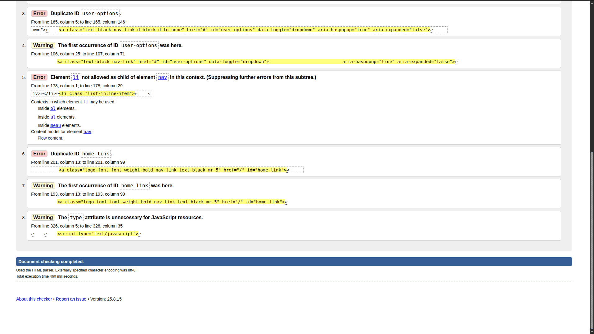

   

  **Solution:** Ensure each element has a unique ID by renaming duplicates (e.g., `user-options-desktop` and `user-options-mobile`).

   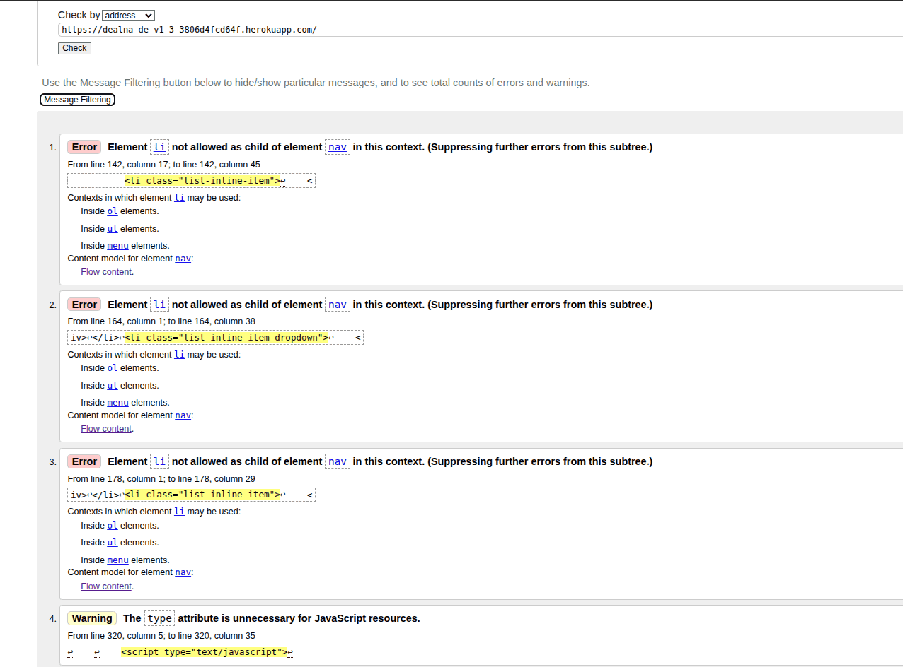


* **Problem:** `<script>` tags were using the unnecessary `type="text/javascript"` attribute. Modern HTML5 defaults to JavaScript, so this is redundant.
  
   

  **Solution:** Remove the `type="text/javascript"` attribute from `<script>` elements.

  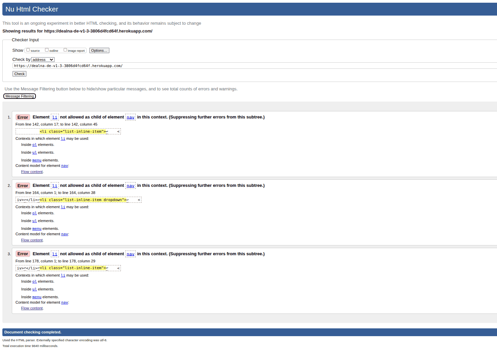

* **Problem:** `<li>` elements were placed directly inside `<nav>` tags, which is invalid since `<li>` elements must be inside a `<ul>`, `<ol>`, or `<menu>`.

   


  **Solution:** Wrap all `<li>` items inside a proper `<ul>` or `<ol>` element within the navigation bar.

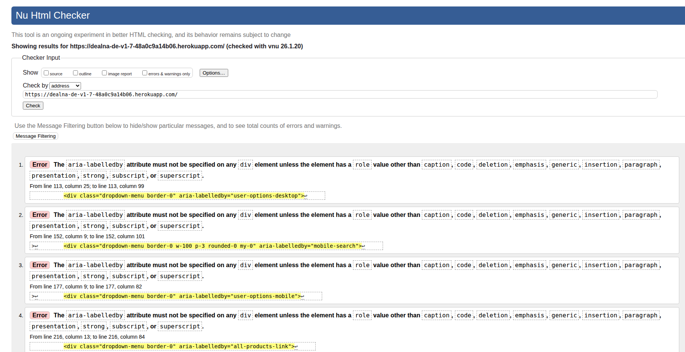
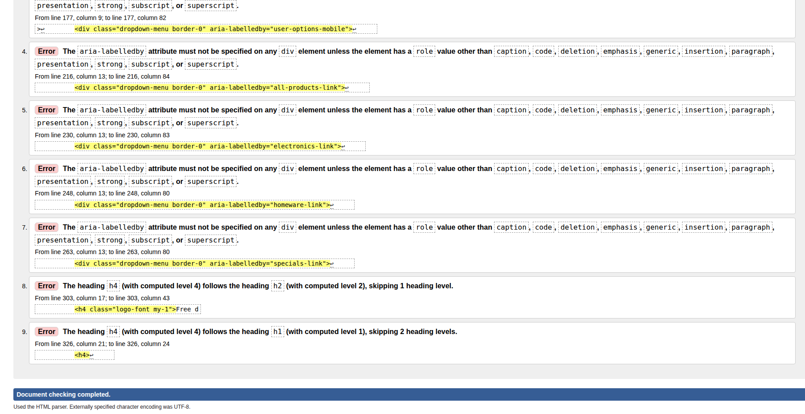


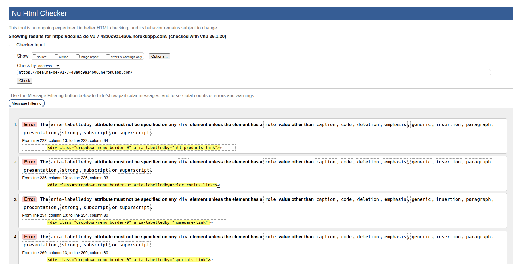


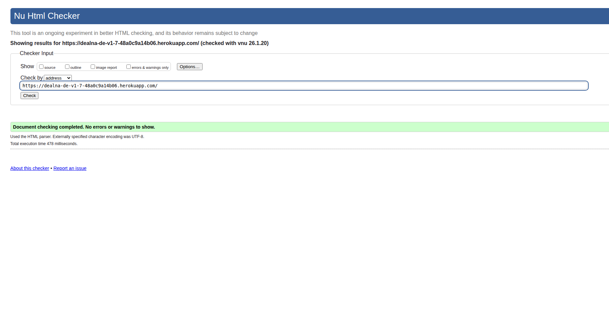
By fixing these issues, the code becomes more **standards-compliant**, **accessible**, and easier to maintain.

[Back to top](<#contents>)
</details>
---


## CSS Validation
<details><summary><span style="font-size:1.7em; font-weight:bold;">More Details</span></summary>

All CSS files for the project have been validated using the **W3C CSS Validator**. No errors were found.

Validator link: [https://jigsaw.w3.org/css-validator/](https://jigsaw.w3.org/css-validator/)

Tested website: [https://dealna-de-v1-7-48a0c9a14b06.herokuapp.com/](https://dealna-de-v1-7-48a0c9a14b06.herokuapp.com/)


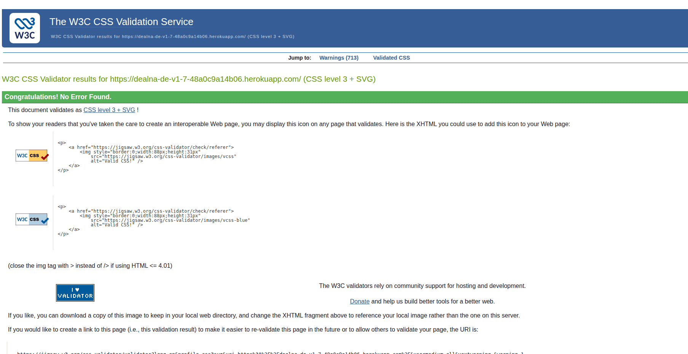

 [Back to top](<#contents>)
</details>
---


 
 

### JavaScript Validation

<details><summary><span style="font-size:1.7em; font-weight:bold;">More Details</span></summary>

Some JavaScript issues were detected during validation:

* Line 35, Column 20: `'template literal syntax' is only available in ES6 (use 'esversion: 6')`
* Line 96, Column 28: `'template literal syntax' is only available in ES6 (use 'esversion: 6')`
* Line 115, Column 7: `Missing semicolon`

### Fixes Applied
1. **ESLint and JSHint Configuration:**
   - Added `/* eslint-env es6 */` and `/* jshint esversion: 6 */` to support ES6.
   - This explicitly tells linters that the script uses ES6 syntax.

2. **Ensured ES6 Compatibility for Template Literals and Arrow Functions:**
   - Verified ES6-compatible tools/environment usage.
   - Added notes to indicate the ES6 usage for future reference.
  
These issues have been fixed. Screenshots of the validation results are shown below:

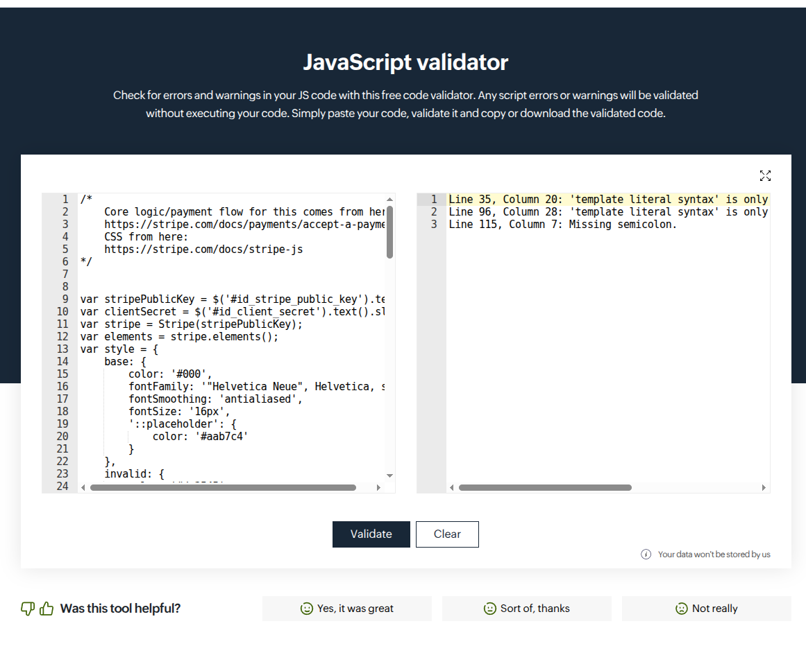


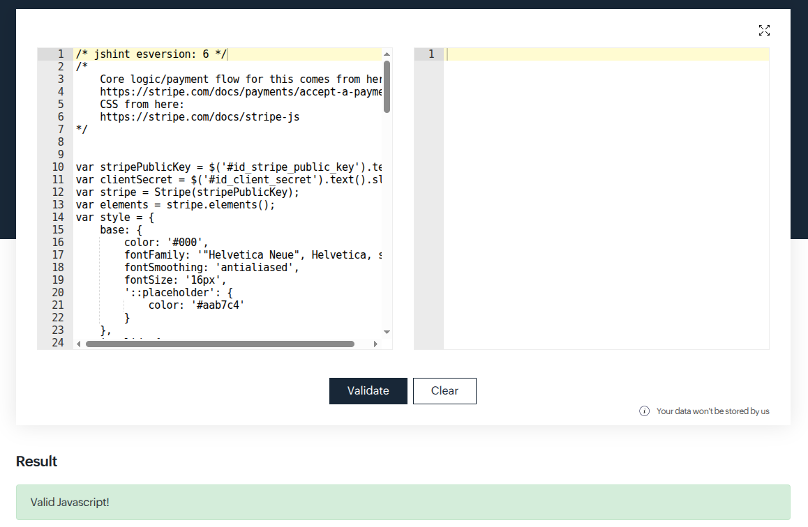


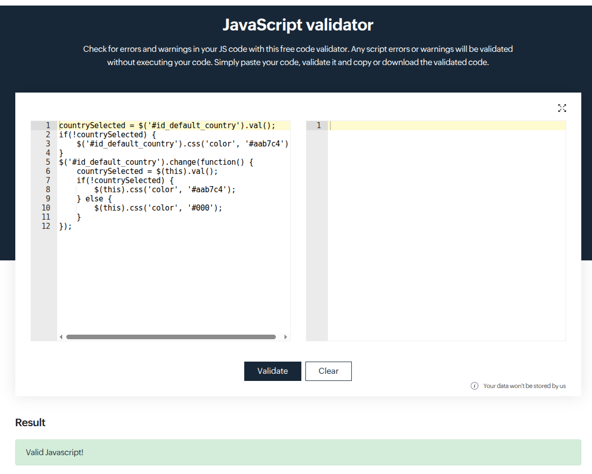

[Back to top](<#contents>)
</details>

---
## Py Validation

<details><summary><span style="font-size:1.7em; font-weight:bold;">More Details</span></summary>


 


 
`flake8` was used as a Python linter to validate code quality and enforce compliance with PEP8 standards. Running `python3 -m flake8` across the project highlighted a number of minor issues, including lines exceeding the 79-character limit, missing blank lines between class and function definitions, unused imports, and missing newlines at the end of some files.

The following errors were identified during the initial validation:
 
 
```
python3 -m flake8
./about/migrations/0001_initial.py:18:80: E501 line too long (94 > 79 characters)
./about/migrations/0001_initial.py:19:80: E501 line too long (80 > 79 characters)
./about/models.py:3:1: E302 expected 2 blank lines, found 1
./about/tests.py:1:1: F401 'django.test.TestCase' imported but unused
./about/urls.py:6:2: W292 no newline at end of file
./about/views.py:4:1: E302 expected 2 blank lines, found 1
./contact/admin.py:4:36: W292 no newline at end of file
./contact/forms.py:4:1: E302 expected 2 blank lines, found 1
./contact/forms.py:13:1: W293 blank line contains whitespace
./contact/forms.py:13:9: W292 no newline at end of file
./contact/migrations/0001_initial.py:18:80: E501 line too long (117 > 79 characters)
./contact/migrations/0001_initial.py:23:80: E501 line too long (87 > 79 characters)
./contact/models.py:4:1: E302 expected 2 blank lines, found 1
./contact/tests.py:1:1: F401 'django.test.TestCase' imported but unused
./contact/urls.py:6:2: W292 no newline at end of file
./contact/views.py:5:1: E302 expected 2 blank lines, found 1
./contact/views.py:10:80: E501 line too long (81 > 79 characters)
./contact/views.py:14:1: W293 blank line contains whitespace
./contact/views.py:15:67: W292 no newline at end of file
./custom_storages.py:12:69: W292 no newline at end of file
./ec_2050_project/settings.py:19:15: E261 at least two spaces before inline comment
./ec_2050_project/settings.py:27:1: W293 blank line contains whitespace
./ec_2050_project/settings.py:28:1: W293 blank line contains whitespace
./ec_2050_project/settings.py:31:1: W293 blank line contains whitespace
./ec_2050_project/settings.py:33:1: E303 too many blank lines (3)
./ec_2050_project/settings.py:34:1: W293 blank line contains whitespace
./ec_2050_project/settings.py:43:1: W293 blank line contains whitespace
./ec_2050_project/settings.py:44:1: W293 blank line contains whitespace
./ec_2050_project/settings.py:46:17: E128 continuation line under-indented for visual indent
./ec_2050_project/settings.py:46:29: E261 at least two spaces before inline comment
./ec_2050_project/settings.py:47:17: E128 continuation line under-indented for visual indent
./ec_2050_project/settings.py:47:61: E261 at least two spaces before inline comment
./ec_2050_project/settings.py:49:1: W293 blank line contains whitespace
./ec_2050_project/settings.py:52:3: E111 indentation is not a multiple of 4
./ec_2050_project/settings.py:72:29: E261 at least two spaces before inline comment
./ec_2050_project/settings.py:72:80: E501 line too long (98 > 79 characters)
./ec_2050_project/settings.py:78:14: W291 trailing whitespace
./ec_2050_project/settings.py:115:62: E261 at least two spaces before inline comment
./ec_2050_project/settings.py:115:80: E501 line too long (83 > 79 characters)
./ec_2050_project/settings.py:132:1: W293 blank line contains whitespace
./ec_2050_project/settings.py:138:1: W293 blank line contains whitespace
./ec_2050_project/settings.py:165:6: W291 trailing whitespace
./ec_2050_project/settings.py:169:36: E225 missing whitespace around operator
./ec_2050_project/settings.py:175:1: E303 too many blank lines (3)
./ec_2050_project/settings.py:180:80: E501 line too long (91 > 79 characters)
./ec_2050_project/settings.py:183:80: E501 line too long (81 > 79 characters)
./ec_2050_project/settings.py:186:80: E501 line too long (82 > 79 characters)
./ec_2050_project/settings.py:189:80: E501 line too long (83 > 79 characters)
./ec_2050_project/settings.py:198:1: W293 blank line contains whitespace
./ec_2050_project/settings.py:212:1: E303 too many blank lines (5)
./ec_2050_project/settings.py:212:1: E266 too many leading '#' for block comment
./ec_2050_project/settings.py:213:1: E266 too many leading '#' for block comment
./ec_2050_project/settings.py:228:1: E303 too many blank lines (8)
./ec_2050_project/settings.py:230:1: W293 blank line contains whitespace
./ec_2050_project/settings.py:231:5: E303 too many blank lines (2)
./ec_2050_project/settings.py:238:5: E303 too many blank lines (2)
./ec_2050_project/settings.py:243:80: E501 line too long (93 > 79 characters)
./ec_2050_project/settings.py:246:5: E303 too many blank lines (2)
./ec_2050_project/settings.py:262:1: E265 block comment should start with '# '
./ec_2050_project/settings.py:267:1: E265 block comment should start with '# '
./ec_2050_project/settings.py:287:1: E303 too many blank lines (3)
./ec_2050_project/settings.py:298:1: W391 blank line at end of file
./ec_2050_project/urls.py:18:29: E231 missing whitespace after ','
./ec_2050_project/urls.py:37:1: F811 redefinition of unused 'handler404' from line 21
./ec_2050_project/urls.py:37:48: W292 no newline at end of file
./ec_2050_project/views.py:3:1: E302 expected 2 blank lines, found 1
./ec_2050_project/views.py:5:58: W292 no newline at end of file
./ec_bag/admin.py:1:1: F401 'django.contrib.admin' imported but unused
./ec_bag/contexts.py:6:1: E302 expected 2 blank lines, found 1
./ec_bag/contexts.py:41:1: W293 blank line contains whitespace
./ec_bag/contexts.py:43:1: W293 blank line contains whitespace
./ec_bag/contexts.py:54:19: W292 no newline at end of file
./ec_bag/models.py:1:1: F401 'django.db.models' imported but unused
./ec_bag/templatetags/ec_bag_tools.py:6:1: E302 expected 2 blank lines, found 1
./ec_bag/templatetags/ec_bag_tools.py:8:28: W292 no newline at end of file
./ec_bag/tests.py:1:1: F401 'django.test.TestCase' imported but unused
./ec_bag/urls.py:8:80: E501 line too long (83 > 79 characters)
./ec_bag/urls.py:9:2: W292 no newline at end of file
./ec_bag/views.py:1:1: W293 blank line contains whitespace
./ec_bag/views.py:11:1: E302 expected 2 blank lines, found 1
./ec_bag/views.py:32:80: E501 line too long (144 > 79 characters)
./ec_bag/views.py:35:80: E501 line too long (101 > 79 characters)
./ec_bag/views.py:38:80: E501 line too long (97 > 79 characters)
./ec_bag/views.py:42:80: E501 line too long (97 > 79 characters)
./ec_bag/views.py:53:1: E303 too many blank lines (3)
./ec_bag/views.py:55:1: W293 blank line contains whitespace
./ec_bag/views.py:65:80: E501 line too long (140 > 79 characters)
./ec_bag/views.py:70:80: E501 line too long (101 > 79 characters)
./ec_bag/views.py:74:80: E501 line too long (97 > 79 characters)
./ec_bag/views.py:77:80: E501 line too long (81 > 79 characters)
./ec_bag/views.py:81:5: E303 too many blank lines (3)
./ec_bag/views.py:84:1: E302 expected 2 blank lines, found 1
./ec_bag/views.py:96:80: E501 line too long (101 > 79 characters)
./ec_bag/views.py:99:80: E501 line too long (81 > 79 characters)
./ec_bag/views.py:102:9: E303 too many blank lines (2)
./ec_bag/views.py:107:1: W293 blank line contains whitespace
./ec_bag/views.py:108:1: W293 blank line contains whitespace
./ec_bag/views.py:108:5: W292 no newline at end of file
./ec_checkout/__init__.py:1:55: W292 no newline at end of file
./ec_checkout/admin.py:4:1: E302 expected 2 blank lines, found 1
./ec_checkout/admin.py:10:1: E303 too many blank lines (3)
./ec_checkout/admin.py:17:1: W293 blank line contains whitespace
./ec_checkout/admin.py:18:32: E231 missing whitespace after ','
./ec_checkout/admin.py:24:1: W293 blank line contains whitespace
./ec_checkout/admin.py:28:1: W293 blank line contains whitespace
./ec_checkout/admin.py:31:1: E305 expected 2 blank lines after class or function definition, found 1
./ec_checkout/admin.py:31:45: W292 no newline at end of file
./ec_checkout/apps.py:9:9: F401 'ec_checkout.signals' imported but unused
./ec_checkout/apps.py:9:35: W292 no newline at end of file
./ec_checkout/forms.py:12:1: W293 blank line contains whitespace
./ec_checkout/forms.py:35:14: E111 indentation is not a multiple of 4
./ec_checkout/forms.py:35:14: E117 over-indented
./ec_checkout/forms.py:43:41: W292 no newline at end of file
./ec_checkout/migrations/0001_initial.py:19:80: E501 line too long (117 > 79 characters)
./ec_checkout/migrations/0001_initial.py:20:80: E501 line too long (85 > 79 characters)
./ec_checkout/migrations/0001_initial.py:25:80: E501 line too long (85 > 79 characters)
./ec_checkout/migrations/0001_initial.py:28:80: E501 line too long (92 > 79 characters)
./ec_checkout/migrations/0001_initial.py:29:80: E501 line too long (83 > 79 characters)
./ec_checkout/migrations/0001_initial.py:31:80: E501 line too long (98 > 79 characters)
./ec_checkout/migrations/0001_initial.py:32:80: E501 line too long (100 > 79 characters)
./ec_checkout/migrations/0001_initial.py:33:80: E501 line too long (97 > 79 characters)
./ec_checkout/migrations/0001_initial.py:39:80: E501 line too long (117 > 79 characters)
./ec_checkout/migrations/0001_initial.py:40:80: E501 line too long (88 > 79 characters)
./ec_checkout/migrations/0001_initial.py:42:80: E501 line too long (104 > 79 characters)
./ec_checkout/migrations/0001_initial.py:43:80: E501 line too long (146 > 79 characters)
./ec_checkout/migrations/0001_initial.py:44:80: E501 line too long (121 > 79 characters)
./ec_checkout/migrations/0005_ec_order_ec_user_profile.py:18:80: E501 line too long (164 > 79 characters)
./ec_checkout/models.py:14:1: E303 too many blank lines (3)
./ec_checkout/models.py:17:5: E303 too many blank lines (2)
./ec_checkout/models.py:21:5: E303 too many blank lines (2)
./ec_checkout/models.py:21:80: E501 line too long (81 > 79 characters)
./ec_checkout/models.py:22:80: E501 line too long (131 > 79 characters)
./ec_checkout/models.py:33:80: E501 line too long (94 > 79 characters)
./ec_checkout/models.py:34:80: E501 line too long (96 > 79 characters)
./ec_checkout/models.py:35:80: E501 line too long (93 > 79 characters)
./ec_checkout/models.py:37:80: E501 line too long (86 > 79 characters)
./ec_checkout/models.py:50:80: E501 line too long (105 > 79 characters)
./ec_checkout/models.py:52:80: E501 line too long (98 > 79 characters)
./ec_checkout/models.py:72:80: E501 line too long (119 > 79 characters)
./ec_checkout/models.py:73:80: E501 line too long (97 > 79 characters)
./ec_checkout/models.py:74:76: E261 at least two spaces before inline comment
./ec_checkout/models.py:74:80: E501 line too long (93 > 79 characters)
./ec_checkout/models.py:76:80: E501 line too long (113 > 79 characters)
./ec_checkout/models.py:87:80: E501 line too long (87 > 79 characters)
./ec_checkout/models.py:87:88: W292 no newline at end of file
./ec_checkout/signals.py:6:1: E302 expected 2 blank lines, found 1
./ec_checkout/signals.py:12:1: W293 blank line contains whitespace
./ec_checkout/signals.py:13:1: E302 expected 2 blank lines, found 1
./ec_checkout/signals.py:18:37: W292 no newline at end of file
./ec_checkout/tests.py:1:1: F401 'django.test.TestCase' imported but unused
./ec_checkout/urls.py:7:80: E501 line too long (96 > 79 characters)
./ec_checkout/urls.py:8:80: E501 line too long (88 > 79 characters)
./ec_checkout/urls.py:11:2: W292 no newline at end of file
./ec_checkout/views.py:1:80: E501 line too long (87 > 79 characters)
./ec_checkout/views.py:15:1: F401 'os' imported but unused
./ec_checkout/views.py:17:1: E302 expected 2 blank lines, found 1
./ec_checkout/views.py:32:1: W293 blank line contains whitespace
./ec_checkout/views.py:33:1: E302 expected 2 blank lines, found 1
./ec_checkout/views.py:39:1: W293 blank line contains whitespace
./ec_checkout/views.py:63:25: E122 continuation line missing indentation or outdented
./ec_checkout/views.py:64:25: E122 continuation line missing indentation or outdented
./ec_checkout/views.py:65:25: E122 continuation line missing indentation or outdented
./ec_checkout/views.py:69:80: E501 line too long (81 > 79 characters)
./ec_checkout/views.py:79:80: E501 line too long (94 > 79 characters)
./ec_checkout/views.py:86:80: E501 line too long (89 > 79 characters)
./ec_checkout/views.py:93:80: E501 line too long (83 > 79 characters)
./ec_checkout/views.py:104:1: W293 blank line contains whitespace
./ec_checkout/views.py:125:5: E303 too many blank lines (2)
./ec_checkout/views.py:133:8: E131 continuation line unaligned for hanging indent
./ec_checkout/views.py:133:8: E266 too many leading '#' for block comment
./ec_checkout/views.py:163:80: E501 line too long (88 > 79 characters)
./ec_checkout/views.py:168:5: E303 too many blank lines (2)
./ec_checkout/views.py:171:1: W293 blank line contains whitespace
./ec_checkout/views.py:180:46: W292 no newline at end of file
./ec_checkout/webhook_handler.py:13:1: E302 expected 2 blank lines, found 1
./ec_checkout/webhook_handler.py:27:80: E501 line too long (81 > 79 characters)
./ec_checkout/webhook_handler.py:28:1: W293 blank line contains whitespace
./ec_checkout/webhook_handler.py:34:10: W291 trailing whitespace
./ec_checkout/webhook_handler.py:38:5: E303 too many blank lines (3)
./ec_checkout/webhook_handler.py:60:56: E261 at least two spaces before inline comment
./ec_checkout/webhook_handler.py:62:59: E261 at least two spaces before inline comment
./ec_checkout/webhook_handler.py:77:80: E501 line too long (82 > 79 characters)
./ec_checkout/webhook_handler.py:79:80: E501 line too long (83 > 79 characters)
./ec_checkout/webhook_handler.py:80:80: E501 line too long (83 > 79 characters)
./ec_checkout/webhook_handler.py:110:80: E501 line too long (110 > 79 characters)
./ec_checkout/webhook_handler.py:139:80: E501 line too long (81 > 79 characters)
./ec_checkout/webhook_handler.py:155:80: E501 line too long (92 > 79 characters)
./ec_checkout/webhook_handler.py:157:5: E301 expected 1 blank line, found 0
./ec_checkout/webhook_handler.py:163:24: W292 no newline at end of file
./ec_checkout/webhooks.py:9:1: E302 expected 2 blank lines, found 1
./ec_checkout/webhooks.py:22:9: E122 continuation line missing indentation or outdented
./ec_checkout/webhooks.py:24:5: F841 local variable 'e' is assigned to but never used
./ec_checkout/webhooks.py:27:5: F841 local variable 'e' is assigned to but never used
./ec_checkout/webhooks.py:37:80: E501 line too long (86 > 79 characters)
./ec_checkout/webhooks.py:46:20: W292 no newline at end of file
./ec_home/admin.py:1:1: F401 'django.contrib.admin' imported but unused
./ec_home/models.py:1:1: F401 'django.db.models' imported but unused
./ec_home/tests.py:1:1: F401 'django.test.TestCase' imported but unused
./ec_home/urls.py:8:1: W391 blank line at end of file
./ec_home/views.py:5:1: E302 expected 2 blank lines, found 1
./ec_home/views.py:8:49: W292 no newline at end of file
./ec_products/admin.py:6:1: E303 too many blank lines (3)
./ec_products/admin.py:18:1: E302 expected 2 blank lines, found 1
./ec_products/admin.py:23:1: W293 blank line contains whitespace
./ec_products/admin.py:27:1: E303 too many blank lines (4)
./ec_products/admin.py:28:1: E305 expected 2 blank lines after class or function definition, found 4
./ec_products/admin.py:29:51: W292 no newline at end of file
./ec_products/forms.py:12:80: E501 line too long (92 > 79 characters)
./ec_products/forms.py:21:67: W292 no newline at end of file
./ec_products/migrations/0001_initial.py:18:80: E501 line too long (117 > 79 characters)
./ec_products/migrations/0001_initial.py:20:80: E501 line too long (91 > 79 characters)
./ec_products/migrations/0001_initial.py:26:80: E501 line too long (117 > 79 characters)
./ec_products/migrations/0001_initial.py:27:80: E501 line too long (81 > 79 characters)
./ec_products/migrations/0001_initial.py:31:80: E501 line too long (103 > 79 characters)
./ec_products/migrations/0001_initial.py:32:80: E501 line too long (87 > 79 characters)
./ec_products/migrations/0001_initial.py:33:80: E501 line too long (82 > 79 characters)
./ec_products/migrations/0001_initial.py:34:80: E501 line too long (150 > 79 characters)
./ec_products/models.py:7:7: E111 indentation is not a multiple of 4
./ec_products/models.py:24:80: E501 line too long (100 > 79 characters)
./ec_products/models.py:30:80: E501 line too long (87 > 79 characters)
./ec_products/models.py:35:25: W291 trailing whitespace
./ec_products/models.py:35:33: W292 no newline at end of file
./ec_products/tests.py:1:1: F401 'django.test.TestCase' imported but unused
./ec_products/urls.py:6:80: E501 line too long (84 > 79 characters)
./ec_products/urls.py:8:80: E501 line too long (85 > 79 characters)
./ec_products/urls.py:9:80: E501 line too long (91 > 79 characters)
./ec_products/urls.py:10:80: E501 line too long (96 > 79 characters)
./ec_products/urls.py:14:1: W293 blank line contains whitespace
./ec_products/urls.py:14:2: W292 no newline at end of file
./ec_products/views.py:6:31: E231 missing whitespace after ','
./ec_products/views.py:9:1: F401 'faq.models.FAQ' imported but unused
./ec_products/views.py:9:27: W291 trailing whitespace
./ec_products/views.py:13:1: E302 expected 2 blank lines, found 1
./ec_products/views.py:14:80: E501 line too long (80 > 79 characters)
./ec_products/views.py:36:1: W293 blank line contains whitespace
./ec_products/views.py:39:80: E501 line too long (81 > 79 characters)
./ec_products/views.py:45:80: E501 line too long (80 > 79 characters)
./ec_products/views.py:47:1: W293 blank line contains whitespace
./ec_products/views.py:48:80: E501 line too long (80 > 79 characters)
./ec_products/views.py:64:1: E303 too many blank lines (3)
./ec_products/views.py:73:1: W293 blank line contains whitespace
./ec_products/views.py:74:5: E303 too many blank lines (3)
./ec_products/views.py:77:23: E225 missing whitespace around operator
./ec_products/views.py:81:80: E501 line too long (94 > 79 characters)
./ec_products/views.py:84:1: W293 blank line contains whitespace
./ec_products/views.py:92:1: E302 expected 2 blank lines, found 1
./ec_products/views.py:108:80: E501 line too long (100 > 79 characters)
./ec_products/views.py:123:1: E303 too many blank lines (3)
./ec_products/views.py:126:1: W293 blank line contains whitespace
./ec_products/views.py:138:1: W293 blank line contains whitespace
./ec_products/views.py:150:5: E303 too many blank lines (3)
./ec_products/views.py:170:1: W293 blank line contains whitespace
./ec_products/views.py:170:2: W292 no newline at end of file
./ec_products/widgets.py:9:80: E501 line too long (90 > 79 characters)
./ec_products/widgets.py:9:91: W292 no newline at end of file
./ec_profiles/admin.py:1:1: F401 'django.contrib.admin' imported but unused
./ec_profiles/admin.py:6:1: E303 too many blank lines (3)
./ec_profiles/forms.py:14:80: E501 line too long (94 > 79 characters)
./ec_profiles/forms.py:34:80: E501 line too long (98 > 79 characters)
./ec_profiles/migrations/0001_initial.py:21:80: E501 line too long (117 > 79 characters)
./ec_profiles/migrations/0001_initial.py:22:80: E501 line too long (97 > 79 characters)
./ec_profiles/migrations/0001_initial.py:23:80: E501 line too long (111 > 79 characters)
./ec_profiles/migrations/0001_initial.py:24:80: E501 line too long (93 > 79 characters)
./ec_profiles/migrations/0001_initial.py:25:80: E501 line too long (97 > 79 characters)
./ec_profiles/migrations/0001_initial.py:26:80: E501 line too long (100 > 79 characters)
./ec_profiles/migrations/0001_initial.py:27:80: E501 line too long (100 > 79 characters)
./ec_profiles/migrations/0001_initial.py:28:80: E501 line too long (91 > 79 characters)
./ec_profiles/migrations/0001_initial.py:29:80: E501 line too long (121 > 79 characters)
./ec_profiles/models.py:8:1: E302 expected 2 blank lines, found 1
./ec_profiles/models.py:15:80: E501 line too long (81 > 79 characters)
./ec_profiles/models.py:16:80: E501 line too long (84 > 79 characters)
./ec_profiles/models.py:17:80: E501 line too long (84 > 79 characters)
./ec_profiles/models.py:18:80: E501 line too long (81 > 79 characters)
./ec_profiles/models.py:21:80: E501 line too long (80 > 79 characters)
./ec_profiles/models.py:22:5: E301 expected 1 blank line, found 0
./ec_profiles/models.py:24:1: E302 expected 2 blank lines, found 0
./ec_profiles/models.py:32:35: W291 trailing whitespace
./ec_profiles/models.py:32:37: W292 no newline at end of file
./ec_profiles/tests.py:1:1: F401 'django.test.TestCase' imported but unused
./ec_profiles/urls.py:5:80: E501 line too long (96 > 79 characters)
./ec_profiles/urls.py:6:2: W292 no newline at end of file
./ec_profiles/views.py:14:1: W293 blank line contains whitespace
./ec_profiles/views.py:18:17: E117 over-indented
./ec_profiles/views.py:21:80: E501 line too long (86 > 79 characters)
./ec_profiles/views.py:24:5: E303 too many blank lines (2)
./ec_profiles/views.py:52:46: W292 no newline at end of file
./env.py:3:80: E501 line too long (141 > 79 characters)
./env.py:7:80: E501 line too long (133 > 79 characters)
./env.py:12:80: E501 line too long (153 > 79 characters)
./env.py:13:80: E501 line too long (129 > 79 characters)
./env.py:20:1: E265 block comment should start with '# '
./env.py:29:1: E303 too many blank lines (4)
./env.py:34:1: W391 blank line at end of file
./faq/admin.py:4:1: E302 expected 2 blank lines, found 1
./faq/admin.py:8:1: E305 expected 2 blank lines after class or function definition, found 1
./faq/forms.py:4:1: E302 expected 2 blank lines, found 1
./faq/migrations/0001_initial.py:19:80: E501 line too long (117 > 79 characters)
./faq/migrations/0001_initial.py:23:80: E501 line too long (145 > 79 characters)
./faq/models.py:4:1: E302 expected 2 blank lines, found 1
./faq/models.py:5:80: E501 line too long (93 > 79 characters)
./faq/tests.py:1:1: F401 'django.test.TestCase' imported but unused
./faq/urls.py:5:80: E501 line too long (93 > 79 characters)
./faq/urls.py:6:80: E501 line too long (84 > 79 characters)
./faq/urls.py:7:80: E501 line too long (84 > 79 characters)
./faq/urls.py:8:80: E501 line too long (90 > 79 characters)
./faq/urls.py:12:1: W293 blank line contains whitespace
./faq/urls.py:12:2: W292 no newline at end of file
./faq/views.py:6:1: W293 blank line contains whitespace
./faq/views.py:9:1: E303 too many blank lines (3)
./faq/views.py:20:1: E303 too many blank lines (3)
./faq/views.py:39:1: W293 blank line contains whitespace
./faq/views.py:40:1: W293 blank line contains whitespace
./faq/views.py:47:80: E501 line too long (81 > 79 characters)
./faq/views.py:52:1: E302 expected 2 blank lines, found 1
./faq/views.py:58:64: W292 no newline at end of file
./review/forms.py:5:1: E302 expected 2 blank lines, found 1
./review/migrations/0001_initial.py:22:80: E501 line too long (117 > 79 characters)
./review/migrations/0001_initial.py:24:80: E501 line too long (88 > 79 characters)
./review/migrations/0001_initial.py:25:80: E501 line too long (148 > 79 characters)
./review/migrations/0001_initial.py:26:80: E501 line too long (118 > 79 characters)
./review/models.py:17:5: E301 expected 1 blank line, found 0
python3 -m flake8
./core/admin.py:1:1: F401 'django.contrib.admin' imported but unused
./core/models.py:1:1: F401 'django.db.models' imported but unused
./core/sitemaps.py:4:1: E302 expected 2 blank lines, found 1
./core/tests.py:1:1: F401 'django.test.TestCase' imported but unused
./core/views.py:1:1: F401 'django.shortcuts.render' imported but unused
./ec_2050_project/settings.py:14:1: E402 module level import not at top of file
./ec_2050_project/settings.py:88:8: E131 continuation line unaligned for hanging indent
./ec_2050_project/settings.py:88:15: E261 at least two spaces before inline comment
./ec_2050_project/settings.py:136:1: W293 blank line contains whitespace
./ec_2050_project/settings.py:168:80: E501 line too long (91 > 79 characters)
./ec_2050_project/settings.py:171:80: E501 line too long (81 > 79 characters)
./ec_2050_project/settings.py:174:80: E501 line too long (82 > 79 characters)
./ec_2050_project/settings.py:177:80: E501 line too long (83 > 79 characters)
./ec_2050_project/settings.py:210:80: E501 line too long (93 > 79 characters)
./ec_2050_project/settings.py:262:15: E225 missing whitespace around operator
./ec_2050_project/settings.py:262:20: E261 at least two spaces before inline comment
./ec_2050_project/settings.py:275:1: W293 blank line contains whitespace
./ec_2050_project/settings.py:276:1: W293 blank line contains whitespace
./ec_2050_project/settings.py:278:1: E303 too many blank lines (5)
./ec_home/sitemaps.py:4:1: E302 expected 2 blank lines, found 1
./ec_home/sitemaps.py:16:29: W292 no newline at end of file
./ec_products/sitemaps.py:4:1: E302 expected 2 blank lines, found 1
./ec_products/sitemaps.py:15:1: W293 blank line contains whitespace
./ec_products/sitemaps.py:18:1: E303 too many blank lines (5)
./env.py:4:80: E501 line too long (133 > 79 characters)
./env.py:11:80: E501 line too long (114 > 79 characters)
./env.py:12:80: E501 line too long (129 > 79 characters)
./env.py:28:80: E501 line too long (82 > 79 characters)
./env.py:34:45: W292 no newline at end of file
./newsletter/migrations/0001_initial.py:17:80: E501 line too long (117 > 79 characters)
./newsletter/migrations/0001_initial.py:21:80: E501 line too long (83 > 79 characters)
./newsletter/migrations/0001_initial.py:22:80: E501 line too long (88 > 79 characters)
./newsletter/migrations/0001_initial.py:23:80: E501 line too long (82 > 79 characters)
./newsletter/views.py:52:80: E501 line too long (84 > 79 characters)
```

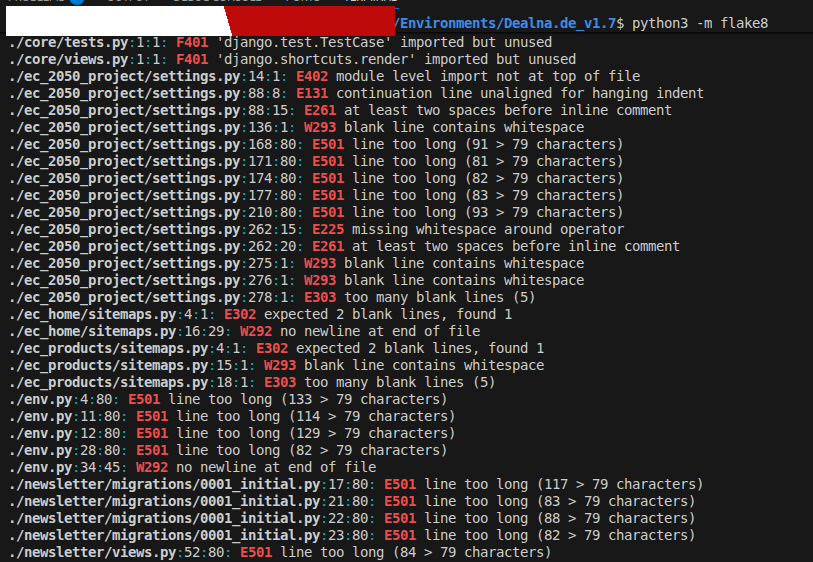


All issues were subsequently resolved, and a final validation confirmed that the project passed `flake8` checks with **no remaining Python errors**.

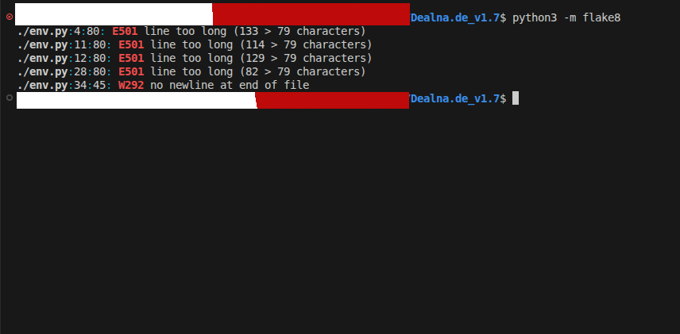


[Back to top](<#contents>)
</details>
 


---

### **Key Takeaways**:
- Validation errors often arise from using non-standard attributes or incorrect syntax.
- Use `data-*` attributes for custom data to comply with HTML5 standards.
- Shift layout and styling tasks to CSS for better maintainability and validation compliance.
- Regularly test your HTML with validators to ensure quality, accessibility, and browser compatibility. 

 

 

 


 
 


## Getting Started:

To set up **Dealna.de v1.7** locally for development or testing purposes, follow these steps:

1. Clone this repository to your local machine.
2. Create a virtual environment and install the dependencies using:
   ```
   pip install -r requirements.txt
   ```
3. Set up the PostgreSQL database and configure environment variables in `.env` (use `.env.example` for reference).
4. Run migrations:
   ```
   python manage.py migrate
   ```
5. Create a superuser:
   ```
   python manage.py createsuperuser
   ```
6. Start the Django development server:
   ```
   python manage.py runserver
   ```
7. Access the site locally at [http://localhost:8000](http://localhost:8000).


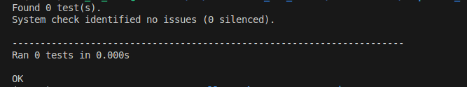


 
##  Deployment

The **live Dealna.de v1.7** app is hosted on [Heroku](https://dealna-de-v1-7-48a0c9a14b06.herokuapp.com/).
Static files are served via **WhiteNoise** (locally) and **AWS S3** (production) for media assets.

---

### 🔹 Step 1: Create a Heroku App

1. Log in to [Heroku Dashboard](https://dashboard.heroku.com/).
2. Click **New → Create new app**.
3. Enter a **unique app name** and select **Europe (EU)** region.
4. Click **Create App**.

---

### 🔹 Step 2: Add Environment Variables

Add these **Config Vars** in Heroku → **Settings → Reveal Config Vars**:

| Key                       | Value                         |
| ------------------------- | ----------------------------- |
| `SECRET_KEY`              | Django secret key             |
| `DEBUG`                   | `False`                       |
| `AWS_ACCESS_KEY_ID`       | Your AWS access key           |
| `AWS_SECRET_ACCESS_KEY`   | Your AWS secret key           |
| `AWS_STORAGE_BUCKET_NAME` | `dealna-de-v1-3-bucket`       |
| `DATABASE_URL`            | Heroku Postgres database URL  |
| `STRIPE_PUBLIC_KEY`       | Stripe publishable key        |
| `STRIPE_SECRET_KEY`       | Stripe secret key             |
| `STRIPE_WH_SECRET`        | Stripe webhook signing secret |
| `EMAIL_HOST_USER`         | Gmail address                 |
| `EMAIL_HOST_PASS`         | Gmail app password            |

**Sample `env.py`:**

```python
import os

# AWS S3
os.environ.setdefault("AWS_ACCESS_KEY_ID", "your-aws-access-key")
os.environ.setdefault("AWS_SECRET_ACCESS_KEY", "your-aws-secret-access-key")
os.environ.setdefault("AWS_STORAGE_BUCKET_NAME", "dealna-de-v1-3-bucket")

# Django & Deployment
os.environ.setdefault("SECRET_KEY", "your-django-secret-key")
os.environ.setdefault("DEBUG", "False")

# Stripe
os.environ.setdefault("STRIPE_PUBLIC_KEY", "your-stripe-public-key")
os.environ.setdefault("STRIPE_SECRET_KEY", "your-stripe-secret-key")
os.environ.setdefault("STRIPE_WH_SECRET", "your-stripe-webhook-secret")

# Gmail
os.environ.setdefault("EMAIL_HOST_USER", "your-email@gmail.com")
os.environ.setdefault("EMAIL_HOST_PASS", "your-gmail-app-password")
```

---

### 🔹 Step 3: AWS S3 Bucket Configuration

In your Django `settings.py`:

```python
# Bucket Config
AWS_STORAGE_BUCKET_NAME = "dealna-de-v1-3-bucket"
AWS_S3_REGION_NAME = "eu-north-1"
AWS_ACCESS_KEY_ID = os.environ.get("AWS_ACCESS_KEY_ID")
AWS_SECRET_ACCESS_KEY = os.environ.get("AWS_SECRET_ACCESS_KEY")
AWS_S3_CUSTOM_DOMAIN = (
    f"{AWS_STORAGE_BUCKET_NAME}.s3.{AWS_S3_REGION_NAME}.amazonaws.com"
)

# Static and media files
STATICFILES_STORAGE = "custom_storages.StaticStorage"
STATICFILES_LOCATION = "static"
DEFAULT_FILE_STORAGE = "custom_storages.MediaStorage"
MEDIAFILES_LOCATION = "media"

# Override static and media URLs in production
STATIC_URL = f"https://{AWS_S3_CUSTOM_DOMAIN}/{STATICFILES_LOCATION}/"
MEDIA_URL = f"https://{AWS_S3_CUSTOM_DOMAIN}/{MEDIAFILES_LOCATION}/"
```

This ensures **media files** (product images, user uploads) are stored and served from AWS S3, while **static files** can also be served via custom storage or WhiteNoise.

---

### 🔹 Step 4: Prepare Project for Deployment

1. Ensure **`requirements.txt`** and **`Procfile`** exist in the project root.
2. Specify Python version in **`.python-version`**:

```bash
echo 3.12 > .python-version
```

3. Procfile content:

```bash
echo web: gunicorn dealna.wsgi > Procfile
```

4. Add **WhiteNoise** middleware in `settings.py` for static files:

```python
MIDDLEWARE = [
    'django.middleware.security.SecurityMiddleware',
    'whitenoise.middleware.WhiteNoiseMiddleware',
    # Other middleware...
]
```

---

### 🔹 Step 5: Deploy to Heroku

* Link Heroku to your GitHub repository.
* Enable **Automatic Deploys** from the `main` branch.
* Click **Deploy Branch** for initial deployment.
* Run migrations and collect static files:

```bash
heroku run python manage.py migrate
heroku run python manage.py collectstatic
```

---

### 🔹 Step 6: Stripe Payments & Webhooks

* Add **Stripe API keys** to `env.py` and Heroku.
* Set up **Stripe Webhooks** for order confirmations.
* Keys stored securely in environment variables.

---

### 🔹 Step 7: Gmail Notifications

* Enable **App Passwords** for Gmail.
* Add credentials to `env.py` and Heroku to send automated emails (order confirmations, receipts).

---

### 🔹 Step 8: Access the App

* GitHub Repository: [Dealna.de v1.4](https://github.com/MohamedMesto/Dealna.de_v1.4)
* Live Site: [Dealna.de v1.7](https://dealna-de-v1-7-48a0c9a14b06.herokuapp.com/)

---

 **Notes:**

* Static files: served via **WhiteNoise**
* Media files: served via **AWS S3**
* Stripe handles all secure online payments
* Gmail API handles automatic emails
* Local and deployed versions are functionally identical

 
# Dealna ([Live site](https://dealna-de-v1-7-48a0c9a14b06.herokuapp.com))

 

Dealna — Project Overview & Rationale

Dealna is an elegant and fully responsive e-commerce web application designed for a modern, health-conscious bakery brand. The project aims to provide users with a seamless online shopping experience for artisanal baked goods, catering to individuals who value convenience, quality, and transparency in what they consume.

The website offers a clean and intuitive interface where users can browse through products, view detailed descriptions, add items to their shopping bag, and complete secure checkouts. Beyond shopping, Dealna integrates features such as newsletter subscriptions, FAQs, and a contact page to help build customer trust and engagement — reflecting the kind of holistic customer experience real businesses need.

Project Goals

The main goal of Dealna is to demonstrate the design and development of a fully functional, responsive, and user-friendly online store using Django and Bootstrap, with secure authentication, Stripe payment integration, and backend management for products and orders.
It also seeks to model how small local businesses can expand their reach through digital transformation — taking a neighborhood bakery and giving it a professional online presence.

Target Audience

Dealna is aimed at:

Everyday consumers looking for healthy, fresh, and locally made baked goods.

Small business owners or bakers exploring e-commerce as a way to scale their businesses.

Students and developers interested in learning modern web development, UX design, and full-stack architecture through a real-world concept.

Why This Project (Rationale)

I chose to create Dealna because food, particularly artisan baking, connects people on a personal and emotional level. During recent years, more consumers have shifted toward online purchasing — even for traditionally local products like bread and pastries. This inspired me to build a platform that blends the warmth of a neighborhood bakery with the convenience of modern e-commerce.

It combines backend logic (Django), frontend design (HTML, CSS, Bootstrap), third-party integrations (Stripe, email verification), and real-world business logic — making it creatively fulfilling.

Ultimately, Dealna isn’t just an online bakery — it’s a digital experience built to show how thoughtful design and solid engineering can make even the simplest daily pleasures more accessible and enjoyable.


   

## UX

### The 5 Planes of UX

#### 1. Strategy

**Purpose**
- Deliver a seamless and visually appealing e-commerce experience for customers to browse, filter, and purchase baked goods.

- Empower bakery owners to manage their store, products, and orders efficiently through a secure and user-friendly system.

**Primary User Needs**
- Guest Users — browse, view, and purchase products easily without needing an account.

- Registered Users — sign up, log in, view order history, and manage account details effortlessly.

- Store Owners / Admins — maintain product listings, monitor sales, and manage orders in the Django admin interface.

**Business Goals**
- Increase online sales and brand awareness for the bakery.

- Build customer loyalty through accounts, order history, and newsletter engagement.

- Maintain an accurate, scalable inventory management system and secure payment workflow.

The Strategy Plane defines the core goals of the project, the target audience, and the business and marketing foundations on which the Dealna e-commerce platform is built.


#### 1.1 Business Model

**Overview**
- Dealna Bakery operates as a Business-to-Consumer (B2C) online store serving customers in Berlin.
- The website offers handmade cakes, pastries and snacks available for online purchase with secure checkout via Stripe.

**Value Proposition**
- High-quality handmade bakery products.
- Convenient online ordering and fast checkout.
- Mobile-first responsive design for all devices.

**Revenue Model**
- Direct product sales.
- Seasonal promotions and special edition products.
- Upselling premium or larger-size items.

**Customer Base**
- Local Berlin customers looking for convenient bakery ordering.
- Shoppers seeking customised cakes and fresh pastries.

**Fulfilment**
- In-store pickup available.
- Local delivery planned as a future enhancement.

#### 1.2 Marketing Strategy

**Search Engine Optimisation (SEO)**
- Meta titles and meta descriptions added across the site.
- Semantic and clean HTML structure for improved crawlability.
- Alt text applied to all product images.
- Sitemap and robots.txt included.
- Fast image delivery using Cloudinary.
- Mobile-first responsive layout for improved ranking.

**Newsletter and Email Marketing**
- Users can subscribe using the newsletter signup form.
- New subscribers may receive discount codes.
- Secure unsubscribe process using unique tokens.
- Future improvements include automated welcome emails and personalised product suggestions.

**Social Media Marketing (Planned)**
- Instagram for product photos, stories and short videos.
- TikTok and YouTube Shorts for behind-the-scenes baking content.
- Facebook for sharing seasonal promotions.
- Potential collaborations with local Berlin food influencers.

**Promotions and Discounts**
- Discount codes available for campaigns and special offers.
- Seasonal and event-based promotions.
- Bundled product offers for increased sales.
- Planned loyalty rewards programme for returning users.

**Trust Signals**
- Professional product photography used across the site.
- Secure payment processing through Stripe.
- Clear terms, privacy and returns policies.
- Consistent and trustworthy brand identity.
- Planned customer reviews and ratings system.

**Content Marketing (Planned)**
- Baking tips and helpful articles.
- Ingredient insights and product stories.
- Behind-the-scenes content.
- Celebration and event planning ideas.

**Analytics and Insights**
- Planned Google Analytics integration.
- Cookie-free traffic insights.
- Conversion tracking and funnel analysis.
- Future tracking of abandoned carts and user behaviour.
 


#### 1. Scope

**[Features](#features)** (see below)

**Content Requirements**
- Product listings with name, image, price, and description.

- Shopping bag and checkout functionality with quantity updates. Guests can add items to the shopping bag and are prompted to log in when they reach the secure checkout page. After logging in, the items in the bag can remain available, and the logged-in user can proceed to checkout.

- Secure payment processing via Stripe.

- User authentication system with email verification.

- Order confirmation and email notifications.

- Newsletter subscription and contact forms.

- FAQ section and custom 404 error page.

- Fully responsive design optimized for all devices.
 

  
  
  
### CRUD Functionality

Dealna includes full Create, Read, Update and Delete (CRUD) functionality across several features of the site. The tables below outline how CRUD is implemented in each relevant area of the project.

---

### Products (Admin Only)

| Operation | Description | Access |
|----------|-------------|--------|
| Create | Admin users can add new products through the Django admin panel. | Admin |
| Read | All users can browse and view all products and their details. | All users |
| Update | Admin users can edit product information, prices and images. | Admin |
| Delete | Admin users can delete products from the catalogue. | Admin |

---

### Shopping Bag

| Operation | Description | Access |
|----------|-------------|--------|
| Create | Users can add products to the shopping bag. Items are stored in session or in the database for logged-in users. | All users |
| Read | Users can view their bag contents at any time. | All users |
| Update | Users can adjust product quantities directly in the bag. | All users |
| Delete | Users can remove items from the shopping bag. | All users |

---

### Checkout and Orders

| Operation | Description | Access |
|----------|-------------|--------|
| Create | Orders are created after successful checkout and payment. | All users |
| Read | Authenticated users can view their order history in their profile. | Registered users |
| Update | Users can update and save delivery details to their profile. | Registered users |
| Delete | Orders are not deleted to preserve transaction integrity. | Not applicable |

---

### User Profiles

| Operation | Description | Access |
|----------|-------------|--------|
| Create | User profiles are automatically generated upon registration. | Registered users |
| Read | Users can view their saved profile details and order history. | Registered users |
| Update | Users can update delivery and profile information. | Registered users |
| Delete | Profile deletion is handled manually (upon request) for GDPR compliance. | Admin |

---

### Newsletter Subscriptions

| Operation | Description | Access |
|----------|-------------|--------|
| Create | Users can subscribe to the newsletter. | All users |
| Read | Admin can view subscriber lists in the Django admin panel. | Admin |
| Update | Not applicable (email addresses cannot be edited). | Not applicable |
| Delete | Users can unsubscribe using a secure tokenised link. | All users |

---

### FAQs (Admin Only)

| Operation | Description | Access |
|----------|-------------|--------|
| Create | Admin users can create new FAQ entries. | Admin |
| Read | Users can view all FAQs on the FAQ page. | All users |
| Update | Admin users can edit existing FAQ entries. | Admin |
| Delete | Admin users can delete FAQs. | Admin |
---


### Future Features

-  **Social Login Integration**: Allow new users to sign in using Google or GitHub, removing the need to create a separate password and making the login process faster and more convenient.

-   **Product Reviews & Ratings**: Allow customers to leave reviews and rate baked goods, helping others make informed choices. Admins will have the ability to approve or remove reviews.

-   **Wishlist Functionality**: Enable registered users to save favorite products to a wishlist for future purchases.

 -   **Discount Codes & Promotions**: Allow admins to create and manage promotional discount codes for marketing campaigns or special events.

-   **Product Recommendations**: Suggest similar or complementary baked goods based on customer browsing and purchase history.

-   **Loyalty Program**: Introduce a reward system where users earn points for purchases that can be redeemed for discounts.

-   **Product Inventory Alerts**: Notify users when out-of-stock items become available again.

 -   **Social Media Integration**: Allow users to share products directly to social platforms such as Instagram or Facebook to boost engagement.

-   **Shipping Tracking Integration**: Include real-time delivery tracking details within order history.

-   **Admin Analytics Dashboard**: Provide the store owner with an overview of sales data, top-performing products, and user engagement metrics.

 -   **Wishlist Reminder Emails**: Send gentle reminders to users when their wishlist items go on sale or are back in stock.
 
 

### MoSCoW Prioritization

I've decomposed my Epics into User Stories for prioritizing and implementing them. Using this approach, I was able to apply "MoSCoW" prioritization and labels to my User Stories within the Issues tab.

- **Must Have**: guaranteed to be delivered 
- **Should Have**: adds significant value 
- **Could Have**: has small impact if left out
- **Won't Have**: not a priority for this iteration - future features

## Ecommerce Business Model

This site sells goods to individual customers, and therefore follows a **Business to Customer** model. It is of the simplest **B2C** forms, as it focuses on individual transactions, and doesn't need anything such as monthly/annual subscriptions.

It is still in its early development stages, although it already has a newsletter, and links for social media marketing.

Social media can potentially build a community of users around the business, and boost site visitor numbers, especially when using larger platforms such a Facebook.

A newsletter list can be used by the business to send regular messages to site users. For example, what items are on special offer, new items in stock, updates to business hours, notifications of events, and much more!

 

 
 

### Robots

I've created the [robots.txt](robots.txt) file at the root-level. Inside, I've included the default settings:

```txt
User-agent: *
Disallow:
Allow: /
Sitemap: https://dealna-de-v1-7-48a0c9a14b06.herokuapp.com/sitemap.xml
```

 
### Newsletter Marketing

I have incorporated a newsletter sign-up form on my application, to allow users to supply their email address if they are interested in learning more. 

**Custom Django Model Newsletter**

📬 Newsletter Feature Implementation -- Dealna Website
------------------------------------------------------

To fulfill the project requirement of including a **newsletter system** and implementing **at least three custom models**, a dedicated app called `newsletter` was created within the Django project.

### 🔧 Step-by-Step Implementation

#### 1\. **Creating the Newsletter App**

A custom Django app named `newsletter` was generated using:

`python manage.py startapp newsletter`

This separates newsletter-related functionality from other parts of the site and keeps the project modular.

#### 2\. **Defining the Custom Model**

Inside the `models.py` of the `newsletter` app, a `Newsletter` model was created with a single field --- `email`. This is the only field required for users to subscribe.

`# newsletter/models.py

from django.db import models

class Newsletter(models.Model):
    email = models.EmailField(unique=True, null=False, blank=False)

    def __str__(self):
        return self.email`

-   The `email` field is **unique**, ensuring that the same email address cannot subscribe more than once.

-   The `__str__` method allows for a readable display of emails in the admin panel.

This model counts as **one of the three required custom models** for the full-stack milestone project.

#### 3\. **Admin Configuration**

To manage subscriptions via the Django admin:

`# newsletter/admin.py

from django.contrib import admin
from .models import Newsletter

admin.site.register(Newsletter)`

This allows site admins to view, add, or delete newsletter entries from the backend.

#### 4\. **Newsletter Form & Frontend Integration**

A basic form was created using Django's `ModelForm`, allowing users to subscribe by submitting their email from a public-facing newsletter page.

The form was added to a `newsletter.html` template linked in the navigation bar, clearly visible to users.

#### 5\. **Sending Emails (Optional Enhancement)**

The `send_mail()` function --- similar to the one used in `webhook_handler.py` for Stripe confirmations --- can be used to notify all newsletter subscribers whenever a **new product** is added.

This would look something like:

`from django.core.mail import send_mail
from .models import Newsletter

def notify_subscribers(product):
    subscribers = Newsletter.objects.all()
    for subscriber in subscribers:
        send_mail(
            subject=f"New Product: {product.name}",
            message=f"Check out our newest product: {product.name} at {product.get_absolute_url()}",
            from_email="noreply@Dealna.de",
            recipient_list=[subscriber.email],
            fail_silently=False,
        )`

> This approach enhances user engagement and builds a customer base over time.


 
## Deployment

The live deployed application can be found deployed on [Heroku](https://dealna-de-v1-7-48a0c9a14b06.herokuapp.com/).
On Heroku, static files are served using WhiteNoise and media files are served via Cloudinary. No functional differences exist between development and deployment.

### Heroku Deployment


To deploy my **Dealna** Django website, I used [**Heroku**](https://www.heroku.com), a **cloud-based Platform as a Service (PaaS)** that simplifies deployment and hosting of web applications. It allows me to run the app entirely in the cloud without managing servers manually.

### 🔧 Step-by-Step Deployment

After creating my Heroku account, here's how I deployed the project:

* * * * *

### 1\. **Create a New Heroku App**

-   I logged into the Heroku Dashboard, clicked **New** (top right), and selected **Create new app**.

-   I gave the app a **unique name** (`dealna-de-v1-7` in my case), chose **Europe (EU)** as the region (since I'm based in Germany), and clicked **Create App**.

* * * * *

### 2\. **Set Environment Variables**

-   In the app dashboard, I navigated to **Settings > Reveal Config Vars**.

-   I manually added the same environment variables from my local `env.py` file, such as:

    -   `SECRET_KEY`

    -   `DEBUG = False`

    -   `CLOUDINARY_CLOUD_NAME`, `CLOUDINARY_API_KEY`, `CLOUDINARY_API_SECRET`

    -   `STRIPE_PUBLIC_KEY`, `STRIPE_SECRET_KEY`, etc.

    -   `DATABASE_URL` (automatically added by Heroku Postgres)

* * * * *

### 3\. **Prepare for Deployment**

-   I pushed my code to GitHub, ensuring the `Procfile`, `requirements.txt` were included in the repo.

-   In the **Deploy** tab of the Heroku dashboard, I:

    -   Linked the Heroku app to my GitHub repo.

    -   Enabled **Automatic Deploys** (so each push to main redeploys the app).

    -   Clicked **Deploy Branch** for the first-time manual deploy.

* * * * *

### 4\. **Final Touches**

-   After deployment, I ran the following from the **Heroku CLI** (or manually via the dashboard):

    `heroku run python manage.py migrate
    heroku run python manage.py collectstatic`

-   I also set up **Heroku Postgres** (as the production database) and **Cloudinary** for static/media files.

| Key | Value |
| --- | --- |
| `CLOUDINARY_CLOUD_NAME`     | your-cloudinary-cloud-name                 |
| `CLOUDINARY_API_KEY`        | your-cloudinary-api-key                    |
| `CLOUDINARY_API_SECRET`     | your-cloudinary-api-secret                |
| `DATABASE_URL` | user-inserts-own-postgres-database-url |
| `DISABLE_COLLECTSTATIC` | 1 (*this is temporary, and can be removed for the final deployment*) |
| `EMAIL_HOST_PASS` | user-inserts-own-gmail-api-key |
| `EMAIL_HOST_USER` | user-inserts-own-gmail-email-address |
| `SECRET_KEY` | any-random-secret-key |
| `STRIPE_PUBLIC_KEY` | user-inserts-own-stripe-public-key |
| `STRIPE_SECRET_KEY` | user-inserts-own-stripe-secret-key |
| `STRIPE_WH_SECRET` | user-inserts-own-stripe-webhook-secret |

Heroku needs some additional files in order to deploy properly.

- [requirements.txt](requirements.txt)
- [Procfile](Procfile)
- [.python-version](.python-version)

Requirements & Deployment Configuration (Steps I Took)

To prepare my Dealna project for deployment on Heroku, I followed these steps:

1. ✅ Installed Project Requirements

I used the provided requirements.txt file to install all necessary dependencies locally:

pip3 install -r requirements.txt


If I installed new packages during development, I updated the file using:

pip3 freeze --local > requirements.txt


This ensured Heroku had all the packages needed for a successful build.

2. ✅ Created the Procfile

To tell Heroku how to run the app, I created a Procfile at the root of mRequirements & Deployment Configuration (Steps I Took)
-------------------------------------------------------

To prepare my Dealna project for deployment on **Heroku**, I followed these steps:

* * * * *

### 1\. ✅ Installed Project Requirements

I used the provided `requirements.txt` file to install all necessary dependencies locally:

`pip3 install -r requirements.txt`

If I installed new packages during development, I updated the file using:

`pip3 freeze --local > requirements.txt`

This ensured Heroku had all the packages needed for a successful build.

* * * * *

### 2\. ✅ Created the Procfile

To tell Heroku how to run the app, I created a `Procfile` at the root of my project:

`echo web: gunicorn Dealna.wsgi > Procfile`

> In my case, the main Django app is called `Dealna`, so I used `Dealna.wsgi`.

* * * * *

### 3\. ✅ Specified the Python Version

To ensure Heroku used the correct Python version, I created a file called `.python-version` with the following:

`3.12`

This matches the Python version I used locally and helps avoid compatibility issues.

* * * * *

### 4\. 🚀 Deployed to Heroku

After pushing my code to GitHub, I went to my Heroku app dashboard and:

-   Connected my Heroku app to the GitHub repository.

-   Enabled **Automatic Deployment** from the `main` branch, so every push redeploys the site.

-   Clicked **Deploy Branch** once for the initial deploy.

After deployment, I ran:

`heroku run python manage.py migrate
heroku run python manage.py collectstatic`

This completed the database setup and prepared static files for production.y project:

echo web: gunicorn Dealna.wsgi > Procfile


In my case, the main Django app is called Dealna, so I used Dealna.wsgi.

3. ✅ Specified the Python Version

To ensure Heroku used the correct Python version, I created a file called .python-version with the following:

3.12


This matches the Python version I used locally and helps avoid compatibility issues.

4. 🚀 Deployed to Heroku

After pushing my code to GitHub, I went to my Heroku app dashboard and:

Connected my Heroku app to the GitHub repository.

Enabled Automatic Deployment from the main branch, so every push redeploys the site.

Clicked Deploy Branch once for the initial deploy.

After deployment, I ran:

heroku run python manage.py migrate
heroku run python manage.py collectstatic


This completed the database setup and prepared static files for production.

The project could now be connected and deployed to Heroku!

**DEBUG Configuration**

To meet Code Institute requirements, `DEBUG = False` is always enforced in production.  

 

### PostgreSQL

Database – PostgreSQL (Code Institute)

For the Dealna website, I used the Code Institute PostgreSQL Database
 as the relational database, connected through Django.
This database was ideal for development and deployment since it integrates smoothly with Heroku.

How I Set It Up

I visited the CI PostgreSQL Database page
 and submitted my email address.

I received an email with my database credentials and a connection URL similar to this:

postgres://<db_username>:<db_password>@<db_host>/<db_name>


I then copied this full database URL into:

My local env.py file, and

My Heroku Config Vars under the key DATABASE_URL.

This connected my Django application to the hosted PostgreSQL database, allowing all my data — such as users, orders, products, and newsletter subscriptions — to be stored safely online.

Note: Code Institute databases are only for CI students and have a limited lifespan (max 8 per student, up to 18 months).
For future production, I plan to migrate to a personal PostgreSQL instance (e.g., via Render or ElephantSQL).

### Stripe API (Payments Integration)

For processing secure online payments, I integrated Stripe
 into the Dealna website.
Stripe handles all transactions during checkout, ensuring encrypted and verified payment processing.

Steps I Took

I created a Stripe account, logged into the dashboard, and retrieved the test API keys:

STRIPE_PUBLIC_KEY → starts with pk_

STRIPE_SECRET_KEY → starts with sk_

I added both keys to:

My local env.py file

My Heroku Config Vars

I set up Stripe Webhooks to handle order confirmation events (in case users close the payment window early):

From the Stripe dashboard → Developers → Webhooks → Add Endpoint

Added:

https://dealna-de-v1-7-48a0c9a14b06.herokuapp.com/ec_checkout/wh/


Selected “Receive all events”

Copied the Signing Secret as:

STRIPE_WH_SECRET


All these keys are stored securely as environment variables. Stripe now automatically handles checkout, payment confirmation, and order success for customers.

### Gmail API (Email Notifications)

To send confirmation emails to customers after successful purchases, I integrated Gmail’s SMTP service
.

How I Configured It

I enabled 2-Step Verification for my Gmail account.

Under Google Account → Security → App Passwords, I generated a 16-character app password.

I used these two environment variables in my project:

EMAIL_HOST_USER = myemail@gmail.com
EMAIL_HOST_PASS = <16-character-app-password>


These were added to both env.py and Heroku Config Vars.

This setup allowed the site to automatically send:

Order confirmation emails

Stripe payment receipts

Future newsletter subscription confirmations

### WhiteNoise Static File Handling

Since Heroku doesn’t persist static files, I used WhiteNoise
 to serve static assets (CSS, JS) efficiently during deployment.

✅ Steps I Followed

Installed WhiteNoise:

pip install whitenoise


Updated the requirements.txt file:

pip freeze --local > requirements.txt


Added WhiteNoise middleware in settings.py:

MIDDLEWARE = [
    'django.middleware.security.SecurityMiddleware',
    'whitenoise.middleware.WhiteNoiseMiddleware',
    # Other middleware below
]


Ran:

python manage.py collectstatic


WhiteNoise ensures my static files (Bootstrap, CSS, JS) load instantly on Heroku even without external storage.

### Local Development

This project can be cloned or forked in order to make a local copy on your own system.

For either method, you will need to install any applicable packages found within the [requirements.txt](requirements.txt) file.

- `pip3 install -r requirements.txt`.

You will need to create a new file called `env.py` at the root-level, and include the same environment variables listed above from the Heroku deployment steps.


I created a file called env.py in the project root to store my environment variables (same as Heroku Config Vars).

Note:
The values in env.py (Stripe keys, Cloudinary URL, Database URL, etc.) are unique to my project and must be replaced with your own if you clone this repository.

✅ Summary of Environment Variables Used

Variable	Description
SECRET_KEY	Django secret key
DATABASE_URL	PostgreSQL connection URL
CLOUDINARY_URL	Cloudinary media storage
STRIPE_PUBLIC_KEY	Stripe publishable key
STRIPE_SECRET_KEY	Stripe secret key
STRIPE_WH_SECRET	Stripe webhook signing secret
EMAIL_HOST_USER	Gmail address
EMAIL_HOST_PASS	Gmail app password


Sample `env.py` file:

```python
import os

os.environ.setdefault("CLOUDINARY_URL", "cloudinary://<your_api_key>:<your_api_secret>@<your_cloud_name>")
os.environ.setdefault("DATABASE_URL", "user-inserts-own-postgres-database-url")
os.environ.setdefault("EMAIL_HOST_PASS", "user-inserts-own-gmail-host-api-key")
os.environ.setdefault("EMAIL_HOST_USER", "user-inserts-own-gmail-email-address")
os.environ.setdefault("SECRET_KEY", "any-random-secret-key")
os.environ.setdefault("STRIPE_PUBLIC_KEY", "user-inserts-own-stripe-public-key")
os.environ.setdefault("STRIPE_SECRET_KEY", "user-inserts-own-stripe-secret-key")
os.environ.setdefault("STRIPE_WH_SECRET", "user-inserts-own-stripe-webhook-secret")  # only if using Stripe Webhooks

# local environment only (not to include these in production/deployment!)
os.environ.setdefault("DEBUG", "True")
os.environ.setdefault("DEVELOPMENT", "True")
```

Once the project is cloned or forked, in order to run it locally, you'll need to follow these steps:

- Start the Django app: `python3 manage.py runserver`
- Stop the app once it's loaded: `CTRL+C` (*Windows/Linux*) or `⌘+C` (*Mac*)
- Make any necessary migrations: `python3 manage.py makemigrations --dry-run` then `python3 manage.py makemigrations`
- Migrate the data to the database: `python3 manage.py migrate --plan` then `python3 manage.py migrate`
- Create a superuser: `python3 manage.py createsuperuser`
- Load fixtures (*if applicable*): `python3 manage.py loaddata file-name.json` (*repeat for each file*)
- Everything should be ready now, so run the Django app again: `python3 manage.py runserver`

If you'd like to backup your database models, use the following command for each model you'd like to create a fixture for:

- `python3 manage.py dumpdata your-model > your-model.json`
- *repeat this action for each model you wish to backup*
- **NOTE**: You should never make a backup of the default *admin* or *users* data with confidential information.

#### Cloning

You can clone the repository by following these steps:

1. Go to the [GitHub repository](https://www.github.com/mairima/Dealna).
2. Locate and click on the green "Code" button at the very top, above the commits and files.
3. Select whether you prefer to clone using "HTTPS", "SSH", or "GitHub CLI", and click the "copy" button to copy the URL to your clipboard.
4. Open "Git Bash" or "Terminal".
5. Change the current working directory to the location where you want the cloned directory.
6. In your IDE Terminal, type the following command to clone the repository:
   - `git clone https://github.com/MohamedMesto/Dealna.de_v1.4.git`
7. Press "Enter" to create your local clone.

 

#### Forking

By forking the GitHub Repository, you make a copy of the original repository on our GitHub account to view and/or make changes without affecting the original owner's repository. You can fork this repository by using the following steps:

1. Log in to GitHub and locate the [GitHub Repository](https://github.com/MohamedMesto/Dealna.de_v1.4).
2. At the top of the Repository, just below the "Settings" button on the menu, locate and click the "Fork" Button.
3. Once clicked, you should now have a copy of the original repository in your own GitHub account!

### Local VS Deployment

There are no remaining major differences between the local version when compared to the deployed version online.

## Credits

### Project Idea & Design

-   The overall concept for the **Dealna** website --- an online store for cakes, snacks, and drinks --- was **inspired by real-world artisanal bakeries** and food brands, as well as personal interest in African and homemade baked goods.

-   The design and UX structure, some code were inspired by the [Code Institute's Boutique Ado](https://github.com/Code-Institute-Solutions/boutique_ado_v1) e-commerce walkthrough project, but heavily customized in visuals, layout, and content.

### Content

This section lists all third-party resources, libraries, tools, and support I used while building the Dealna website. Every effort has been made to ensure correct attribution for code, media, and guidance received throughout the project.

| Source | Notes |
| --- | --- |
| [Markdown Builder](https://markdown.2bn.dev) | Help generating Markdown files |
| [Chris Beams](https://chris.beams.io/posts/git-commit) | "How to Write a Git Commit Message" |
| [Boutique Ado](https://codeinstitute.net) | Code Institute walkthrough project inspiration |
| [Bootstrap](https://getbootstrap.com) | Various components / responsive front-end framework |
| [Cloudinary](https://cloudinary.com) | Cloud-based storage and delivery for static and media files |
| [Whitenoise](https://whitenoise.readthedocs.io) | Static file service |
| [Stripe](https://docs.stripe.com/payments/elements) | Online payment services |
| [Gmail API](https://developers.google.com/gmail/api/guides) | Sending payment confirmation emails |
| [Python Tutor](https://pythontutor.com) | Additional Python help |
| [ChatGPT](https://chatgpt.com) | for AI-assisted content creation, some code ideas, wireframes, and image generation |

### Media

This section lists all third-party resources, libraries, tools, and support I used while building the Dealna website. Every effort has been made to ensure correct attribution for code, media, and guidance received throughout the project

- Images
| [Pexels](https://images.pexels.com/photos/416160/pexels-photo-416160.jpeg) | Hero image |

| Source | Notes |
| --- | --- |
| [favicon.io](https://favicon.io) | Generating the favicon |
| [Boutique Ado](https://codeinstitute.net) | Sample images provided from the walkthrough projects |
| [Font Awesome](https://fontawesome.com) | Icons used throughout the site |
| [Cloudinary](https://cloudinary.com) | Hosts and delivers all uploaded product images and media assets |
| [ChatGPT Image Generator](https://chat.openai.com) | colors |
| [Noris Readme](https://github.com/mairima/nourish) | Readme |

### Acknowledgements

Throughout the development of the Dealna project, I received support, encouragement, and guidance from various people and platforms — all of which played a valuable role in helping me grow as a developer.

This section is dedicated to recognizing and appreciating that support:

- I would like to thank God (Allah)
-  I would like to thank Code Institute, for the course structure, walkthrough projects (especially Boutique Ado), mentorship, and Slack community support throughout my Full Stack Software Developer journey.
- I would like to thank the the kind irish people.

- I would like to thank all Code Institute mentors,for the support throughout the development of this project.
- I would like to thank the [Code Institute](https://codeinstitute.net) Tutor Team for their assistance with troubleshooting and debugging some project issues.
- I would like to thank the [Code Institute Slack community](https://code-institute-room.slack.com) and [Code Institute Discord community](https://discord-portal.codeinstitute.net) for the moral support.
- I would like to thank my family.


You can view the live site here also: [Dealna.de For E-Commerce v1.7]( https://dealna-de-v1-7-48a0c9a14b06.herokuapp.com/).


 
