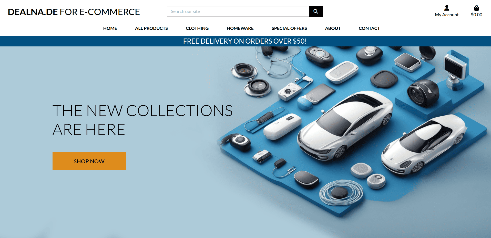
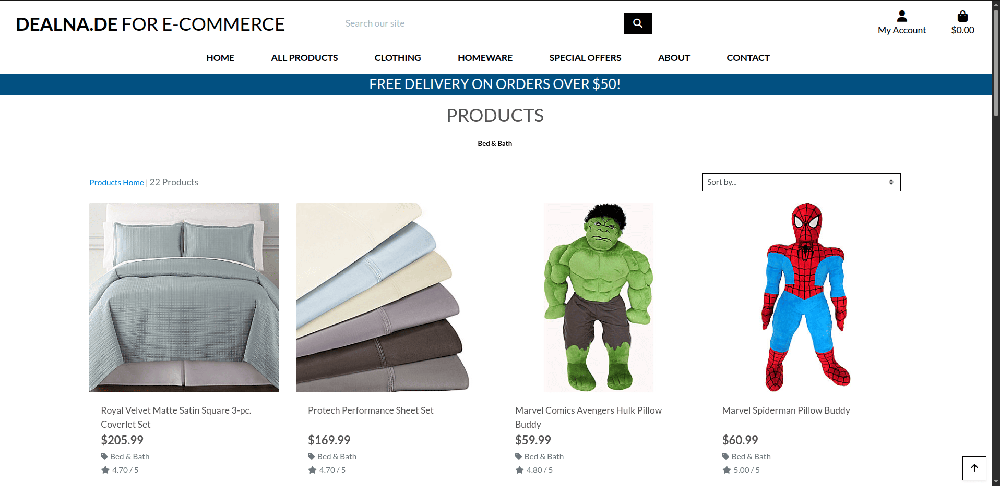
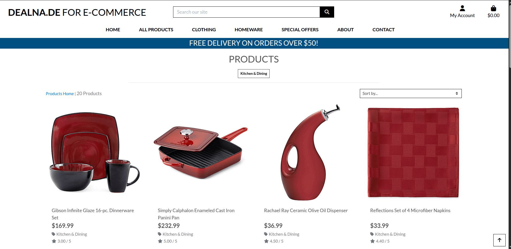
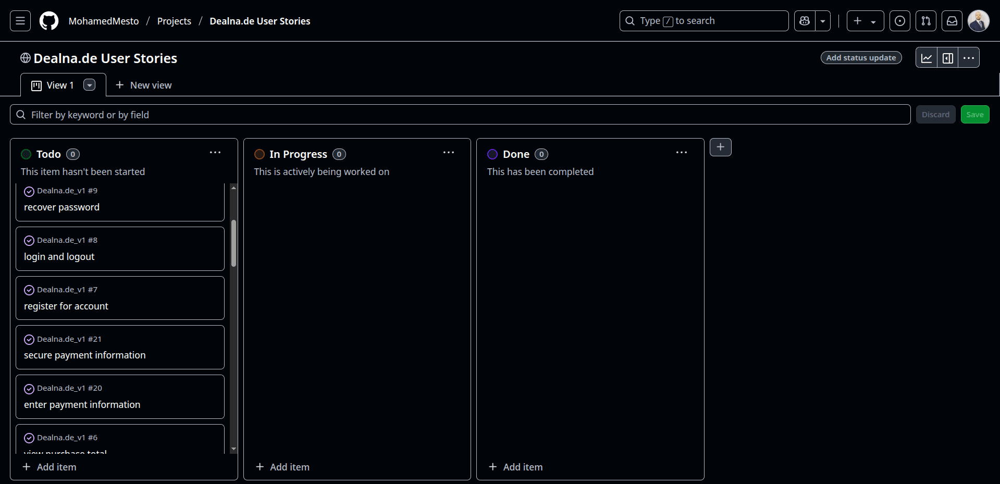
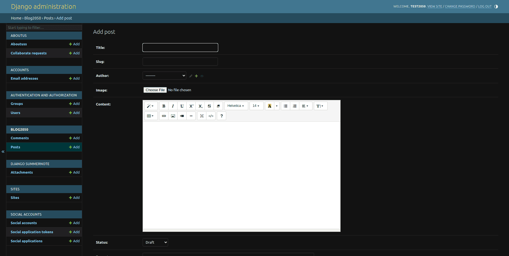
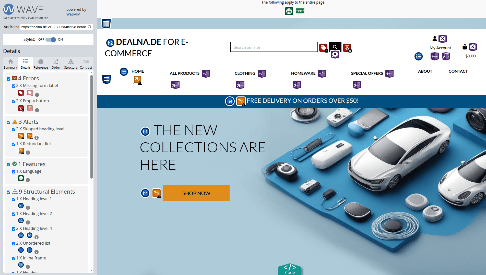
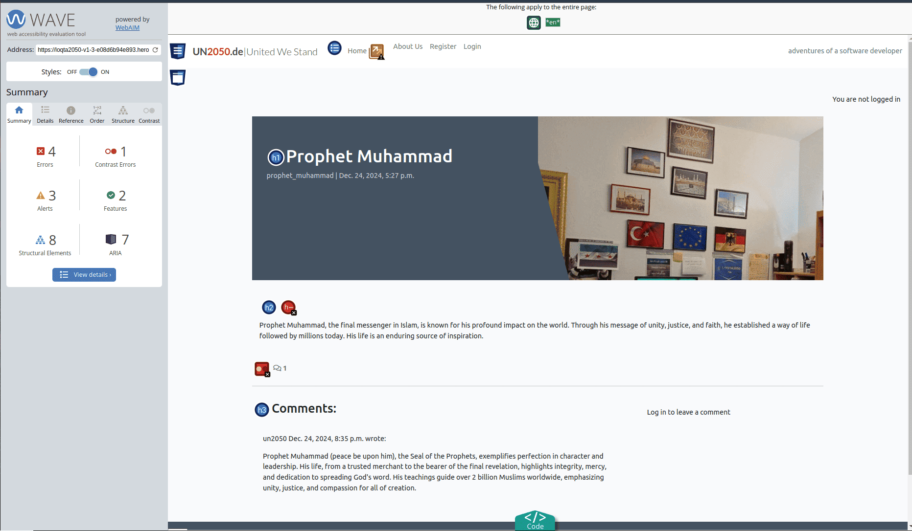
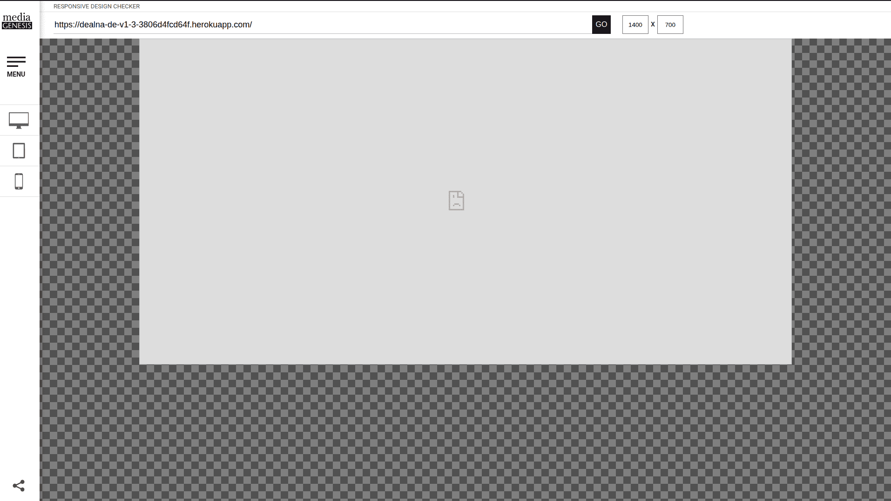
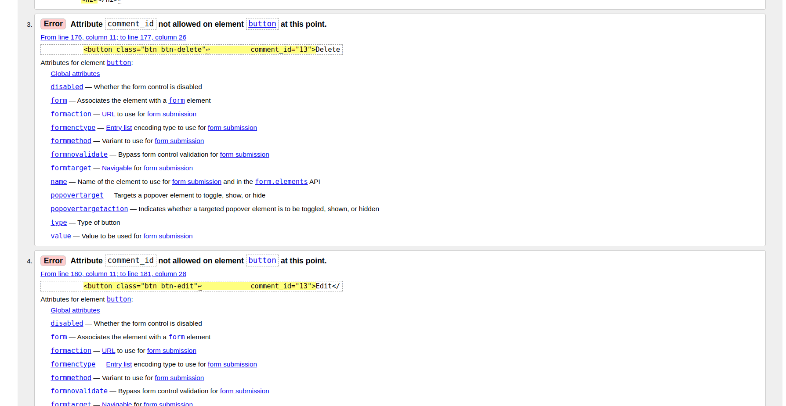

[](https://ec-platform-2050-v1-1e860717f359.herokuapp.com/)


  
---
[]( https://ec-platform-2050-v1-1e860717f359.herokuapp.com/)

 
[]( https://ec-platform-2050-v1-1e860717f359.herokuapp.com/)
 
[]( https://ec-platform-2050-v1-1e860717f359.herokuapp.com/)


[]( https://ec-platform-2050-v1-1e860717f359.herokuapp.com/)


---
 
# **_Loqta2050.com E-Commerce V1.0_**

## Loqta2050 E-Commerce V1.0 (Shop Smart, Live Better) - Portfolio Project 5 - Full Stack Toolkit Project.

**Loqta2050 E-Commerce V1.0:** A Gateway to Seamless Online Shopping  

The **Loqta2050 E-Commerce Platform** is designed to provide users with a modern, intuitive, and secure online shopping experience. Powered by Django, this dynamic platform delivers a seamless experience for browsing, purchasing, and managing products across diverse categories, reflecting a commitment to quality, reliability, and user satisfaction.

### A Platform for Smart Shopping  

At its core, **Loqta2050 E-Commerce V1.0** offers users a curated selection of products, from fashion and electronics to home goods and lifestyle essentials. The intuitive navigation and categorization make it easy for shoppers to discover products tailored to their needs. Each product listing includes detailed descriptions, high-quality images, and customer reviews, creating a sense of trust and connection between buyers and sellers.

### A User-Centric Experience  

The platform is designed with usability in mind, featuring:  
- **Dynamic Product Listings:** Easily browse products by category, price, or rating.  
- **Secure Checkout:** A seamless and secure payment process ensures a hassle-free shopping experience.  
- **Personalized Profiles:** Registered users can view order history, save payment information, and track deliveries.  
- **Mobile Responsiveness:** The site ensures accessibility across devices, making it convenient for users on the go.  

### A Tool for Informed Decisions  

By presenting detailed product information, customer reviews, and competitive pricing, **Loqta2050 E-Commerce V1.0** empowers users to make informed purchasing decisions. Whether shopping for everyday essentials or unique finds, users are encouraged to explore and engage with the platform, ensuring a satisfying shopping experience.

### Continuous Innovation and Growth  

The **Loqta2050 E-Commerce V1.0** reflects the iterative evolution of a robust platform. Features such as advanced search filters, personalized recommendations, and seamless social sharing are just the beginning of a roadmap aimed at enhancing the user experience. Each iteration is a step closer to making this platform a go-to destination for online shoppers worldwide.

### Conclusion  

In an era of rapid digital transformation, **Loqta2050 E-Commerce V1.0** stands out as a reliable and engaging online shopping destination. It goes beyond simply selling products; it fosters trust, inspires confidence, and creates connections among its users. The live site invites you to explore this vibrant e-commerce hub and experience the future of online shopping.

**You can view the live site here - [Loqta2050 E-Commerce V1.0](https://loqta2050.com).**  


---


**You can view the live site here - [Loqta2050.com For E-Commerce V1.0]( https://ec-platform-2050-v1-1e860717f359.herokuapp.com/).**  


---

[]( https://ec-platform-2050-v1-1e860717f359.herokuapp.com/)

--- 

[](https://loqta2050.com)

# Contents

- [**_Loqta2050.com E-Commerce V1.0_**](#loqta2050com-e-commerce-v10)
  - [Loqta2050 E-Commerce V1.0 (Shop Smart, Live Better) - Portfolio Project 5 - Full Stack Toolkit Project.](#loqta2050-e-commerce-v10-shop-smart-live-better---portfolio-project-5---full-stack-toolkit-project)
    - [A Platform for Smart Shopping](#a-platform-for-smart-shopping)
    - [A User-Centric Experience](#a-user-centric-experience)
    - [A Tool for Informed Decisions](#a-tool-for-informed-decisions)
    - [Continuous Innovation and Growth](#continuous-innovation-and-growth)
    - [Conclusion](#conclusion)
- [Contents](#contents)
  - [Purpose of the Project – **Loqta2050.com E-Commerce V1.0**](#purpose-of-the-project--loqta2050com-e-commerce-v10)
  - [User Stories:](#user-stories)
  - [**User Stories**](#user-stories-1)
    - [**As a Site User**:](#as-a-site-user)
    - [**As a Site Admin**:](#as-a-site-admin)
    - [**As a Site Owner**:](#as-a-site-owner)
    - [**As a Site Admin**:](#as-a-site-admin-1)
    - [**As a Site Owner**:](#as-a-site-owner-1)
  - [Site Structure](#site-structure)
  - [Design Choices](#design-choices)
    - [Colour Scheme](#colour-scheme)
    - [Typography](#typography)
  - [Features:](#features)
    - [Existing Features:](#existing-features)
    - [Future Features:](#future-features)
  - [Technologies Used](#technologies-used)
  - [Data Model:](#data-model)
  - [Testing:](#testing)
  - [Chrome Test](#chrome-test)
  - [Lighthouse Testing](#lighthouse-testing)
  - [Performance](#performance)
    - [Desktop lighthouse Performance](#desktop-lighthouse-performance)
    - [Mobile lighthouse Performance](#mobile-lighthouse-performance)
  - [Accessibility Testing](#accessibility-testing)
      - [Lighthouse Accessibility Testing](#lighthouse-accessibility-testing)
      - [WAVE Web Accessibility Evaluation Tool](#wave-web-accessibility-evaluation-tool)
    - [Fixing Accessibility issues:](#fixing-accessibility-issues)
    - [Adobe Color Accessibility Tool](#adobe-color-accessibility-tool)
  - [Responsive Testing](#responsive-testing)
      - [The Responsive Design Checker](#the-responsive-design-checker)
      - [The Viewport Resizer](#the-viewport-resizer)
    - [Manual Testing:](#manual-testing)
    - [Automated Unit Testing:](#automated-unit-testing)
    - [Running Tests:](#running-tests)
  - [Validator Testing - Bugs Fixed:](#validator-testing---bugs-fixed)
  - [HTML Validation](#html-validation)
    - [**Example 1: Invalid Attribute in an Element**](#example-1-invalid-attribute-in-an-element)
      - [**Error**:](#error)
      - [**Cause**:](#cause)
      - [**Fix**:](#fix)
      - [**Code Example**:](#code-example)
      - [**JavaScript Access**:](#javascript-access)
    - [**Example 2: Invalid Width Attribute Value**](#example-2-invalid-width-attribute-value)
      - [**Error**:](#error-1)
      - [**Cause**:](#cause-1)
      - [**Fix**:](#fix-1)
      - [**Code Example**:](#code-example-1)
    - [**Key Takeaways**:](#key-takeaways)
  - [CSS Validation](#css-validation)
  - [JS Validation](#js-validation)
    - [Fixes Applied](#fixes-applied)
  - [Py Validation](#py-validation)
  - [Getting Started:](#getting-started)
  - [Deployment:](#deployment)
  - [Credits](#credits)


## Purpose of the Project – **Loqta2050.com E-Commerce V1.0**  

The goal of **Loqta2050.com** is to create a modern, user-friendly e-commerce platform that offers a seamless shopping experience. Built with Django and PostgreSQL, this platform is designed to support a wide range of products, including electronics, clothing, homeware, and special offers.  

With features such as advanced search, secure checkout, product categorization, and personalized user accounts, **Loqta2050.com** aims to provide an intuitive and efficient marketplace for both buyers and sellers. Customers can easily browse, purchase, and track their orders, while vendors can manage their inventory and sales through a robust backend system.  

Whether you're a shopper looking for the best deals or a seller aiming to expand your reach, **Loqta2050.com** offers a powerful and scalable solution to meet your e-commerce needs.


## User Stories:


 
 
 
## **User Stories**

### **As a Site User**:  

1. **View Products List**  
   - *As a Shopper, I want to view a list of products so that I can select some to purchase and identify the price, description, and product rating.*  
   - **Acceptance Criteria**:  
     - The product list displays prices, descriptions, and ratings.  
     - Users can click on products to view more details.  
     - The list is paginated for easy navigation.

2. **View Product Details**  
   - *As a Shopper, I want to view individual product details so that I can see the product image and available sizes.*  
   - **Acceptance Criteria**:  
     - Product details page includes images, sizes, and descriptions.  
     - Users can zoom in on images.  
     - Available sizes are clearly marked.

3. **Identify Deals and Offers**  
   - *As a Shopper, I want to quickly identify deals, clearance items, and special offers so that I can take advantage of special savings on products I'd like to purchase.*  
   - **Acceptance Criteria**:  
     - Deals and special offers are highlighted on the homepage.  
     - Clearance items are marked with discounted prices.  
     - Users can filter products by deals and offers.

4. **View Purchase Total**  
   - *As a Shopper, I want to easily view the total of my purchases at any time so that I can avoid spending too much.*  
   - **Acceptance Criteria**:  
     - The shopping cart displays the total cost.  
     - Users can view the total before proceeding to checkout.  
     - The total updates automatically when items are added or removed.

5. **Register for Account**  
   - *As a Site User, I want to easily register for an account so that I can have a personal account and view my profile.*  
   - **Acceptance Criteria**:  
     - Registration form is simple and easy to complete.  
     - Users receive a confirmation email after registration.  
     - Users can log in immediately after registration.

6. **Login and Logout**  
   - *As a Site User, I want to easily log in or log out so that I can access my personal account information.*  
   - **Acceptance Criteria**:  
     - Login and logout buttons are easily accessible.  
     - Users are redirected to their profile after logging in.  
     - Session expires after a period of inactivity.

7. **Recover Password**  
   - *As a Site User, I want to easily recover my password in case I forget it so that I can recover access to my account.*  
   - **Acceptance Criteria**:  
     - Password recovery option is available on the login page.  
     - Users receive a password reset link via email.  
     - Users can set a new password after clicking the link.

8. **Email Confirmation After Registration**  
   - *As a Site User, I want to receive an email confirmation after registering so that I can verify that my account registration was successful.*  
   - **Acceptance Criteria**:  
     - Confirmation email is sent immediately after registration.  
     - Email contains a link to verify the account.  
     - Users cannot log in until the account is verified.

9. **Personalized User Profile**  
   - *As a Site User, I want to have a personalized user profile so that I can view my personal order history, order confirmations, and save my payment information.*  
   - **Acceptance Criteria**:  
     - Profile page displays order history and confirmations.  
     - Users can save and update payment information.  
     - Profile information is secure and private.

10. **Sort Product List**  
    - *As a Shopper, I want to sort the list of available products so that I can easily identify the best-rated, best-priced, and categorically sorted products.*  
    - **Acceptance Criteria**:  
      - Sorting options include price, rating, and category.  
      - Products are dynamically sorted based on user selection.  
      - Default sorting is by relevance.

11. **Sort Specific Category**  
    - *As a Shopper, I want to sort a specific category of product so that I can find the best-priced or best-rated product in a specific category, or sort the products in that category by name.*  
    - **Acceptance Criteria**:  
      - Users can select a category and apply sorting options.  
      - Sorting options include price, rating, and name.  
      - Products within the category are displayed accordingly.

12. **Sort Multiple Categories**  
    - *As a Shopper, I want to sort multiple categories of products simultaneously so that I can find the best-priced or best-rated products across broad categories, such as "clothing" or "homeware."*  
    - **Acceptance Criteria**:  
      - Users can select multiple categories and apply sorting.  
      - Sorting options include price and rating.  
      - Products from selected categories are displayed together.

13. **Search for Product**  
    - *As a Shopper, I want to search for a product by name or description so that I can find a specific product I'd like to purchase.*  
    - **Acceptance Criteria**:  
      - Search bar is easily accessible on all pages.  
      - Search results include products matching the name or description.  
      - Users can refine search results with filters.

14. **View Search Results**  
    - *As a Shopper, I want to easily see what I've searched for and the number of results so that I can quickly decide whether the product I want is available.*  
    - **Acceptance Criteria**:  
      - Search results display the search term and number of matches.  
      - Users can see a preview of products in the search results.  
      - No results message is displayed if no matches are found.

15. **Select Product Size and Quantity**  
    - *As a Shopper, I want to easily select the size and quantity of a product when purchasing it so that I can ensure I don't accidentally select the wrong product, quantity, or size.*  
    - **Acceptance Criteria**:  
      - Size and quantity options are clearly displayed.  
      - Users can adjust quantity before adding to the cart.  
      - Out-of-stock sizes are marked as unavailable.

16. **View Shopping Cart**  
    - *As a Shopper, I want to view items in my bag to be purchased so that I can identify the total cost of my purchase and all items I will receive.*  
    - **Acceptance Criteria**:  
      - Shopping cart displays all selected items and their details.  
      - Total cost is clearly displayed.  
      - Users can remove items from the cart.

17. **Adjust Cart Quantity**  
    - *As a Shopper, I want to adjust the quantity of individual items in my bag so that I can easily make changes to my purchase before checkout.*  
    - **Acceptance Criteria**:  
      - Quantity can be adjusted directly in the cart.  
      - Total cost updates automatically when quantity is changed.  
      - Users can save changes before proceeding to checkout.

18. **Enter Payment Information**  
    - *As a Shopper, I want to easily enter my payment information so that I can check out quickly and with no hassles.*  
    - **Acceptance Criteria**:  
      - Payment information form is simple and secure.  
      - Users can save payment information for future purchases.  
      - Multiple payment options are available.

19. **Secure Payment Information**  
    - *As a Shopper, I want to feel my personal and payment information is safe and secure so that I can confidently provide the needed information to make a purchase.*  
    - **Acceptance Criteria**:  
      - Site uses SSL encryption for secure transactions.  
      - Payment information is stored securely.  
      - Users are notified of any security measures.

20. **View Order Confirmation**  
    - *As a Shopper, I want to view an order confirmation after checkout so that I can verify that I haven't made any mistakes.*  
    - **Acceptance Criteria**:  
      - Order confirmation page displays all purchase details.  
      - Users can print or save the confirmation.  
      - Confirmation email is sent immediately after purchase.

21. **Receive Email Confirmation After Checkout**  
    - *As a Shopper, I want to receive an email confirmation after checking out so that I can keep the confirmation of what I've purchased for my records.*  
    - **Acceptance Criteria**:  
      - Confirmation email is sent immediately after checkout.  
      - Email includes order details and a summary.  
      - Users can contact support from the email if needed.

---

### **As a Site Admin**:  

1. **Add Product**  
   - *As a Store Owner, I want to add a product so that I can add new items to my store.*  
   - **Acceptance Criteria**:  
     - Product addition form is easy to use.  
     - New products are immediately available in the store.  
     - Users can add images, descriptions, and prices.

2. **Edit Product**  
   - *As a Store Owner, I want to edit/update a product so that I can change product prices, descriptions, images, and other product criteria.*  
   - **Acceptance Criteria**:  
     - Product details can be edited from the admin panel.  
     - Changes are reflected immediately in the store.  
     - Users can preview changes before saving.

3. **Delete Product**  
   - *As a Store Owner, I want to delete a product so that I can remove items that are no longer for sale.*  
   - **Acceptance Criteria**:  
     - Products can be deleted from the admin panel.  
     - Deleted products are removed from the store immediately.  
     - Users are prompted to confirm before deletion.

---

### **As a Site Owner**:  

1. **Mark Collaboration Requests as Read**  
   - *I can mark collaboration requests as "read" so that I can see how many I still need to process.*  
   - **Acceptance Criteria**:  
     - Collaboration requests have a "read/unread" status flag in the database.  
     - Status can be toggled via the admin panel.  
     - Read requests are visually distinct from unread ones.

2. **Store Collaboration Requests in the Database**  
   - *I can store collaboration requests in the database so that I can review them.*  
   - **Acceptance Criteria**:  
     - Submitted requests are saved with details and metadata (e.g., date, status).  
     - Requests are retrievable through the admin interface.

3. **Add Contact Form for Collaboration Requests**  
   - *I can fill in a contact form so that I can submit a request for collaboration.*  
   - **Acceptance Criteria**:  
     - The website includes a contact form for collaboration requests.  
     - The form collects necessary details (name, email, message).  
     - Successful submissions display a confirmation message.

---

### **As a Site Admin**:  

1. **Moderate User Posts and Comments**  
   - *I want to manage user posts and comments so I can moderate inappropriate content.*  
   - **Acceptance Criteria**:  
     - AC1: Admins can approve or disapprove comments.  
     - AC2: Approved comments are visible, while disapproved ones are not.

2. **Create, Read, Update, and Delete Posts**  
   - *I can create, read, update, and delete posts so that I can manage my blog content.*  
   - **Acceptance Criteria**:  
     - AC1: Logged-in admins can create, read, update, and delete blog posts.

3. **Create Draft Posts**  
   - *I can create draft posts so that I can finish writing the content later.*  
   - **Acceptance Criteria**:  
     - AC1: Logged-in admins can save draft blog posts.  
     - AC2: Draft posts can be edited and published later.

4. **Manage Categories**  
   - *I want to manage categories so I can keep the content organized.*

5. **View All User Activities**  
   - *I want to view all user activities and ensure compliance with community guidelines.*

6. **Update About Page Content**  
   - *I can create or update the about page content so that it is available on the site.*  
   - **Acceptance Criteria**:  
     - AC1: The About app is accessible in the admin panel.

---

### **As a Site Owner**:  

1. **Mark Collaboration Requests as Read**  
   - *I can mark collaboration requests as "read" so that I can see how many I still need to process.*  
   - **Acceptance Criteria**:  
     - AC1: Collaboration requests have a "read/unread" status flag in the database.  
     - AC2: Status can be toggled via the admin panel.  
     - AC3: Read requests are visually distinct from unread ones.

2. **Store Collaboration Requests in the Database**  
   - *I can store collaboration requests in the database so that I can review them.*  
   - **Acceptance Criteria**:  
     - AC1: Submitted requests are saved with details and metadata (e.g., date, status).  
     - AC2: Requests are retrievable through the admin interface.

3. **Add Contact Form for Collaboration Requests**  
   - *I can fill in a contact form so that I can submit a request for collaboration.*  
   - **Acceptance Criteria**:  
     - AC1: The website includes a contact form for collaboration requests.  
     - AC2: The form collects necessary details (name, email, message).  
     - AC3: Successful submissions display a confirmation message.


## Site Structure

**EC Platform 2050 V1** is designed as a modern e-commerce platform with a user-friendly interface and seamless navigation. Here's an overview of its structure:

1. **Home Page:**  
   - A visually appealing landing page showcasing featured products, special offers, and categories.  
   - Includes a navigation bar with links to key sections such as Shop, Deals, and User Account.  

2. **Product Categories:**  
   - **Shop by Category:** Products are organized into categories (e.g., Clothing, Homeware, Electronics) for easy browsing.  
   - **Deals & Offers:** Highlights discounted products, clearance items, and special promotions.  
   - **New Arrivals:** Showcases the latest products added to the platform.  

3. **Product Page:**  
   - **Product Details:** Displays comprehensive information about a product, including images, price, description, available sizes, and ratings.  
   - **Add to Cart:** Allows users to select quantity and size, and add products to their shopping cart.  
   - **Product Reviews:** Displays user reviews and ratings for the product.  

4. **Shopping Cart:**  
   - **Cart Summary:** Displays all items added to the cart, including quantity, price, and total cost.  
   - **Edit Cart:** Allows users to adjust quantities or remove items before checkout.  
   - **Proceed to Checkout:** Redirects users to the secure checkout page.  

5. **Checkout Page:**  
   - **Shipping Details:** Users can enter their shipping address and choose delivery options.  
   - **Payment Information:** A secure form for entering payment details (e.g., credit card, PayPal).  
   - **Order Summary:** Displays a final summary of the order, including items, total cost, and shipping fees.  
   - **Place Order:** Completes the purchase and redirects users to an order confirmation page.  

6. **User Account:**  
   - **Registration & Login:** Users can create an account or log in to access personalized features.  
   - **Order History:** Displays past orders with details such as order number, date, and status.  
   - **Saved Payment Methods:** Allows users to save and manage payment information for faster checkout.  
   - **Profile Management:** Users can update their personal information and preferences.  

7. **Admin Dashboard:**  
   - **Product Management:** Admins can add, edit, or delete products from the platform.  
   - **Order Management:** Admins can view and manage customer orders.  
   - **User Management:** Admins can manage user accounts and permissions.  

8. **About Us Page:**  
   - Provides information about the platform's mission, vision, and values.  
   - Highlights the team behind EC Platform 2050 and their commitment to quality.  

9. **Contact Us Page:**  
   - A user-friendly contact form for inquiries, feedback, or support requests.  
   - Includes links to social media platforms and customer support email.  

10. **User Interaction Features:**  
    - **Wishlist:** Users can save products to a wishlist for future purchase.  
    - **Product Reviews:** Users can leave reviews and ratings for purchased products.  
    - **Newsletter Subscription:** Users can subscribe to receive updates on new products and promotions.  

 
The **Loqta2050.com For E-Commerce V1.0** is accessible at [Loqta2050.com For E-Commerce V1.0]( https://ec-platform-2050-v1-1e860717f359.herokuapp.com/), offering an intuitive layout with seamless access to all sections via the navigation bar.  

[Back to top](<#contents>)  


## Design Choices

### Colour Scheme
 

The color scheme of Word Adventure is designed for clarity and user engagement. The interface uses a dark background (#121213) to reduce eye strain and make key elements stand out. Green (#538D4E) highlights correct letters, while orange (#B59F3B) indicates misplaced letters, providing immediate feedback. The New Game and Backspace buttons are highlighted in red (#C50E1F) for visibility, ensuring easy access to these essential controls. The overall color palette creates a visually appealing, focused gameplay experience.

[Back to top](<#contents>)

  
  


 


 
[Back to top](<#contents>)

### Typography


The typography of Word Adventure is crafted for simplicity and readability. A clean sans-serif font is used throughout the interface, ensuring a modern and approachable feel. The text appears in contrasting colors—typically light text on a dark background (#121213)—to reduce eye strain and enhance focus. This choice not only supports a smooth gameplay experience but also allows players to focus entirely on guessing the correct word. The well-defined typography aligns with the game’s intuitive and user-friendly design.

[Back to top](<#contents>)

## Features: 

### Existing Features:

The **Un2050 News Site** offers several features to enhance user experience:


1. **Navigation**  
 

   The navigation menu is featured at the top of the page and contains links to the main content sections:
   - **Responsive Design:** Three variations of the navigation bar are provided for different screen sizes. Each variation maintains consistent color and design styles, while the structure adapts to ensure a smooth user experience across devices.
 - 
   

   
   

2. **User Registration and Authentication**: 
   Users can create accounts, log in, and log out securely. Once logged in, users can create and comment on posts.

 

3. **Post Creation and Voting**: 
   - Users can submit news stories on different topics.
   - Other users can upvote or downvote these posts based on their preferences.

   
 

    


 

4. **Commenting System**: 
   Users can comment on posts, fostering discussions on different news stories.
   
 


 


 

1. **Time and Date of Posting**: 
   Each post displays the date and time it was published to provide context to the news stories.
   
   

2. **User-friendly Interface**: 
   Un2050 provides a simple and intuitive interface for users to navigate posts, leave comments, and upvote/downvote stories. 

3. **Admin Moderation Tools**: 
   Admin users have access to moderation tools, allowing them to approve, delete, or edit user content when necessary.

 

8. **Pagination for Posts**: 
   Users can browse through a paginated list of posts, making it easier to explore older news stories.

   

 
9. **About us Page**
    
    

    


### Future Features:

1. **Private Messaging**: 
   Users will be able to send private messages to one another for more direct engagement.
   
2. **Multimedia Support**: 
   The ability for users to include images or videos in their posts to enhance the richness of shared content.
   
3. **Push Notifications**: 
   Users will receive notifications for upvotes, comments, and replies on their posts.
   
4. **Tagging System**: 
   Implement a tagging system for posts to enable better organization and searching across topics.

   
## Technologies Used  

- **HTML5:** Provides the foundational structure and semantic content for the **UN2050 News Site**, ensuring accessibility and compatibility across browsers.  
- **CSS3:** Styles and layouts are meticulously crafted to deliver a responsive and visually appealing design that enhances user experience.  
- **JavaScript (JS):** Powers the interactive elements of the site, such as navigation menus and user engagement features like comments and likes.  
- **[Python](https://www.python.org/):** The backend logic is implemented using Python, enabling robust data handling and seamless integration with the database.  
- **[Django](https://www.djangoproject.com/):** A high-level web framework used for building the server-side logic, managing models, views, templates, and user authentication efficiently.  
- **[Bootstrap](https://getbootstrap.com/):** Provides a responsive grid system and pre-designed components, accelerating the design process and ensuring consistency across the site.  
- **[PostgreSQL](https://www.postgresql.org/):** A powerful, open-source relational database system used to manage and store the site's data securely.  
- **[Cloudinary](https://cloudinary.com/):** Utilized for hosting and optimizing images, ensuring fast loading times and reduced server load.  
- **[Heroku](https://www.heroku.com/):** The platform used for deploying the live site, offering scalability and reliable hosting for the project.  
- **[Adobe XD](https://www.adobe.com/ie/products/xd.html):** Employed to design wireframes and prototypes, allowing the team to visualize and test user flows before development.  
- **[Adobe Illustrator](https://www.adobe.com/ie/products/illustrator.html):** Used to create the site's logo and social media graphics, maintaining a professional and consistent brand identity.  
- **[Adobe Photoshop](https://www.adobe.com/ie/products/photoshop.html):** Utilized to resize and optimize images for web use, enhancing the visual quality of the site while maintaining performance.  
- **[VS Code](https://code.visualstudio.com/):** The primary code editor for development, offering a range of extensions for better productivity and code management.  
- **Git Bash:** A command-line tool for version control and managing project repositories efficiently.  
- **GitHub:** Used to host and manage the codebase, ensuring version control and seamless collaboration among team members.  
- **[Google Fonts](https://fonts.google.com/):** Provides a selection of web fonts used to ensure a clean and modern typography throughout the site.  
- **[Favicon Generator](https://favicon.io/):** Used to create the site's favicon, adding a professional touch to the browser tab display.  


## Data Model:

This project uses Django’s Object-Relational Mapping (ORM) to handle data interactions between the application and PostgreSQL. The key models are as follows:

- **User**: Handles authentication and user profile information.
- **Post**: Represents a news article or story, including its title, content, author, category, and timestamp.
- **Comment**: Represents user comments on a post.
- **Category**: Represents a grouping or category of posts (e.g., Politics, Technology).
- **Vote**: Handles upvoting and downvoting of posts and comments.

The relational model ensures each post has associated comments, votes, and categories.


## Testing:

## Chrome Test


## Lighthouse Testing

## Performance
The website was also put through Lighthouse testing via Chrome Devtools which tests a site under 4 different headings; Performance, Accessibility, Best Practices and it tests it under mobile and desktop criteria.

### Desktop lighthouse Performance

 

### Mobile lighthouse Performance

 
 
 


## Accessibility Testing 

#### Lighthouse Accessibility Testing 


 

#### WAVE Web Accessibility Evaluation Tool

[WAVE Web Accessibility Evaluation Tool](https://wave.webaim.org/) was used to check the colour contrast on the website for accessibility purposes which it passed. 




 




### Fixing Accessibility issues:

Accessibility issues have been resolved, ensuring the link is now descriptive and user-friendly for all users, including those relying on screen readers.


**However, there are still some contrast issues to fix!**


### Adobe Color Accessibility Tool 

The [Adobe Color Accessibility Tool](https://color.adobe.com/create/color-accessibility) was used also to ensure the color palette met accessibility standards by testing contrast and simulating color blindness. This tool confirmed that the design maintains clarity and readability for users with visual impairments.
  


 


## Responsive Testing

#### The Responsive Design Checker

Responsiveness was tested via a few different mediums manually, including Chrome Devtools, [The Viewport Resizer](https://chrome.google.com/webstore/detail/viewport-resizer-%E2%80%93-respon/kapnjjcfcncngkadhpmijlkblpibdcgm?hl=en) chrome extension and [The Responsive Design Checker](https://responsivedesignchecker.com/) website.

#### The Viewport Resizer 



 


### Manual Testing:
We conducted manual testing by simulating common user behaviors to ensure the system works as expected. The scenarios tested include:

- **Creating posts and comments**: We verified that logged-in users can successfully create, edit, and delete posts and comments, ensuring that these actions were handled correctly by the system.
- **Upvoting and downvoting posts**: We tested the voting functionality to confirm that users could only vote once per post and that votes were correctly recorded and displayed.
- **Filtering posts by category**: We checked the category filter functionality to ensure users could easily browse posts based on specific categories.
- **Handling valid and invalid inputs**: We tested the system's ability to handle both valid and invalid inputs, ensuring appropriate error messages were displayed when users submitted empty forms, invalid post data, or attempted duplicate votes.

### Automated Unit Testing:
We also wrote and ran unit tests using Django’s `unittest` framework to verify the core functionalities of the website. Below is a summary of the unit tests we implemented:

1. **Post Creation and Retrieval:**
   - We wrote tests to verify that logged-in users can create new posts and that required fields are validated.
   - We ensured that posts were correctly displayed on both the homepage and individual post pages.
   - We tested the pagination feature to confirm that posts were properly divided into pages.

2. **Comment Submission:**
   - We confirmed that logged-in users could submit comments on posts and that these comments were correctly linked to the relevant posts and displayed in the right order.
   - We ensured non-logged-in users were restricted from submitting comments.

3. **User Authentication:**
   - We created unit tests to verify that users could successfully register, log in, and log out.
   - We tested that only authenticated users could create, edit, or delete posts and comments.
   - We ensured that password reset and account management features functioned as expected.

4. **Post Voting System:**
   - We wrote tests to confirm that the upvoting and downvoting functionality worked correctly, ensuring users could only vote once per post.
   - We ensured that vote counts were updated in real-time and accurately reflected user inputs.

5. **Category Filtering:**
   - We tested the category filtering functionality to confirm that posts were correctly filtered and displayed based on the category selected.
   - We ensured users could navigate between categories without any errors.

6. **Error Handling:**
   - We validated that the system properly handled invalid inputs, such as attempts to create posts or comments with missing data or invalid forms.
   - We checked that the system displayed helpful error messages when users performed invalid actions.

### Running Tests:
To run the unit tests we created, you can use the following command in the project directory:

```bash
python manage.py test
```

This command will execute all the tests we implemented, allowing you to confirm that each core functionality works as intended. Running these tests ensures that the site remains robust and stable throughout development.

 

  

 

## Validator Testing - Bugs Fixed:

## HTML Validation

Validation errors occur when HTML code does not adhere to the established standards, which can lead to browser inconsistencies or inaccessible content. It is crucial to test your code against validators like the [W3C HTML Validator](https://validator.w3.org/) to ensure compliance with best practices and maintain cross-browser functionality. Below are two examples of common validation errors, their causes, and fixes.

 

### **Example 1: Invalid Attribute in an Element**

#### **Error**: 
`Error: Attribute comment_id not allowed on element button at this point.`

#### **Cause**:  
HTML5 does not allow custom attributes directly on elements like `<button>`. Attributes that are not globally recognized or specific to the element type will result in validation errors.




#### **Fix**:  
Use `data-*` attributes to store custom data. These attributes are valid in HTML5 and can be accessed programmatically.

 


#### **Code Example**:  
**Before**:
```html
<button class="btn btn-delete" comment_id="13">Delete</button>
```

**After**:
```html
<button class="btn btn-delete" data-comment-id="13">Delete</button>
```

#### **JavaScript Access**:  
```javascript
const button = document.querySelector('.btn-delete');
console.log(button.dataset.commentId); // Outputs: "13"
```

---

### **Example 2: Invalid Width Attribute Value**

#### **Error**:  
`Error: Bad value 75% for attribute width on element img: Expected a digit but saw % instead.`


 

#### **Cause**:  
The `width` attribute in HTML expects a numeric value in pixels, not a percentage. Using a percentage value causes a validation error.

#### **Fix**:  
Use CSS for percentage-based widths, as this is the appropriate method for responsive designs.


#### **Code Example**:  
**Before**:
```html

```

**After**:
```html

```

---

### **Key Takeaways**:
- Validation errors often arise from using non-standard attributes or incorrect syntax.
- Use `data-*` attributes for custom data to comply with HTML5 standards.
- Shift layout and styling tasks to CSS for better maintainability and validation compliance.
- Regularly test your HTML with validators to ensure quality, accessibility, and browser compatibility. 

 
## CSS Validation

No CSS errors found.


## JS Validation


 

### Fixes Applied
1. **ESLint and JSHint Configuration:**
   - Added `/* eslint-env es6 */` and `/* jshint esversion: 6 */` to support ES6.
   - This explicitly tells linters that the script uses ES6 syntax.

2. **Replaced `for...of` with `Array.from().forEach`:**
   - `Array.from()` converts the `HTMLCollection` to an array, enabling the use of `forEach`.
   - Ensures compatibility with environments that may not support `for...of`.

3. **Changed `let` to `const` where variables are not reassigned:**
   - Ensures better readability and avoids unnecessary reassignments.

4. **Used `const` or `let` instead of `var`:**
   - To adhere to modern JavaScript standards.

5. **Ensured ES6 Compatibility for Template Literals and Arrow Functions:**
   - Verified ES6-compatible tools/environment usage.
   - Added notes to indicate the ES6 usage for future reference.

 


## Py Validation

No py errors remains.


## Getting Started:

To set up **Un2050** locally for development or testing purposes, follow these steps:

1. Clone this repository to your local machine.
2. Create a virtual environment and install the dependencies using:
   ```
   pip install -r requirements.txt
   ```
3. Set up the PostgreSQL database and configure environment variables in `.env` (use `.env.example` for reference).
4. Run migrations:
   ```
   python manage.py migrate
   ```
5. Create a superuser:
   ```
   python manage.py createsuperuser
   ```
6. Start the Django development server:
   ```
   python manage.py runserver
   ```
7. Access the site locally at [http://localhost:8000](http://localhost:8000).


## Deployment:

This project can be deployed on platforms such as **Heroku** using the following steps:

1. Create a Heroku app and set the buildpacks to:
   1. `heroku/python`
   2. `heroku/nodejs` (if using front-end dependencies)
   
2. Set the required environment variables:
   - `DATABASE_URL`
   - `SECRET_KEY`
   - `DEBUG` (set to `False` in production)
   
3. Push your project to Heroku:
   ```
   git push heroku main
   ```


## Credits  

- **[Django Documentation](https://docs.djangoproject.com/):** For providing comprehensive guidance on the framework's features, concepts, and best practices.  
- **[Unsplash](https://unsplash.com/):** For the high-quality, free images used to enhance the visual appeal of the website.  
- **[Pexels](https://www.pexels.com/):** For additional media resources, providing free-to-use images and videos.  
- **[FontAwesome](https://fontawesome.com/):** For the icons used throughout the site to improve navigation and visual clarity.  
- **[Coolors](https://coolors.co/):** For creating a harmonious and accessible color palette for the site’s design.  
- **[W3Schools](https://www.w3schools.com/):** For quick references and examples of CSS and HTML techniques used in the project.  
- **[Bootstrap Documentation](https://getbootstrap.com/docs/):** For detailed explanations of components and utilities used to style and layout the site.  
- **[TinyPNG](https://tinypng.com/):** For compressing images, ensuring faster load times and better performance.  
- **[Google Fonts](https://fonts.google.com/):** For providing a modern and clean typography for the site's content.  
- **[Heroku Documentation](https://devcenter.heroku.com/):** For assistance with deploying the project and configuring server settings.  
- **[Cloudinary Documentation](https://cloudinary.com/documentation):** For image hosting and optimization, ensuring efficient and responsive performance.  
- **[Traversy Media](https://www.youtube.com/user/TechGuyWeb):** For video tutorials on Django, Bootstrap, and web development best practices.  
- **[Code Institute Course Material](https://codeinstitute.net/):** For foundational knowledge and guidance throughout the development of the project.
- **[Word_adventure](https://github.com/MohamedMesto/Word_adventure)**: From it the README template was sourced.

You can view the live site here also: [Loqta2050.com For E-Commerce V1.0]( https://ec-platform-2050-v1-1e860717f359.herokuapp.com/).

