[](https://dealna-de-v1-3-3806d4fcd64f.herokuapp.com/)


  
---
[]( https://dealna-de-v1-3-3806d4fcd64f.herokuapp.com/)


[]( https://Dealna.de)


[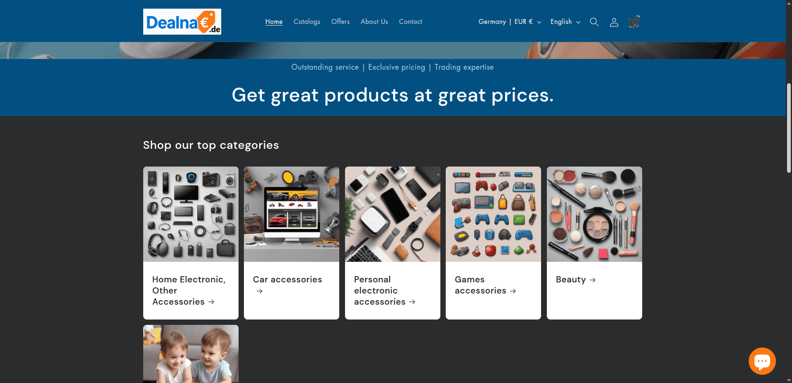]( https://Dealna.de)


[]( https://dealna-de-v1-3-3806d4fcd64f.herokuapp.com/)


 
[]( https://dealna-de-v1-3-3806d4fcd64f.herokuapp.com/)


[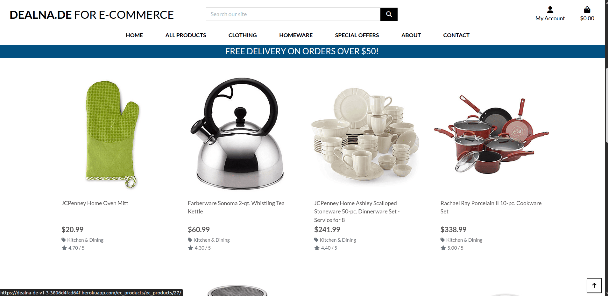]( https://dealna-de-v1-3-3806d4fcd64f.herokuapp.com/)

  
---
 
# **_Dealna.de E-Commerce V1.3_**

## Dealna.de v1.3 (Shop Smart, Live Better) - Portfolio Project 5 - Full Stack Toolkit Project.

**Dealna.de v1.3:** A Gateway to Seamless Online Shopping  

The **Dealna.de E-Commerce Platform** is designed to provide users with a modern, intuitive, and secure online shopping experience. Powered by Django, this dynamic platform delivers a seamless experience for browsing, purchasing, and managing products across diverse categories, reflecting a commitment to quality, reliability, and user satisfaction.

### A Platform for Smart Shopping  

At its core, **Dealna.de v1.3** offers users a curated selection of products, from fashion and electronics to home goods and lifestyle essentials. The intuitive navigation and categorization make it easy for shoppers to discover products tailored to their needs. Each product listing includes detailed descriptions, high-quality images, and customer reviews, creating a sense of trust and connection between buyers and sellers.

### A User-Centric Experience  

The platform is designed with usability in mind, featuring:  
- **Dynamic Product Listings:** Easily browse products by category, price, or rating.  
- **Secure Checkout:** A seamless and secure payment process ensures a hassle-free shopping experience.  
- **Personalized Profiles:** Registered users can view order history, save payment information, and track deliveries.  
- **Mobile Responsiveness:** The site ensures accessibility across devices, making it convenient for users on the go.  

### A Tool for Informed Decisions  

By presenting detailed product information, customer reviews, and competitive pricing, **Dealna.de v1.3** empowers users to make informed purchasing decisions. Whether shopping for everyday essentials or unique finds, users are encouraged to explore and engage with the platform, ensuring a satisfying shopping experience.

### Continuous Innovation and Growth  

The **Dealna.de v1.3** reflects the iterative evolution of a robust platform. Features such as advanced search filters, personalized recommendations, and seamless social sharing are just the beginning of a roadmap aimed at enhancing the user experience. Each iteration is a step closer to making this platform a go-to destination for online shoppers worldwide.

### Conclusion  

In an era of rapid digital transformation, **Dealna.de v1.3** stands out as a reliable and engaging online shopping destination. It goes beyond simply selling products; it fosters trust, inspires confidence, and creates connections among its users. The live site invites you to explore this vibrant e-commerce hub and experience the future of online shopping.

**You can view the live site here - [Dealna.de For E-Commerce v1.3]( https://dealna-de-v1-3-3806d4fcd64f.herokuapp.com/).**  


---

**You can view Dealna.de live site here - [Dealna.de](https://Dealna.de).**  


---

[]( https://dealna-de-v1-3-3806d4fcd64f.herokuapp.com/)

--- 


# Contents

- [**_Dealna.de E-Commerce V1.3_**](#dealnade-e-commerce-v13)
  - [Dealna.de v1.3 (Shop Smart, Live Better) - Portfolio Project 5 - Full Stack Toolkit Project.](#dealnade-v13-shop-smart-live-better---portfolio-project-5---full-stack-toolkit-project)
    - [A Platform for Smart Shopping](#a-platform-for-smart-shopping)
    - [A User-Centric Experience](#a-user-centric-experience)
    - [A Tool for Informed Decisions](#a-tool-for-informed-decisions)
    - [Continuous Innovation and Growth](#continuous-innovation-and-growth)
    - [Conclusion](#conclusion)
- [Contents](#contents)
  - [Purpose of the Project – **Dealna.de E-Commerce v1.3**](#purpose-of-the-project--dealnade-e-commerce-v13)
  - [User Stories:](#user-stories)
    - [**User Stories**](#user-stories-1)
    - [**Additional User Stories for Site Admin and Site Owner**](#additional-user-stories-for-site-admin-and-site-owner)
    - [**Additional User Stories for New Apps**](#additional-user-stories-for-new-apps)
  - [**Site Structure**](#site-structure)
    - [**1. Home Page**](#1-home-page)
    - [**2. Product Categories**](#2-product-categories)
    - [**3. Product Page**](#3-product-page)
    - [**4. Shopping Cart**](#4-shopping-cart)
    - [**5. Checkout Page**](#5-checkout-page)
    - [**6. User Account**](#6-user-account)
    - [**7. Admin Dashboard**](#7-admin-dashboard)
    - [**8. User Interaction Features**](#8-user-interaction-features)
    - [Dealna.de v1.3 Site Structure](#dealnade-v13-site-structure)
  - [Design Choices](#design-choices)
    - [**Typography**](#typography)
  - [**Features**](#features)
    - [**Existing Features**](#existing-features)
    - [**Future Features**](#future-features)
  - [**Technologies Used**](#technologies-used)
    - [**Frameworks \& Libraries**](#frameworks--libraries)
    - [**Database**](#database)
    - [**Tools \& Services**](#tools--services)
    - [**Design Tools**](#design-tools)
  - [**Data Model**](#data-model)
    - [**Core Models**](#core-models)
    - [**New App Models**](#new-app-models)
    - [**Relational Model**](#relational-model)
    - [**Example Relationships**](#example-relationships)
    - [**Database Schema Diagram (Simplified)**](#database-schema-diagram-simplified)
    - [**Generating the ERD**](#generating-the-erd)
  - [**Email Marketing Integration**](#email-marketing-integration)
    - [**Mailchimp**](#mailchimp)
    - [**Screenshot of Mailchimp Pricing**](#screenshot-of-mailchimp-pricing)
  - [**Compliance and Trust**](#compliance-and-trust)
    - [**Händlerbund Membership**](#händlerbund-membership)
    - [**Trusted Shops Seal**](#trusted-shops-seal)
    - [**European Compliance**](#european-compliance)
    - [**Screenshot of Trusted Shops Seal**](#screenshot-of-trusted-shops-seal)
  - [Testing:](#testing)
    - [Chrome Test](#chrome-test)
    - [Lighthouse Testing](#lighthouse-testing)
      - [Performance](#performance)
        - [Desktop lighthouse Performance](#desktop-lighthouse-performance)
        - [Mobile lighthouse Performance](#mobile-lighthouse-performance)
      - [Accessibility Testing](#accessibility-testing)
        - [Lighthouse Accessibility Testing](#lighthouse-accessibility-testing)
        - [Lighthouse SEO Testing](#lighthouse-seo-testing)
        - [WAVE Web Accessibility Evaluation Tool](#wave-web-accessibility-evaluation-tool)
    - [Fixing Accessibility issues:](#fixing-accessibility-issues)
      - [The Problem:](#the-problem)
      - [Solutions:](#solutions)
        - [**Add `aria-label` (no visible text)**](#add-aria-label-no-visible-text)
    - [Adobe Color Accessibility Tool](#adobe-color-accessibility-tool)
  - [**Responsive Testing**](#responsive-testing)
    - [**Testing Tools**](#testing-tools)
    - [**Issues with Online Tools**](#issues-with-online-tools)
    - [**Issues with Checkout Page**](#issues-with-checkout-page)
    - [**Key Findings**](#key-findings)
    - [Manual Testing:](#manual-testing)
    - [Automated Unit Testing:](#automated-unit-testing)
    - [Running Tests:](#running-tests)
  - [Validator Testing - Bugs Fixed:](#validator-testing---bugs-fixed)
  - [HTML Validation](#html-validation)
    - [HTML Validation Issues (Nu Html Checker)](#html-validation-issues-nu-html-checker)
    - [**Example 1: Invalid Attribute in an Element**](#example-1-invalid-attribute-in-an-element)
      - [**Error**:](#error)
      - [**Cause**:](#cause)
      - [**Fix**:](#fix)
      - [**Code Example**:](#code-example)
      - [**JavaScript Access**:](#javascript-access)
    - [**Example 2: Invalid Width Attribute Value**](#example-2-invalid-width-attribute-value)
      - [**Error**:](#error-1)
      - [**Cause**:](#cause-1)
      - [**Fix**:](#fix-1)
      - [**Code Example**:](#code-example-1)
    - [**Key Takeaways**:](#key-takeaways)
  - [CSS Validation](#css-validation)
  - [JS Validation](#js-validation)
    - [Fixes Applied](#fixes-applied)
  - [Py Validation](#py-validation)
  - [Getting Started:](#getting-started)
  - [Deployment:](#deployment)
  - [Credits](#credits)


## Purpose of the Project – **Dealna.de E-Commerce v1.3**  

The goal of **Dealna.de** is to create a modern, user-friendly e-commerce platform that offers a seamless shopping experience. Built with Django and PostgreSQL, this platform is designed to support a wide range of products, including electronics, clothing, homeware, and special offers.  

With features such as advanced search, secure checkout, product categorization, and personalized user accounts, **Dealna.de** aims to provide an intuitive and efficient marketplace for both buyers and sellers. Customers can easily browse, purchase, and track their orders, while vendors can manage their inventory and sales through a robust backend system.  

Whether you're a shopper looking for the best deals or a seller aiming to expand your reach, **Dealna.de** offers a powerful and scalable solution to meet your e-commerce needs.


---

**Facebook Business Page for Dealna.de v1**  
As part of our project requirements, we have created a dedicated Facebook business page for our e-commerce platform, **Dealna.de v1**. This page serves as a marketing and engagement tool to connect with potential customers, showcase our products, and promote special offers. The page includes essential details about our platform, such as the website link, contact information, and a brief description of our mission to provide a seamless shopping experience. Screenshots of the Facebook business page have been included in this documentation to verify its creation and authenticity.**You can visit our Facebook business page using the following link:** [Dealna.de v1 Facebook Page](https://www.facebook.com/share/1B8bq6A3Jw/).  


[](https://www.facebook.com/share/1B8bq6A3Jw/)


[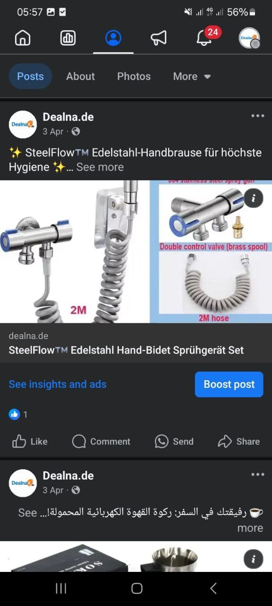](https://www.facebook.com/share/1B8bq6A3Jw/)


[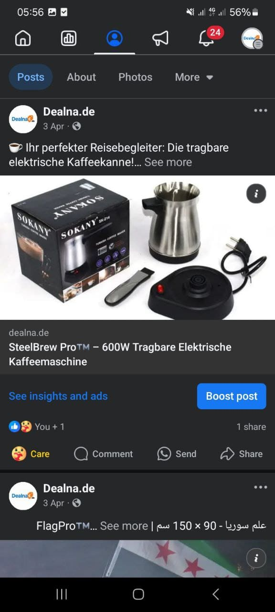](https://www.facebook.com/share/1B8bq6A3Jw/)

--- 
 


[Back to top](<#contents>)


 
## User Stories:
<details><summary><span style="font-size:1.3em; font-weight:bold;">details</span></summary>


  


 
 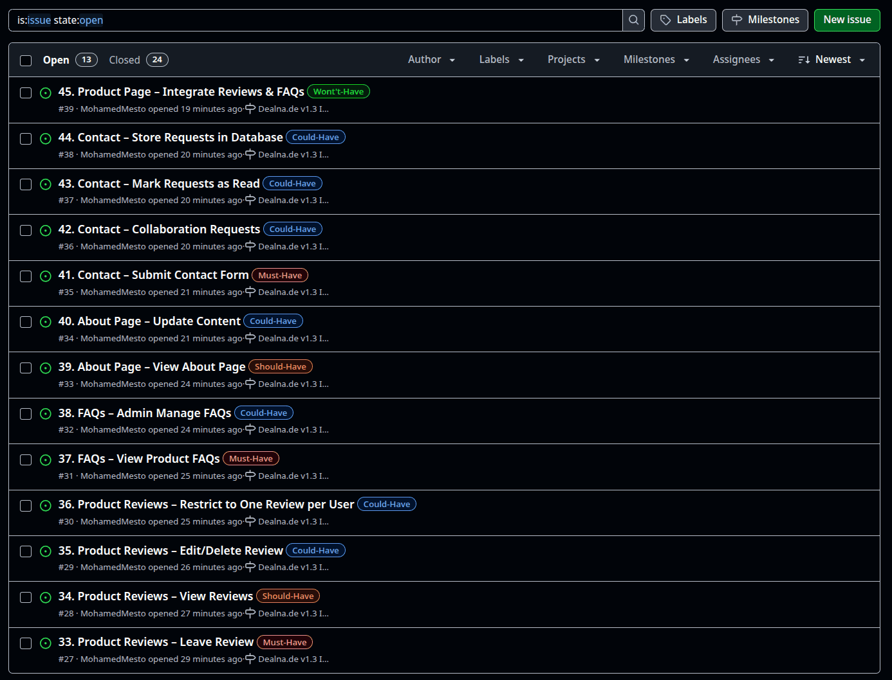


### **User Stories**

| User Story ID | AS A / AN | I WANT TO BE ABLE TO... | SO THAT I CAN... |
| --- | --- | --- | --- |
| | | ***Viewing and Navigation*** | | 
| 1 | Shopper | View a list of products | Select some to purchase and identify the price, description, and product rating |
| 2 | Shopper | View individual product details | See the product image and available sizes |
| 3 | Shopper | Quickly identify deals, clearance items, and special offers | Take advantage of special savings on products I'd like to purchase |
| 4 | Shopper | Easily view the total of my purchases at any time | Avoid spending too much |
| | | ***Registration & User Accounts*** | | 
| 5 | Site User | Easily register for an account | Have a personal account and view my profile |
| 6 | Site User | Easily login or logout | Access my personal account information |
| 7 | Site User | Easily recover my password in case I forget it | Recover access to my account |
| 8 | Site User | Receive an email confirmation after registering | Verify that my account registration was successful |
| 9 | Site User | Have a personalized user profile | View my personal order history, order confirmations, and save my payment information |
| | | ***Sorting & Searching*** | | 
| 10 | Shopper | Sort the list of available products | Easily identify the best-rated, best-priced, and categorically sorted products |
| 11 | Shopper | Sort a specific category of product | Find the best-priced or best-rated product in a specific category, or sort the products in that category by name |
| 12 | Shopper | Sort multiple categories of products simultaneously | Find the best-priced or best-rated products across broad categories, such as "clothing" or "homeware" |
| 13 | Shopper | Search for a product by name or description | Find a specific product I'd like to purchase |
| 14 | Shopper | Easily see what I've searched for and the number of results | Quickly decide whether the product I want is available |
| | | ***Purchasing & Checkout*** | | 
| 15 | Shopper | Easily select the size and quantity of a product when purchasing it | Ensure I don't accidentally select the wrong product, quantity, or size |
| 16 | Shopper | View items in my bag to be purchased | Identify the total cost of my purchase and all items I will receive |
| 17 | Shopper | Adjust the quantity of individual items in my bag | Easily make changes to my purchase before checkout |
| 18 | Shopper | Easily enter my payment information | Check out quickly and with no hassles |
| 19 | Shopper | Feel my personal and payment information is safe and secure | Confidently provide the needed information to make a purchase |
| 20 | Shopper | View an order confirmation after checkout | Verify that I haven't made any mistakes |
| 21 | Shopper | Receive an email confirmation after checking out | Keep the confirmation of what I've purchased for my records |
| | | ***Admin & Store Management*** | | 
| 22 | Store Owner | Add a product | Add new items to my store |
| 23 | Store Owner | Edit/update a product | Change product prices, descriptions, images, and other product criteria |
| 24 | Store Owner | Delete a product | Remove items that are no longer for sale |

---

### **Additional User Stories for Site Admin and Site Owner**

| User Story ID | AS A / AN | I WANT TO BE ABLE TO... | SO THAT I CAN... |
| --- | --- | --- | --- |
| | | ***Site Admin*** | | 
| 25 | Site Admin | Moderate user posts and comments | Manage inappropriate content |
| 26 | Site Admin | Create, read, update, and delete posts | Manage blog content |
| 27 | Site Admin | Create draft posts | Finish writing the content later |
| 28 | Site Admin | Manage categories | Keep the content organized |
| 29 | Site Admin | View all user activities | Ensure compliance with community guidelines |
| 30 | Site Admin | Update About page content | Keep the About page up-to-date |
| | | ***Site Owner*** | | 
| 31 | Site Owner | Mark collaboration requests as "read" | Track which requests I still need to process |
| 32 | Site Owner | Store collaboration requests in the database | Review them later |
| 33 | Site Owner | Add a contact form for collaboration requests | Allow users to submit collaboration requests |

### **Additional User Stories for New Apps**
 
| User Story ID | AS A / AN  | I WANT TO BE ABLE TO...                       | SO THAT I CAN...                                              |
| ------------- | ---------- | --------------------------------------------- | ------------------------------------------------------------- |
|               |            | ***Reviews App***                             |                                                               |
| 34            | Shopper    | Leave a review for a product                  | Share my experience and help other shoppers decide            |
| 35            | Shopper    | View reviews from other users                 | Make better-informed purchasing decisions                     |
| 36            | Shopper    | Edit or delete my own review                  | Correct mistakes or remove feedback I no longer want to share |
| 37            | System     | Restrict each user to one review per product  | Ensure fair and balanced feedback                             |
|               |            | ***FAQ App***                                 |                                                               |
| 38            | Shopper    | View frequently asked questions for a product | Quickly find answers without contacting support               |
| 39            | Site Admin | Add, edit, or delete FAQs                     | Keep product information accurate and up to date              |
|               |            | ***About App***                               |                                                               |
| 40            | Shopper    | View an About page                            | Learn more about the store, its mission, and values           |
| 41            | Site Admin | Update the About page content                 | Keep the information current                                  |
|               |            | ***Contact App***                             |                                                               |
| 42            | Shopper    | Submit a contact form                         | Ask questions or request help                                 |
| 43            | Site Owner | Receive collaboration requests                | Explore opportunities with potential partners                 |
| 44            | Site Owner | Mark collaboration requests as “read”         | Track which requests I still need to process                  |
| 45            | Site Owner | Store collaboration requests in the database  | Review them later                                             |

[Back to top](<#contents>)


---

## **Site Structure**

**Dealna.de v1** is designed as a modern e-commerce platform with a user-friendly interface and seamless navigation. Here's an updated overview of its structure:

---

### **1. Home Page**

* A visually appealing landing page showcasing featured products, special offers, and categories.
* Includes a navigation bar with links to key sections: **Shop, Deals, About, Contact, and User Account**.

---

### **2. Product Categories**

* **Shop by Category:** Products organized into categories (e.g., Clothing, Homeware, Electronics).
* **Deals & Offers:** Highlights discounted products, clearance items, and promotions.
* **New Arrivals:** Displays the latest products added to the platform.

---

### **3. Product Page**

* **Product Details:** Images, price, description, available sizes, and ratings.
* **Add to Cart:** Select size/quantity and add products to cart.
* **Product Reviews (Review App):**

  * Shows ratings and comments.
  * Logged-in users can leave, edit, or delete reviews.
* **FAQs (FAQ App):**

  * Displays product-related questions and answers.
  * Admins can add/edit/delete FAQs.

---

### **4. Shopping Cart**

* **Cart Summary:** All items, quantities, price, and total cost.
* **Edit Cart:** Adjust quantities or remove items.
* **Proceed to Checkout:** Redirects to secure checkout page.

---

### **5. Checkout Page**

* **Shipping Details:** Enter shipping address and delivery options.
* **Payment Information:** Secure form for card/PayPal.
* **Order Summary:** Final breakdown of items and costs.
* **Place Order:** Completes purchase and shows confirmation.

---

### **6. User Account**

* **Registration & Login:** Create or log into account.
* **Order History:** View previous orders with details.
* **Saved Payment Methods:** Manage saved cards/payment info.
* **Profile Management:** Update personal info and preferences.
* **My Reviews (Review App):** Manage submitted product reviews.

---

### **7. Admin Dashboard**

* **Product Management:** Add, edit, or delete products.
* **Order Management:** View and manage customer orders.
* **User Management:** Manage user accounts and permissions.
* **FAQ Management (FAQ App):** Add/edit/delete product FAQs.
* **Review Moderation (Review App):** Monitor and remove inappropriate reviews.
* **About Page Management (About App):** Update company details/vision.
* **Contact Management (Contact App):** Review contact/collaboration form submissions.

---

### **8. User Interaction Features**

* **Wishlist:** Save products for future purchase.
* **Product Reviews (Review App):** Submit and read reviews.
* **FAQs (FAQ App):** Quick answers to product-related questions.
* **Newsletter Subscription:** Get updates and promotions.
* **Contact Form (Contact App):**

  * Users send support, inquiry, or collaboration requests.
  * Submissions stored in database for admin follow-up.
* **About Page (About App):**

  * Displays company mission, vision, and values.
  * Managed by admin for credibility and transparency.

### Dealna.de v1.3 Site Structure
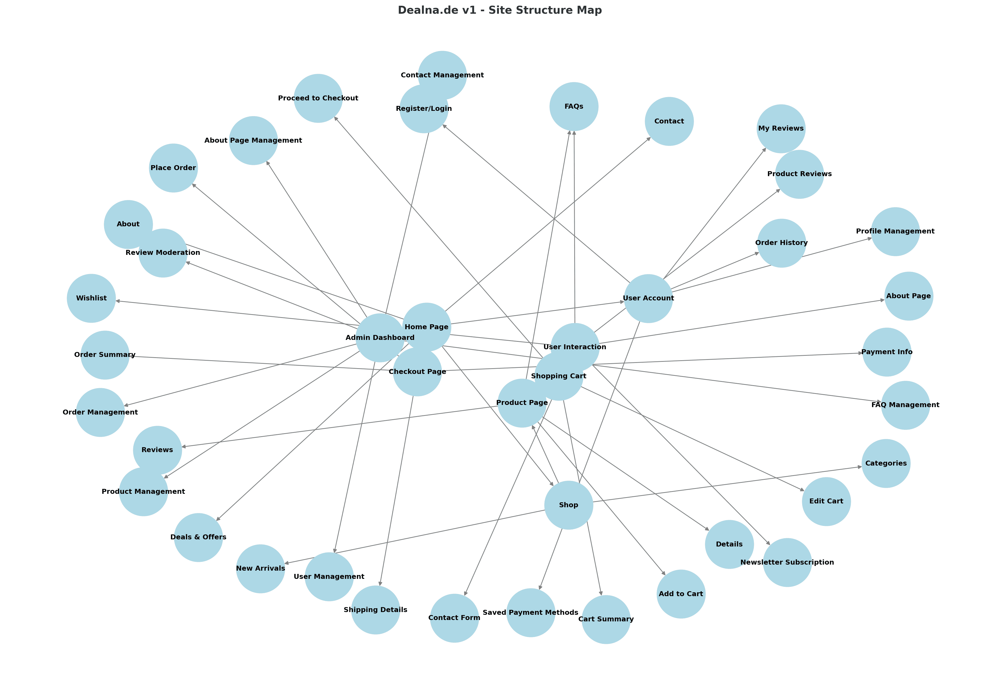


 

 
[Back to top](<#contents>)
</details>

---

 
 
The **Dealna.de For E-Commerce v1.3** is accessible at [Dealna.de For E-Commerce v1.3]( https://dealna-de-v1-3-3806d4fcd64f.herokuapp.com/), offering an intuitive layout with seamless access to all sections via the navigation bar.  


 


## Design Choices

 
<details><summary><span style="font-size:1.3em; font-weight:bold;">Colour Scheme</span></summary>


The color scheme of **Dealna.de v1** is designed to create a modern, engaging, and user-friendly experience. The interface features a clean and professional look with a primary color of **#04668C** (a deep blue) for headings and key elements, complemented by **#A7C3D1** (a soft blue) for secondary accents and backgrounds. To draw attention to important actions and highlights, **#DE8C1C** (a warm orange) is used for buttons and interactive elements. The text is displayed in **#000000** (black) for readability, while **#FFFFFF** (white) is used for backgrounds and contrast. This cohesive color palette ensures a visually appealing and intuitive experience for users, enhancing both functionality and aesthetics.

The palette was generated using **[Adobe Color Wheel](https://color.adobe.com/create/image)**, ensuring a professional and harmonious selection of shades.

 

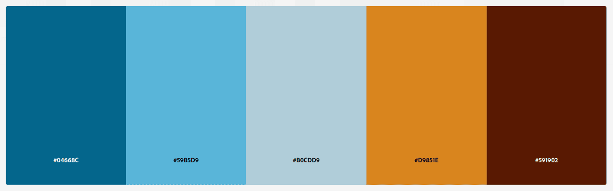


  
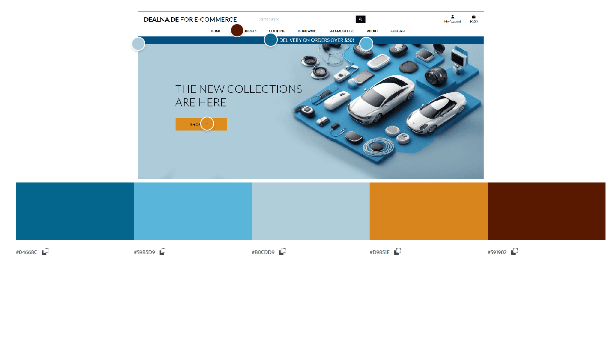

 

 

### **Typography**

The typography of **Dealna.de v1** is designed for clarity, readability, and a modern aesthetic:

* **Font Family:** The site uses the **Poppins** font (via Google Fonts), delivering an elegant, approachable, and consistent look across devices.
* **Primary Text Color:** **#000000** (black) ensures high readability for most content.
* **Text on Dark Backgrounds:** **#FFFFFF** (white) maintains strong contrast and accessibility.
* **Headings & Key UI Elements:** Styled in **#04668C** (deep blue) to reinforce brand identity and draw attention.
* **Secondary Visual Accents:** **#59B5D9** (bright aqua blue) and **#B0CDD9** (soft pastel blue) are used for subtle section highlights, background tints, and less prominent elements.
* **Interactive & Action Elements:** **#D9851E** (warm orange) highlights buttons, links, and CTAs to guide user engagement.
* **Emphasis & Contrast Accents:** **#591902** (dark burgundy) is used sparingly for alerts, strong highlights, or emphasis within content.

This design system ensures a clear typographic hierarchy, enhances user navigation, and aligns with the visual branding already in place—especially with the Poppins font providing a polished and cohesive feel.


 
 


[Back to top](<#contents>)

</details>


 
---

## **Features**

### **Existing Features**

The **Dealna.de v1** offers a range of features designed to enhance the user experience and streamline the shopping process:
 
<details><summary><span style="font-size:1.3em; font-weight:bold;">Features Details</span></summary>

 
1. **Navigation**

   * The navigation menu is prominently featured at the top of the page, providing easy access to key sections such as **Shop**, **Deals**, **About**, **FAQ**, **Contact**, **Account**, and **Cart**.
   * **Responsive Design:** The navigation bar adapts seamlessly to different screen sizes, ensuring a smooth user experience across devices.

     * **Notebook/Desktop View:** 
  
     * **Mobile View:**     <br>   

2. **User Registration and Authentication**

   * Users can create accounts, log in, and log out securely. Registered users can access personalized features such as order history and saved payment information.

     * **Notebook/Desktop View:** 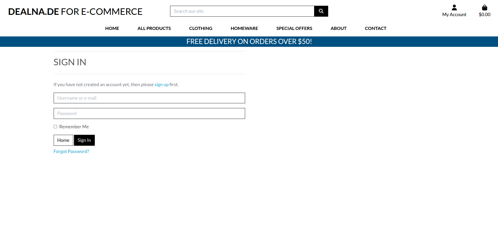
     * **Mobile View:** <br>  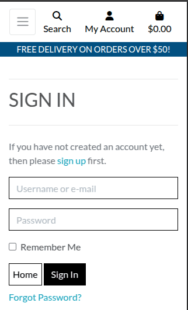
     * **Notebook/Desktop View:** 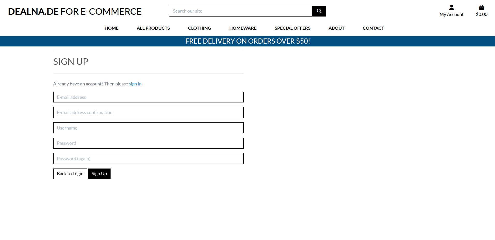 
     * **Mobile View:** <br>  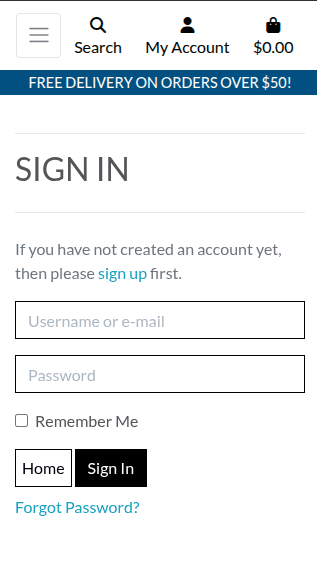

3. **Product Browsing and Filtering**

   * Users can browse products by category, sort by price, rating, or name, and filter by deals or special offers.
   * Each product page includes detailed information, images, available sizes, and user reviews.

     * **Notebook/Desktop View:** 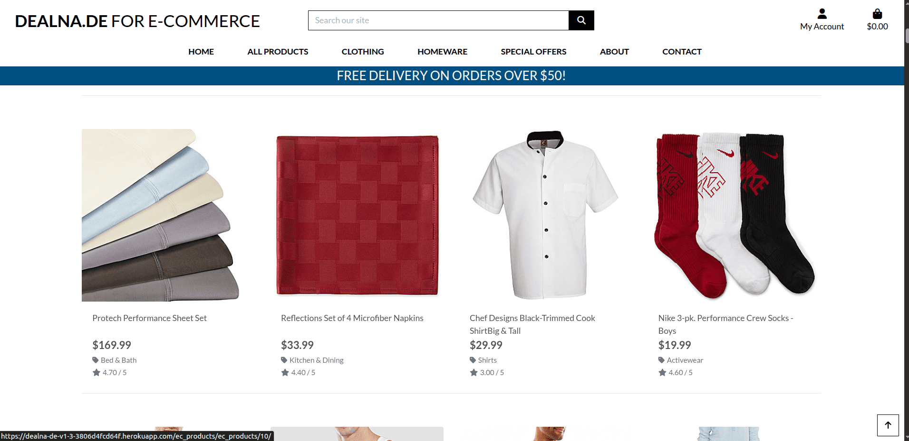
     * **Mobile View:** <br> 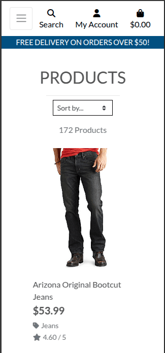

4. **Shopping Cart and Checkout**

   * Users can add products to their cart, adjust quantities, and proceed to a secure checkout process.
   * The cart displays the total cost and allows users to review their order before payment.

     * **Notebook/Desktop View:** 
     * **Mobile View:** <br> 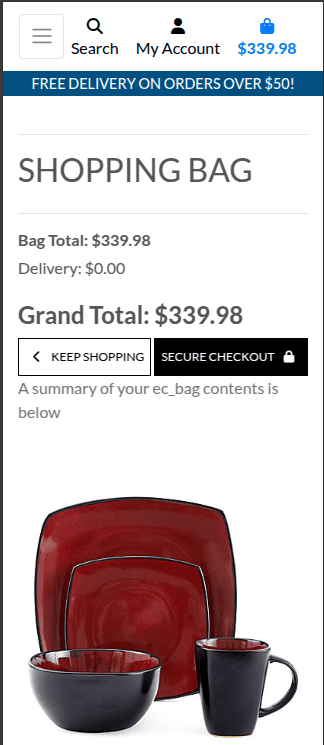


     * **Notebook/Desktop View:** 
         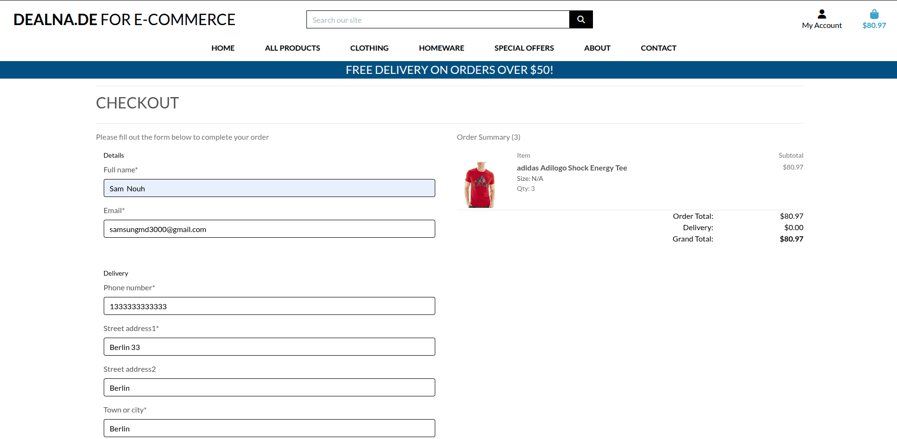
         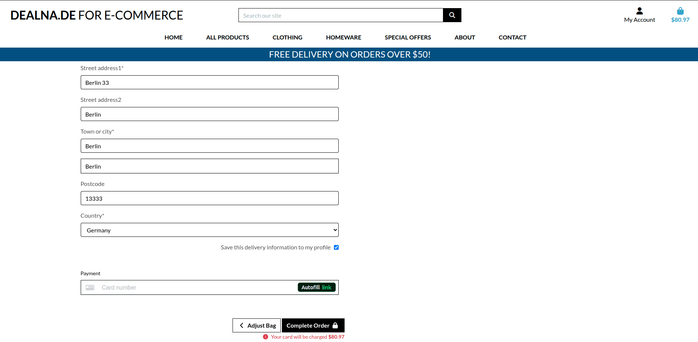

      
     * **Mobile View:**  <br>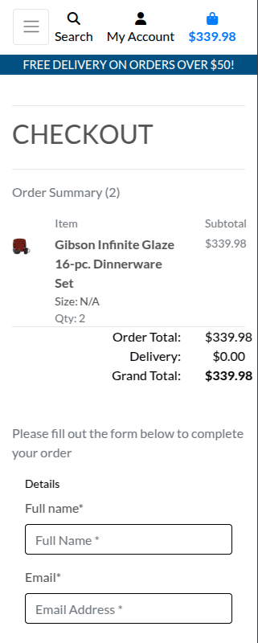

1. **Order Confirmation and Email Notifications**

   * After placing an order, users receive an on-screen confirmation and an email with order details.


     * **Notebook/Desktop View:** 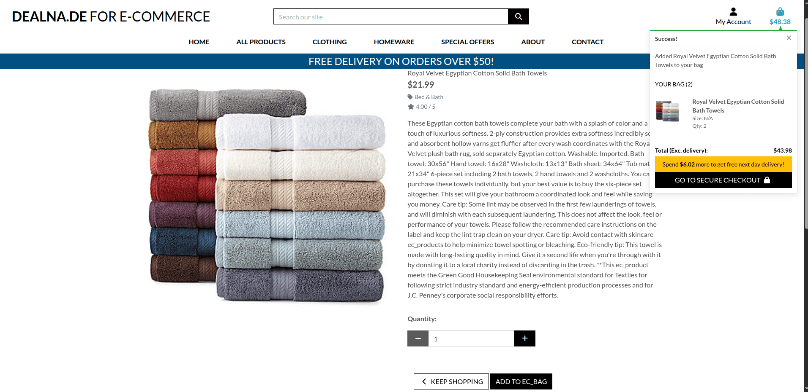
     * **Mobile View:**<br> 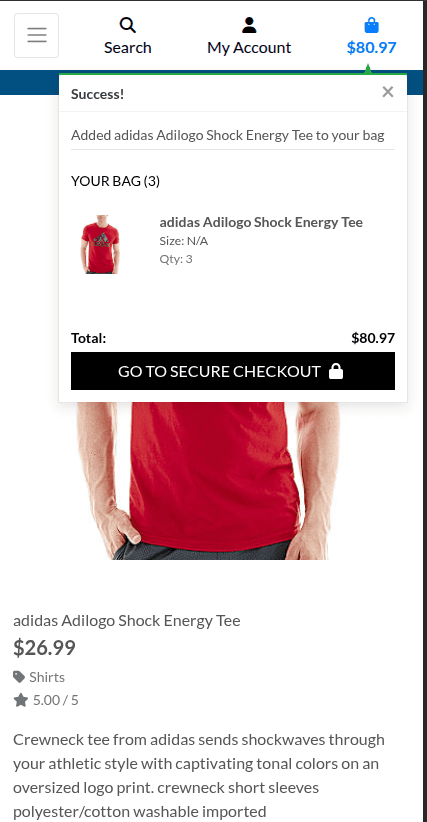


     * **Notebook/Desktop View:** 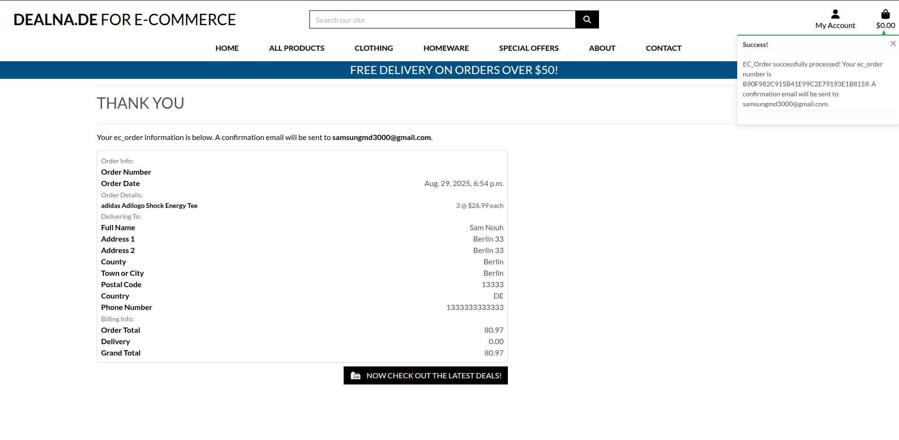
      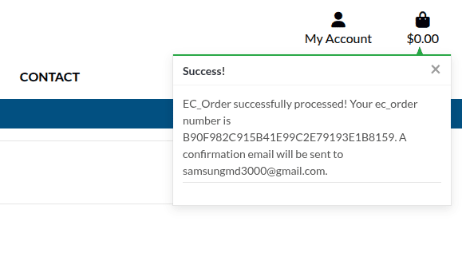
     * **Mobile View:**<br> 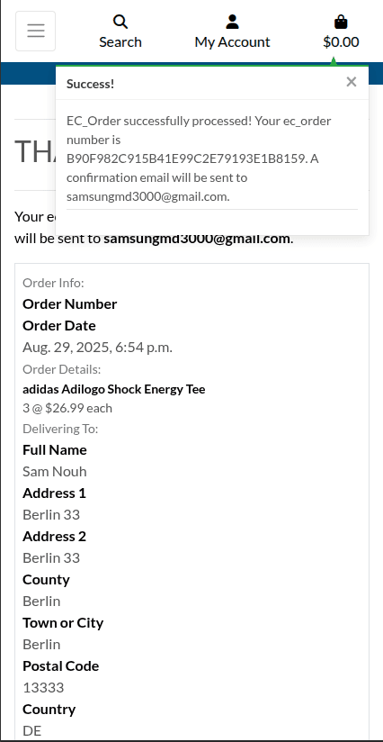

2. **Reviews**

   * Shoppers can read product reviews from other users and leave their own ratings and feedback.
   * Reviews help build trust and support better purchase decisions.
    * **Notebook/Desktop View:** 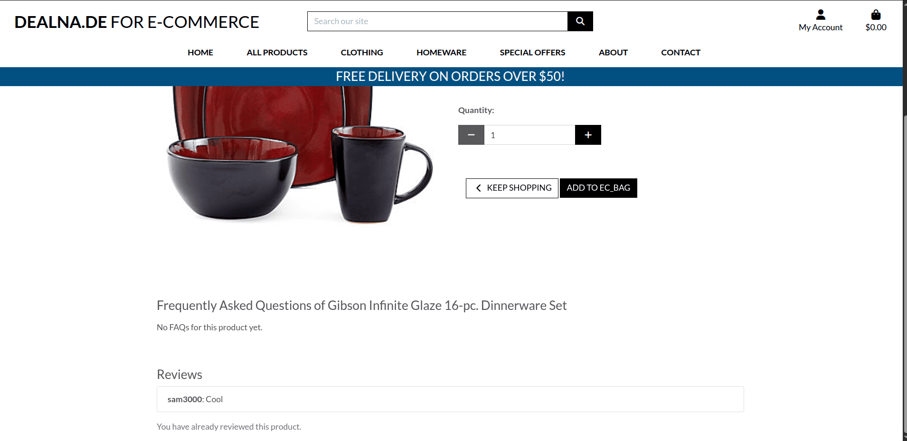
      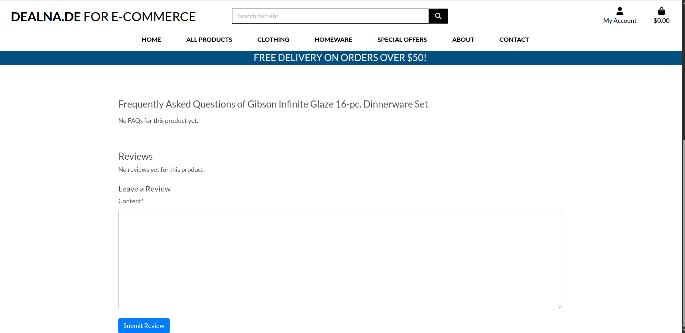

3. **About Page**

   * A dedicated page that introduces **Dealna.de**, including mission, vision, and values.
   * Enhances brand trust by sharing more about the team and purpose behind the platform.

4. **FAQ Page**

   * Provides answers to frequently asked questions about shopping, shipping, returns, and account management.
   * Improves customer support by reducing repetitive queries.
   *  **Notebook/Desktop View:** 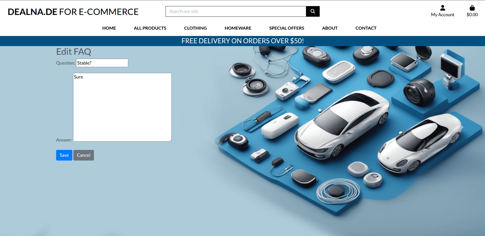
      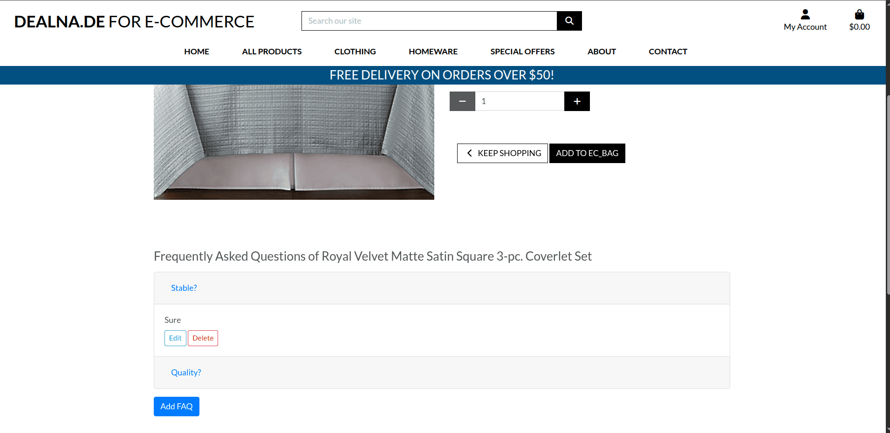


      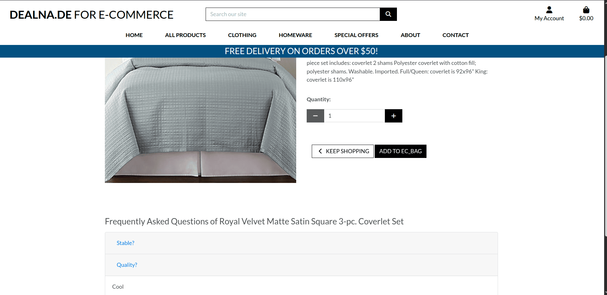


 


     * **Mobile View:**<br> 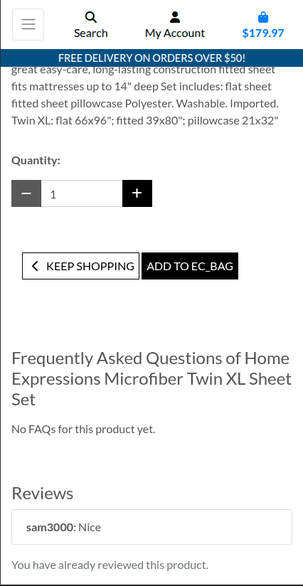

5. **Contact Page**

   * Users can easily reach out to the store via a simple and intuitive contact form.
   * Messages are stored in the database, allowing the admin to track and respond to collaboration or support requests.
     * **Notebook/Desktop View:** 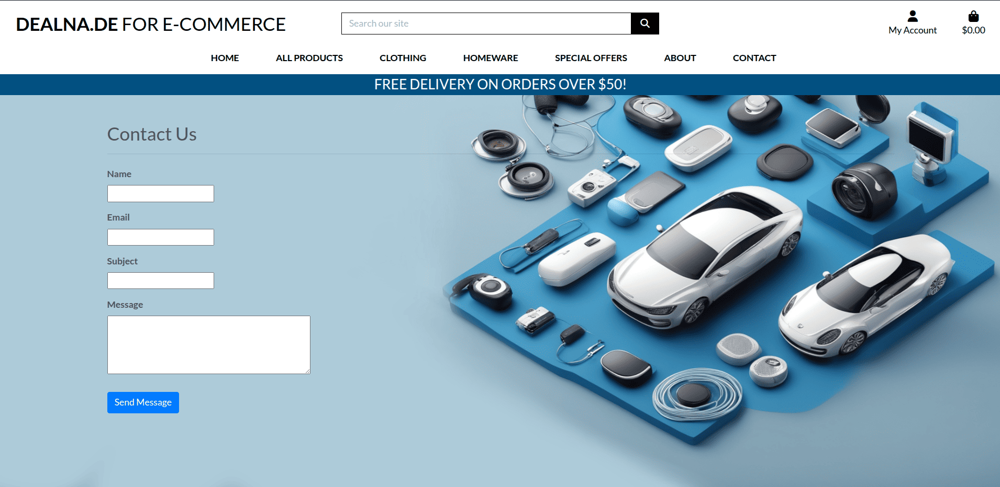

     * **Mobile View:**<br> 


6.  **Admin Dashboard**

    * Admin users can manage products, view orders, respond to contact messages, and update inventory through a dedicated dashboard.

      * **Notebook/Desktop View:** 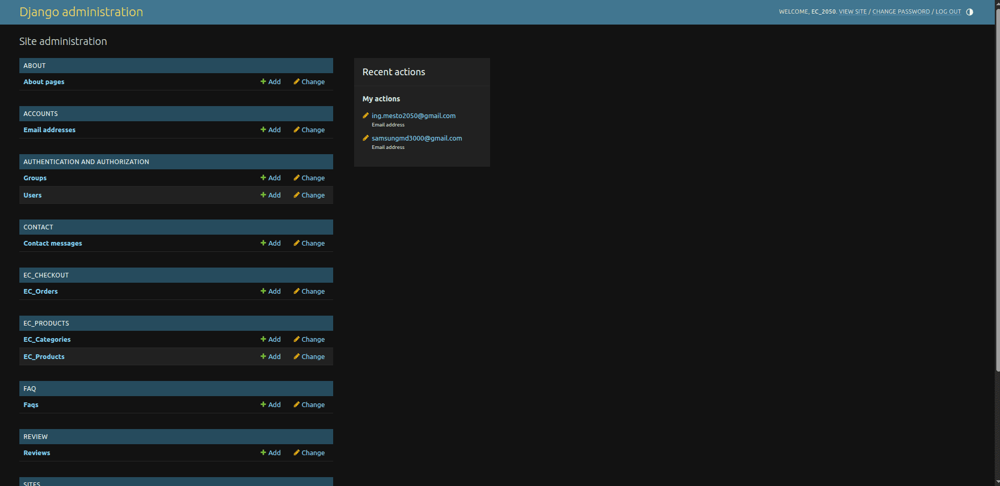
         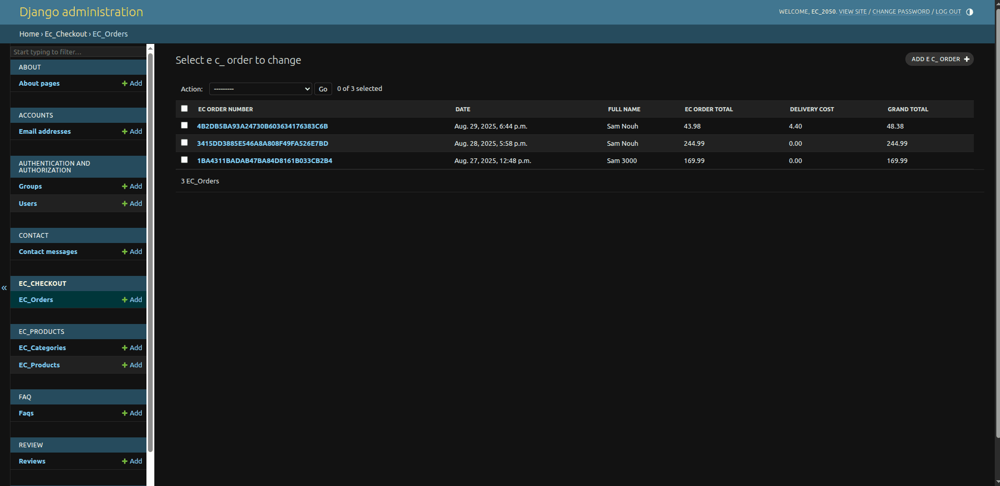
      * **Mobile View:** <br> 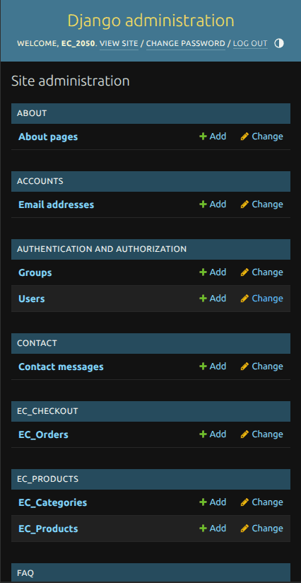

---

### **Future Features**

1. **Wishlist Functionality**

   * Allow users to save products to a wishlist for future purchase.

2. **Advanced Search and Filtering**

   * Implement more advanced search and filtering options, such as price range, brand, and customer ratings.

3. **Newsletter Subscription**

   * Allow users to subscribe to a newsletter for updates on new products, promotions, and exclusive deals.

4. **Social Media Integration**

   * Add social media sharing buttons for products and integrate social media feeds on the website.

5. **Live Chat Support**

   * Introduce a live chat feature for real-time customer support.

---
 
[Back to top](<#contents>)
 

</details>


  

## **Technologies Used**

 

<details><summary><span style="font-size:1.3em; font-weight:bold;">Languages</span></summary>


- **[HTML5](https://developer.mozilla.org/en-US/docs/Web/HTML):** Provides the foundational structure and semantic content for the **Dealna.de v1**, ensuring accessibility and compatibility across browsers.  
- **[CSS3](https://developer.mozilla.org/en-US/docs/Web/CSS):** Styles and layouts are meticulously crafted to deliver a responsive and visually appealing design that enhances user experience.  
- **[JavaScript](https://developer.mozilla.org/en-US/docs/Web/JavaScript):** Powers the interactive elements of the site, such as navigation menus, product filtering, and shopping cart functionality.  
- **[Python](https://www.python.org/):** The backend logic is implemented using Python, enabling robust data handling and seamless integration with the database.  

---

### **Frameworks & Libraries**

- **[Django](https://www.djangoproject.com/):** A high-level web framework used for building the server-side logic, managing models, views, templates, and user authentication efficiently.  
- **[Bootstrap5](https://getbootstrap.com/):** Provides a responsive grid system and pre-designed components, accelerating the design process and ensuring consistency across the site.  
- **[Django-Allauth](https://django-allauth.readthedocs.io/en/latest/overview.html):** Python user authentication and login plugin for Django.  
- **[Stripe](https://stripe.com/en-gb):** Online payments platform used for secure checkout functionality.  
- **[jQuery](https://jquery.com/):** Used for initializing Bootstrap5 components and enhancing shopping cart functionality.  
- **[Jinja](https://jinja.palletsprojects.com/en/2.11.x/):** Templating language for Python, used for dynamic HTML rendering.  

---

### **Database**

- **[PostgreSQL](https://www.postgresql.org/):** A powerful, open-source relational database system used to manage and store the site's data securely.  
- **[SQLite3](https://www.sqlitetutorial.net/sqlite-python/):** Default database created with Django, used for app development on localhost.  

---

### **Tools & Services**

- **[Heroku](https://www.heroku.com/):** The platform used for deploying the live site, offering scalability and reliable hosting for the project.  
- **[AWS S3](https://aws.amazon.com/s3/):** Amazon Simple Storage Service (S3), used to store and serve static and media files.  
- **[Cloudinary](https://cloudinary.com/):** Utilized for hosting and optimizing images, ensuring fast loading times and reduced server load.  
- **[VS Code](https://code.visualstudio.com/):** The primary code editor for development, offering a range of extensions for better productivity and code management.  
- **[Git](https://git-scm.com/):** Used for version control by committing to Git and pushing to GitHub.  
- **[GitHub](https://github.com/):** Used to store, host, and deploy the project files and source code.  
- **[Font Awesome](https://fontawesome.com/icons?d=gallery):** Used for icons to enhance headings and add emphasis to text.  
- **[Google Fonts](https://fonts.google.com/):** Provides a selection of web fonts used to ensure a clean and modern typography throughout the site.  
- **[Favicon Generator](https://favicon.io/):** Used to create the site's favicon, adding a professional touch to the browser tab display.  

---

### **Design Tools**

- **[Adobe XD](https://www.adobe.com/ie/products/xd.html):** Employed to design wireframes and prototypes, allowing the team to visualize and test user flows before development.  
- **[Adobe Illustrator](https://www.adobe.com/ie/products/illustrator.html):** Used to create the site's logo and social media graphics, maintaining a professional and consistent brand identity.  
- **[Adobe Photoshop](https://www.adobe.com/ie/products/photoshop.html):** Utilized to resize and optimize images for web use, enhancing the visual quality of the site while maintaining performance.  


[Back to top](<#contents>)  

</details>

---


## **Data Model**

 
This project uses Django’s **Object-Relational Mapping (ORM)** to manage interactions between the application and **PostgreSQL**. The updated key models include the new apps.
 

<details><summary><span style="font-size:1.3em; font-weight:bold;">Details</span></summary>


 

### **Core Models**

1. **User**

   * Handles authentication and user profile information.
   * Fields:

     * `username`, `email`, `password`, `first_name`, `last_name`, `is_staff`

2. **Product**

   * Represents a product available for purchase.
   * Fields:

     * `name`, `description`, `price`, `category` (FK), `image`, `rating`, `stock`

3. **Category**

   * Represents a grouping of products.
   * Fields: `name`, `friendly_name`

4. **Order**

   * Represents a user's purchase order.
   * Fields: `user` (FK), `order_number`, `date`, `total`, `status`

5. **OrderLineItem**

   * Represents an individual item within an order.
   * Fields: `order` (FK), `product` (FK), `quantity`, `lineitem_total`

6. **Review**

   * Represents a user review for a product.
   * Fields: `user` (FK), `product` (FK), `rating`, `comment`, `date`

---

### **New App Models**

1. **FAQ**

   * Stores frequently asked questions related to products or general site queries.
   * Fields: `question` (CharField), `answer` (TextField), `product` (FK, optional), `created_at`, `updated_at`

2. **About**

   * Contains information about the company or store.
   * Fields: `title` (CharField), `content` (TextField), `updated_at`

3. **Contact**

   * Stores messages submitted through the contact form.
   * Fields: `name` (CharField), `email` (EmailField), `subject` (CharField), `message` (TextField), `created_at`, `is_read` (BooleanField)

---

### **Relational Model**

* **Product → Category**: Each product belongs to a category.
* **Order → User**: Each order is placed by a user.
* **Order → OrderLineItem → Product**: Orders contain multiple line items, each referencing a product.
* **Review → User, Product**: Users can leave reviews for products.
* **FAQ → Product**: Optional, relates questions to specific products.
* **About**: Single model for company/store info.
* **Contact → Admin/User**: Contact messages are stored in the database and can be flagged as read.

---

### **Example Relationships**

1. **User → Order**

   * A user can place multiple orders.

2. **Product → Category**

   * Products belong to a category.

3. **Order → OrderLineItem → Product**

   * An order can contain multiple line items, each representing a product.

4. **User → Review → Product**

   * A user can leave multiple reviews on different products.

5. **Product → FAQ**

   * A product can have multiple FAQs.

6. **Contact Messages**

   * Each message is stored for admin review.

---

### **Database Schema Diagram (Simplified)**

```
User
├── Order
│   ├── OrderLineItem
│   │   └── Product
│   │       └── Category
└── Review
    └── Product
FAQ
└── Product
About
Contact
```

---

### **Generating the ERD**

To create a visual diagram of the models, use **Django Extensions**:

```bash
./manage.py graph_models -a -g -o Dealna_de_v1_3_diagram.png
```

* `-a`: Include all apps
* `-g`: Group models by app
* `-o`: Output file name

The generated **ERD** will be saved as:
**[Dealna\_de\_v1\_3\_diagram.png](Dealna_de_v1_3_diagram.png)**

This diagram includes **core models** and **new apps** for a complete overview of your project schema.

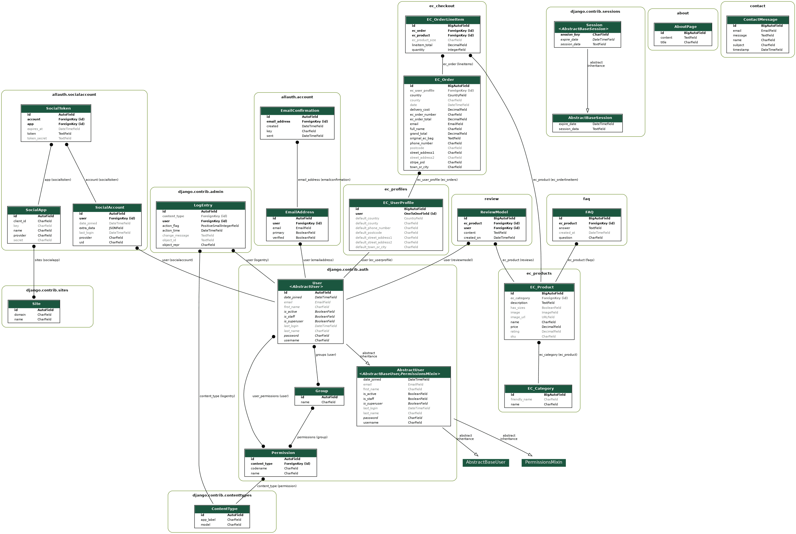  


[Back to top](<#contents>)
 
</details>


 

## **Email Marketing Integration**

<details><summary><span style="font-size:1.3em; font-weight:bold;">details</span></summary>

 


### **Mailchimp**  
Initially, we planned to integrate **Mailchimp** for email marketing to allow users to subscribe to newsletters and receive updates about new products, promotions, and exclusive deals. However, due to recent changes in Mailchimp's registration rules and pricing, this feature could not be implemented.  

- **Issue:**  
  - Mailchimp no longer offers a free plan beyond a 14-day trial.  
  - The paid plan starts at **$24/month**, which was beyond the project's budget.  

- **Alternative Solution:**  
  - For future implementation, we recommend exploring other email marketing services that offer free or more affordable plans, such as **Sendinblue** or **MailerLite**.  

### **Screenshot of Mailchimp Pricing**  
Below is a screenshot of Mailchimp's pricing page, highlighting the cost barrier:  

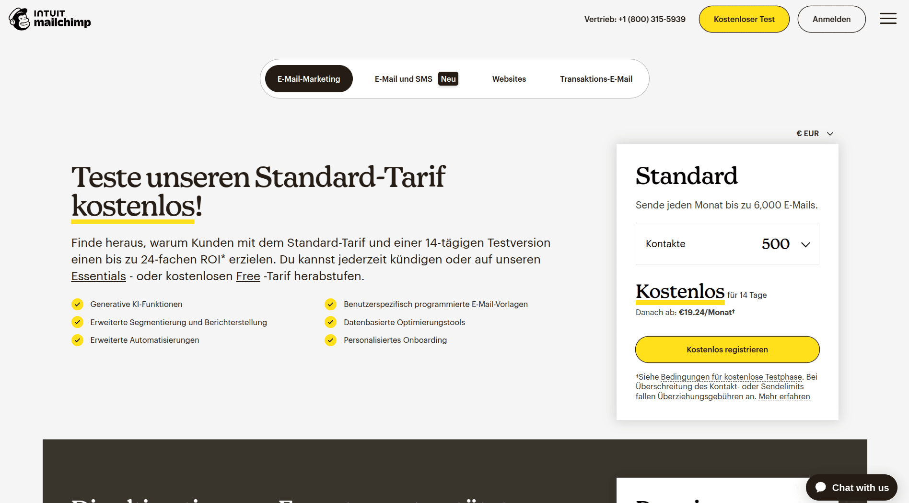  


[Back to top](<#contents>)


 </details>


---
 


## **Compliance and Trust**

<details><summary><span style="font-size:1.3em; font-weight:bold;">details</span></summary>


### **Händlerbund Membership**  
We are proud members of **[Händlerbund](https://www.haendlerbund.de/de)**, the largest association for e-commerce and online retailers in Europe. This membership ensures that our platform, **Dealna.de v1**, adheres to the highest standards of legal compliance and consumer protection.  

### **Trusted Shops Seal**  
Our website has been awarded the **Trusted Shops** seal, a mark of trust and reliability in e-commerce. This certification demonstrates our commitment to:  
- Transparent business practices.  
- Secure payment processing.  
- Reliable customer service.  
- Compliance with European consumer protection laws.  

### **European Compliance**  
We strictly follow all European regulations, including:  
- **GDPR (General Data Protection Regulation):** Ensuring the privacy and security of user data.  
- **Consumer Rights Directive:** Providing clear information about products, prices, and return policies.  
- **E-Commerce Directive:** Ensuring transparency in online transactions and contracts.  

### **Screenshot of Trusted Shops Seal**  
Below is a screenshot of the **Trusted Shops** seal displayed on our website [Dealna.de](https://Dealna.de/):  

  


[Back to top](<#contents>)


 </details>


---


## Testing:

<details><summary><span style="font-size:1.3em; font-weight:bold;">details</span></summary>

### Chrome Test


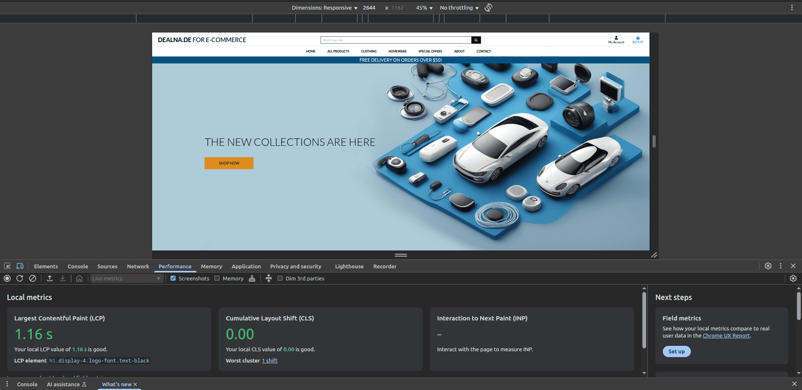


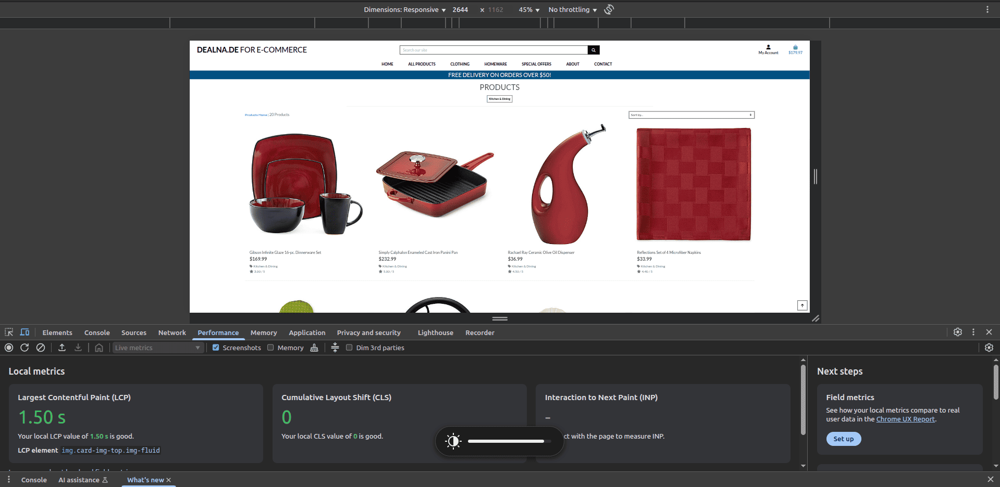


### Lighthouse Testing

 

 


#### Performance
The website was also put through Lighthouse testing via Chrome Devtools which tests a site under 4 different headings; Performance, Accessibility, Best Practices and it tests it under mobile and desktop criteria.

##### Desktop lighthouse Performance

 

##### Mobile lighthouse Performance

 
 
 


#### Accessibility Testing 

##### Lighthouse Accessibility Testing 
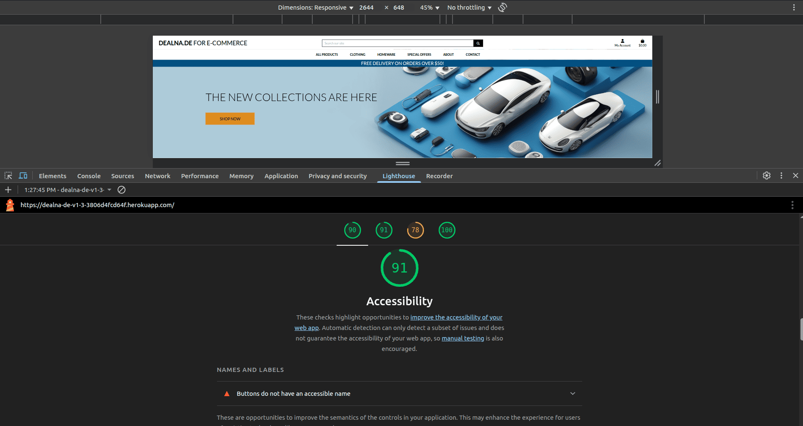

##### Lighthouse SEO Testing 
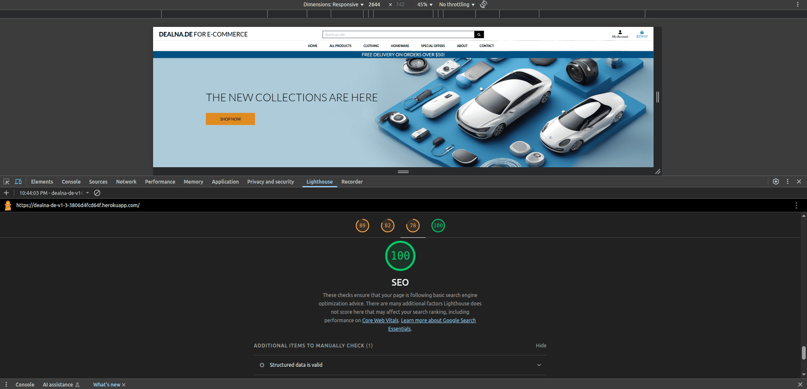
 

##### WAVE Web Accessibility Evaluation Tool

[WAVE Web Accessibility Evaluation Tool](https://wave.webaim.org/) was used to check the colour contrast on the website for accessibility purposes which it passed. 


 


### Fixing Accessibility issues:

Accessibility issues have been resolved, ensuring the link is now descriptive and user-friendly for all users, including those relying on screen readers.


1. **Accessibility Issue1:**
      The error you’re seeing is an **accessibility issue**. It indicates that a form control `<input>` **doesn’t have an associated `label`**, which makes it harder for screen reader users to understand the purpose of the input.

      In your code, the relevant form is the **search field in the header**:

 

      ### The Problem:

      * The `<input>` **does not have a `label`**.
      * It only has a `placeholder`.
      * A placeholder **is not a substitute for a label** in terms of accessibility.

      ---

      #### Solutions:

      

      #### ** Use `aria-label` (no visible label)**
      ```
      <input class="form-control border border-black rounded-0" type="text" name="q"
            placeholder="Search our site" aria-label="Search the site">
      ```
      

      * This gives screen readers a description of the input without showing a visible label.
      * Useful if you don’t want to add a visible label.
      
      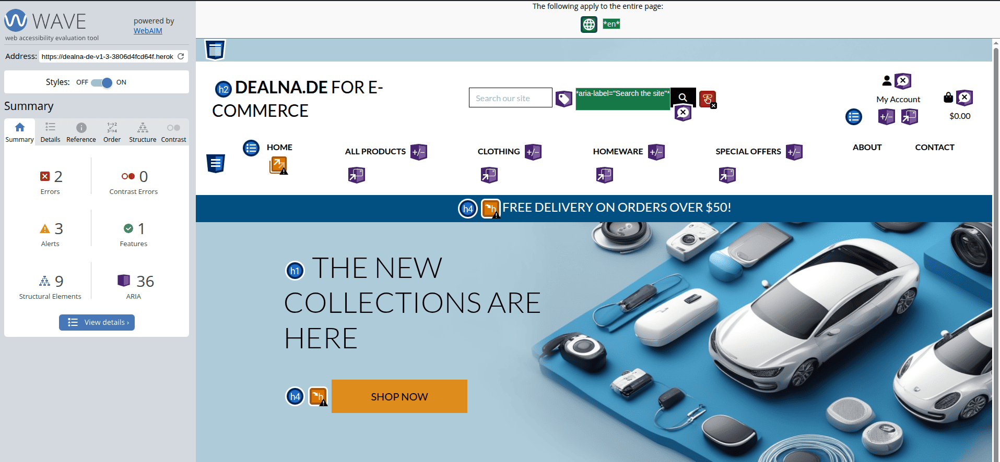
      


2. **Accessibility Issue2:**
   
   The new error is about **search button being “empty”**, which is another **accessibility issue**. Screen readers cannot tell what the button does because it has **no visible or textual label**.

   #### The Problem:

   * The `<button>` only contains an icon (`<i class="fas fa-search">`).
   * Screen readers **cannot interpret an icon** as meaningful text.
   * This is considered an “empty button” from an accessibility perspective.

   ---

   #### Solutions:
   
   ##### **Add `aria-label` (no visible text)**

   ```html
   <button class="form-control btn btn-black border border-black rounded-0" type="submit" aria-label="Search">
      <i class="fas fa-search"></i>
   </button>
   ```
 
   
 


 
  

### Adobe Color Accessibility Tool 

The [Adobe Color Accessibility Tool](https://color.adobe.com/create/color-accessibility) was used also to ensure the color palette met accessibility standards by testing contrast and simulating color blindness. This tool confirmed that the design maintains clarity and readability for users with visual impairments.


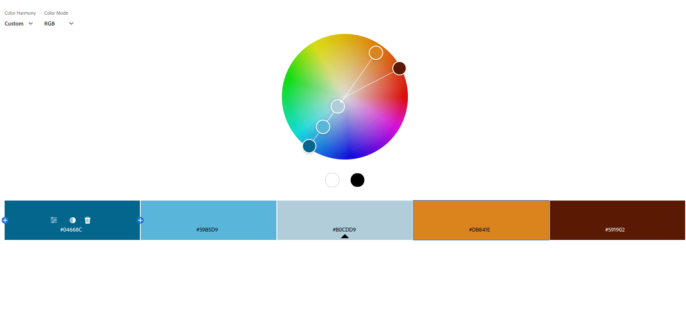


---


  
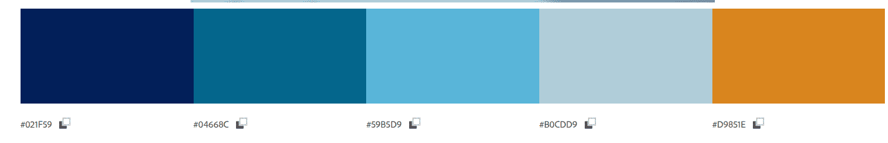


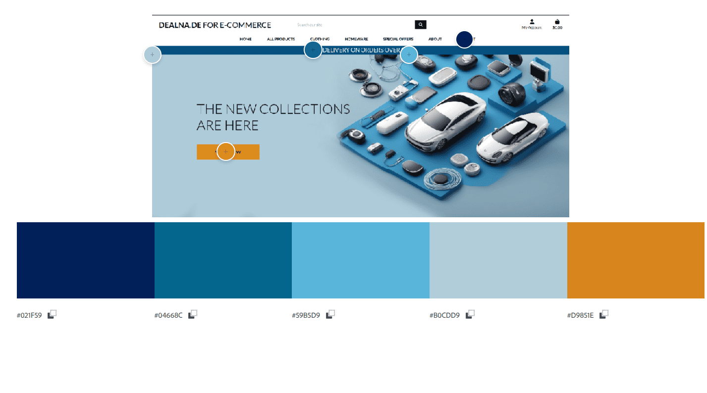


 


 
---

## **Responsive Testing**

Responsiveness was tested manually using **Chrome DevTools** and by physically testing the website on various devices, including:  
- **Desktop** (1920x1080, 1440x900, 1366x768)  
- **Laptop** (1280x800)  
- **Tablet** (iPad Air, iPad Mini, Samsung Galaxy Tab)  
- **Mobile** (iPhone 12, iPhone SE, Samsung Galaxy S20, Google Pixel 5)  

### **Testing Tools**  
1. **Chrome DevTools**  
   - Used to simulate different screen sizes and resolutions.  
   - Tested breakpoints for responsiveness, including:  
     - Extra small devices (portrait phones, <576px)  
     - Small devices (landscape phones, ≥576px)  
     - Medium devices (tablets, ≥768px)  
     - Large devices (desktops, ≥992px)  
     - Extra large devices (large desktops, ≥1200px)  

2. **Physical Device Testing**  
   - The website was tested on actual devices to ensure responsiveness and usability across different screen sizes and operating systems.  

### **Issues with Online Tools**  
- **[The Responsive Design Checker](https://responsivedesignchecker.com/):** Unable to test due to access restrictions on the website.  
- **[The Viewport Resizer](https://chrome.google.com/webstore/detail/viewport-resizer-%E2%80%93-respon/kapnjjcfcncngkadhpmijlkblpibdcgm?hl=en):** Unable to test due to access restrictions on the website.  


### **Issues with Checkout Page**  
- Unable to visit the Checkout page:
  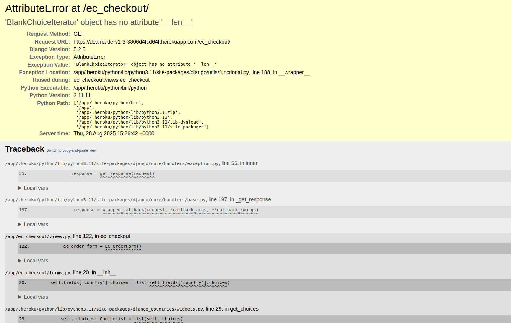
  
- We add the `django==4.2` to the `requirements.tx`t in order to make Heroku run the right Django version. Therefore the issue solved
  

---

### **Key Findings**  
- The website is fully responsive and adapts seamlessly to different screen sizes.  
- All interactive elements (e.g., buttons, forms, navigation menus) function correctly across devices.  
- Images and text scale appropriately without breaking the layout.  

---

 
 
 


### Manual Testing:
We conducted manual testing by simulating common user behaviors to ensure the system works as expected. The scenarios tested include:

- **Creating posts and comments**: We verified that logged-in users can successfully create, edit, and delete posts and comments, ensuring that these actions were handled correctly by the system.
- **Upvoting and downvoting posts**: We tested the voting functionality to confirm that users could only vote once per post and that votes were correctly recorded and displayed.
- **Filtering posts by category**: We checked the category filter functionality to ensure users could easily browse posts based on specific categories.
- **Handling valid and invalid inputs**: We tested the system's ability to handle both valid and invalid inputs, ensuring appropriate error messages were displayed when users submitted empty forms, invalid post data, or attempted duplicate votes.

### Automated Unit Testing:
We also wrote and ran unit tests using Django’s `unittest` framework to verify the core functionalities of the website. Below is a summary of the unit tests we implemented:

1. **Post Creation and Retrieval:**
   - We wrote tests to verify that logged-in users can create new posts and that required fields are validated.
   - We ensured that posts were correctly displayed on both the homepage and individual post pages.
   - We tested the pagination feature to confirm that posts were properly divided into pages.

2. **Comment Submission:**
   - We confirmed that logged-in users could submit comments on posts and that these comments were correctly linked to the relevant posts and displayed in the right order.
   - We ensured non-logged-in users were restricted from submitting comments.

3. **User Authentication:**
   - We created unit tests to verify that users could successfully register, log in, and log out.
   - We tested that only authenticated users could create, edit, or delete posts and comments.
   - We ensured that password reset and account management features functioned as expected.

4. **Post Voting System:**
   - We wrote tests to confirm that the upvoting and downvoting functionality worked correctly, ensuring users could only vote once per post.
   - We ensured that vote counts were updated in real-time and accurately reflected user inputs.

5. **Category Filtering:**
   - We tested the category filtering functionality to confirm that posts were correctly filtered and displayed based on the category selected.
   - We ensured users could navigate between categories without any errors.

6. **Error Handling:**
   - We validated that the system properly handled invalid inputs, such as attempts to create posts or comments with missing data or invalid forms.
   - We checked that the system displayed helpful error messages when users performed invalid actions.

### Running Tests:
To run the unit tests we created, you can use the following command in the project directory:

```bash
python manage.py test
```

This command will execute all the tests we implemented, allowing you to confirm that each core functionality works as intended. Running these tests ensures that the site remains robust and stable throughout development.


 
[Back to top](<#contents>)
</details>
  

 1111111111
 

## Validator Testing - Bugs Fixed:

## HTML Validation

Validation errors occur when HTML code does not adhere to the established standards, which can lead to browser inconsistencies or inaccessible content. It is crucial to test your code against validators like the [W3C HTML Validator](https://validator.w3.org/) to ensure compliance with best practices and maintain cross-browser functionality. Below are two examples of common validation errors, their causes, and fixes.

 
### HTML Validation Issues (Nu Html Checker)

During validation of the project with the **Nu Html Checker**, several errors and warnings were reported.

* **Problem:** `<li>` elements were placed directly inside `<nav>` tags, which is invalid since `<li>` elements must be inside a `<ul>`, `<ol>`, or `<menu>`.
  **Solution:** Wrap all `<li>` items inside a proper `<ul>` or `<ol>` element within the navigation bar.

* **Problem:** Duplicate IDs were found (`user-options` and `home-link`). HTML requires all IDs to be unique in the document.

   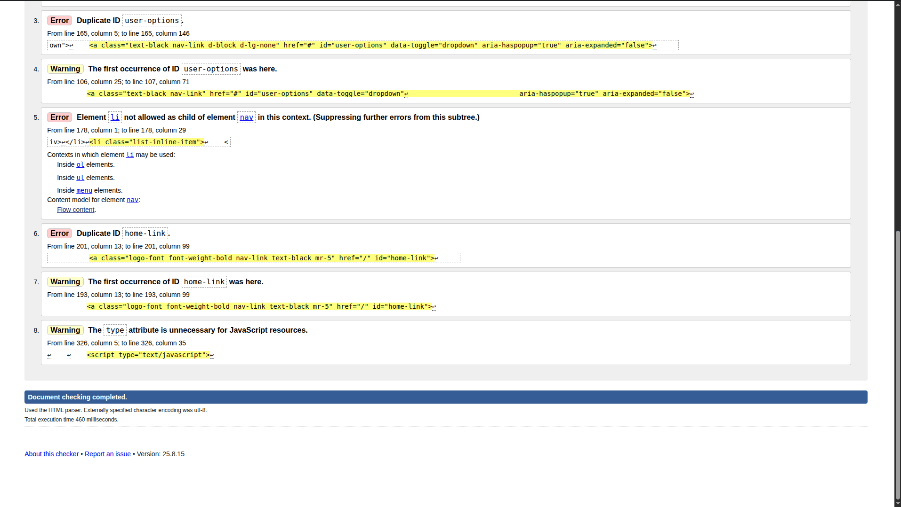


  **Solution:** Ensure each element has a unique ID by renaming duplicates (e.g., `user-options-desktop` and `user-options-mobile`).

   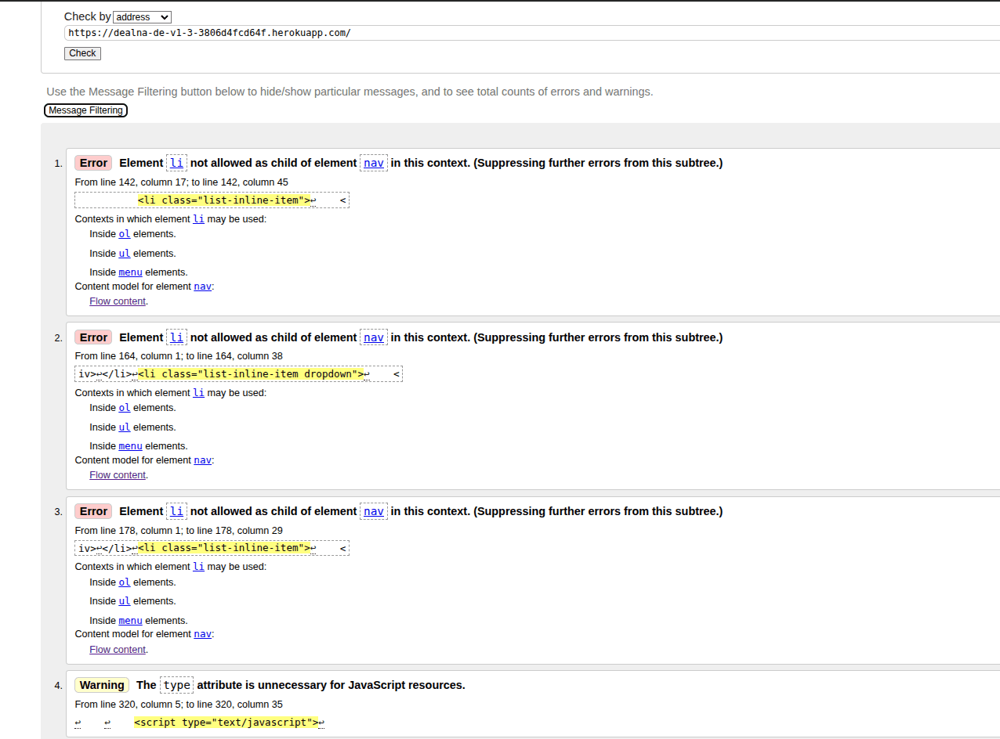


* **Problem:** `<script>` tags were using the unnecessary `type="text/javascript"` attribute. Modern HTML5 defaults to JavaScript, so this is redundant.
  **Solution:** Remove the `type="text/javascript"` attribute from `<script>` elements.

By fixing these issues, the code becomes more **standards-compliant**, **accessible**, and easier to maintain.

8888888888888888

### **Example 1: Invalid Attribute in an Element**

#### **Error**: 
`Error: Attribute comment_id not allowed on element button at this point.`

#### **Cause**:  
HTML5 does not allow custom attributes directly on elements like `<button>`. Attributes that are not globally recognized or specific to the element type will result in validation errors.


#### **Fix**:  
Use `data-*` attributes to store custom data. These attributes are valid in HTML5 and can be accessed programmatically.

 


#### **Code Example**:  
**Before**:
```html
<button class="btn btn-delete" comment_id="13">Delete</button>
```

**After**:
```html
<button class="btn btn-delete" data-comment-id="13">Delete</button>
```

#### **JavaScript Access**:  
```javascript
const button = document.querySelector('.btn-delete');
console.log(button.dataset.commentId); // Outputs: "13"
```

---

### **Example 2: Invalid Width Attribute Value**

#### **Error**:  
`Error: Bad value 75% for attribute width on element img: Expected a digit but saw % instead.`

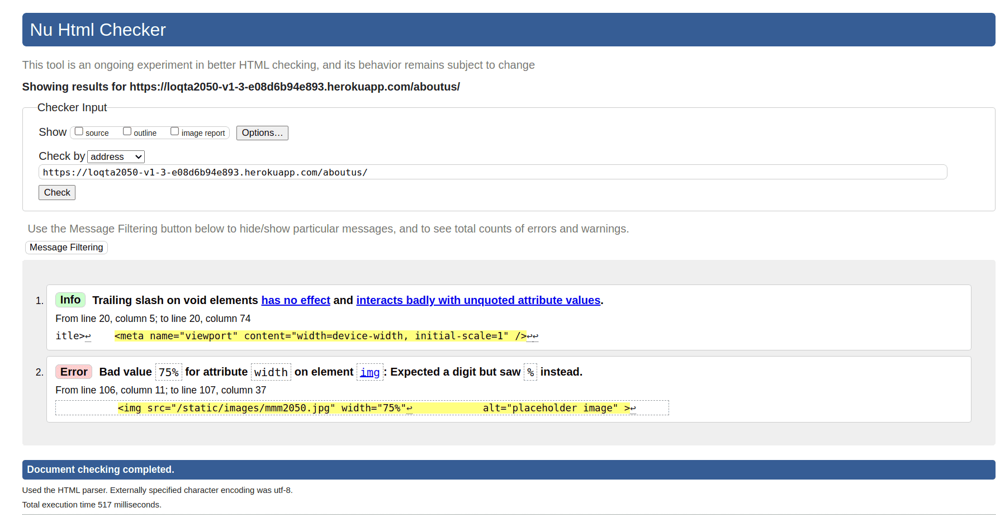

 

#### **Cause**:  
The `width` attribute in HTML expects a numeric value in pixels, not a percentage. Using a percentage value causes a validation error.

#### **Fix**:  
Use CSS for percentage-based widths, as this is the appropriate method for responsive designs.

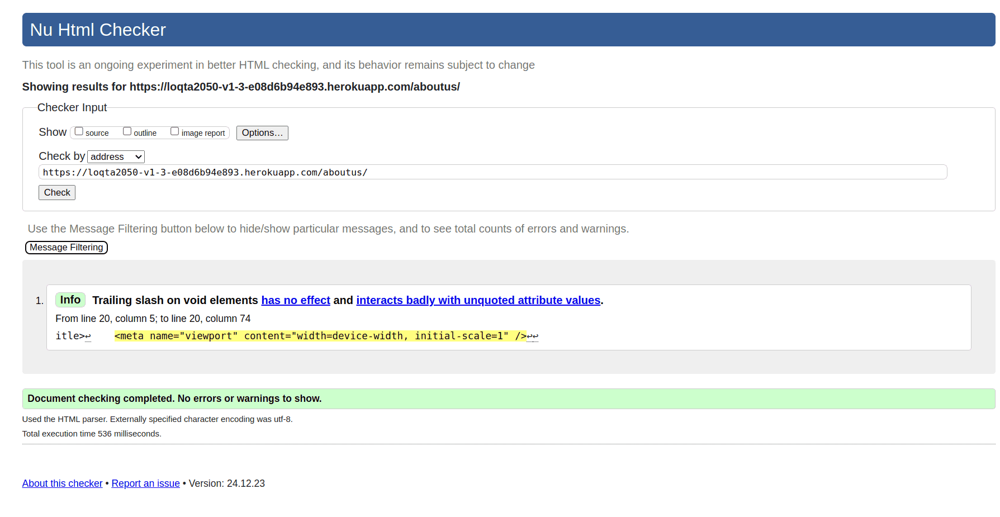


#### **Code Example**:  
**Before**:
```html

```

**After**:
```html

```

---

### **Key Takeaways**:
- Validation errors often arise from using non-standard attributes or incorrect syntax.
- Use `data-*` attributes for custom data to comply with HTML5 standards.
- Shift layout and styling tasks to CSS for better maintainability and validation compliance.
- Regularly test your HTML with validators to ensure quality, accessibility, and browser compatibility. 

 
## CSS Validation

No CSS errors found.


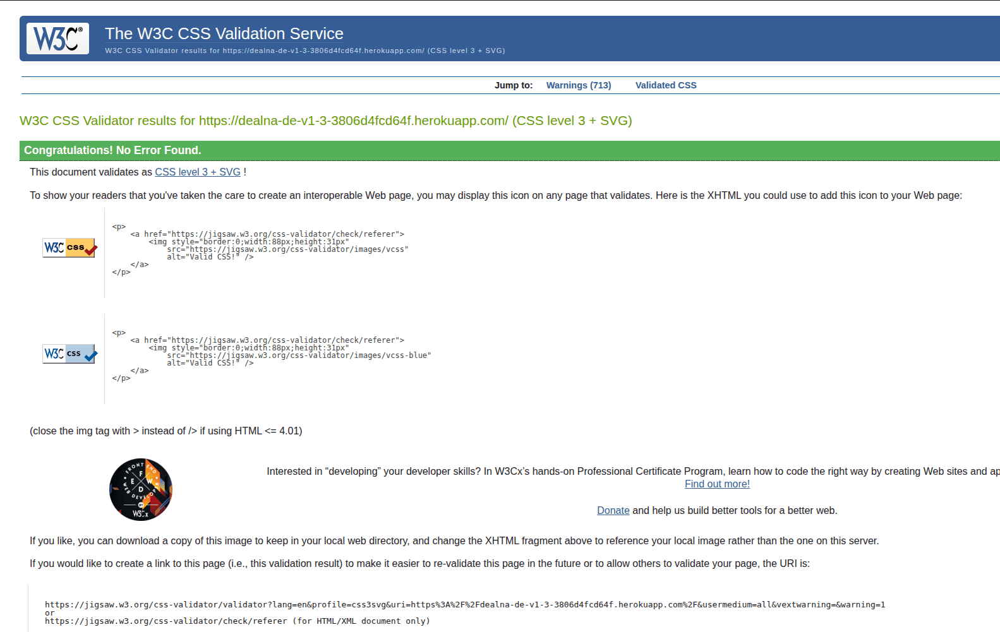


## JS Validation


 

### Fixes Applied
1. **ESLint and JSHint Configuration:**
   - Added `/* eslint-env es6 */` and `/* jshint esversion: 6 */` to support ES6.
   - This explicitly tells linters that the script uses ES6 syntax.

2. **Replaced `for...of` with `Array.from().forEach`:**
   - `Array.from()` converts the `HTMLCollection` to an array, enabling the use of `forEach`.
   - Ensures compatibility with environments that may not support `for...of`.

3. **Changed `let` to `const` where variables are not reassigned:**
   - Ensures better readability and avoids unnecessary reassignments.

4. **Used `const` or `let` instead of `var`:**
   - To adhere to modern JavaScript standards.

5. **Ensured ES6 Compatibility for Template Literals and Arrow Functions:**
   - Verified ES6-compatible tools/environment usage.
   - Added notes to indicate the ES6 usage for future reference.

 


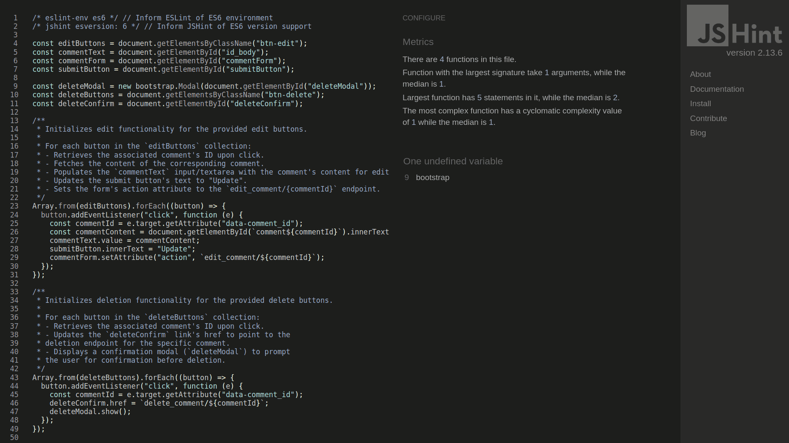


## Py Validation

No py errors remains.


## Getting Started:

To set up **Un2050** locally for development or testing purposes, follow these steps:

1. Clone this repository to your local machine.
2. Create a virtual environment and install the dependencies using:
   ```
   pip install -r requirements.txt
   ```
3. Set up the PostgreSQL database and configure environment variables in `.env` (use `.env.example` for reference).
4. Run migrations:
   ```
   python manage.py migrate
   ```
5. Create a superuser:
   ```
   python manage.py createsuperuser
   ```
6. Start the Django development server:
   ```
   python manage.py runserver
   ```
7. Access the site locally at [http://localhost:8000](http://localhost:8000).


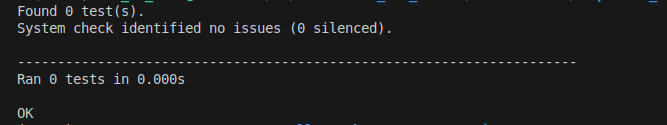


## Deployment:

This project can be deployed on platforms such as **Heroku** using the following steps:

1. Create a Heroku app and set the buildpacks to:
   1. `heroku/python`
   2. `heroku/nodejs` (if using front-end dependencies)
   
2. Set the required environment variables:
   - `DATABASE_URL`
   - `SECRET_KEY`
   - `DEBUG` (set to `False` in production)
   
3. Push your project to Heroku:
   ```
   git push heroku main
   ```


## Credits  

- **[Django Documentation](https://docs.djangoproject.com/):** For providing comprehensive guidance on the framework's features, concepts, and best practices.  
- **[Unsplash](https://unsplash.com/):** For the high-quality, free images used to enhance the visual appeal of the website.  
- **[Pexels](https://www.pexels.com/):** For additional media resources, providing free-to-use images and videos.  
- **[FontAwesome](https://fontawesome.com/):** For the icons used throughout the site to improve navigation and visual clarity.  
- **[Coolors](https://coolors.co/):** For creating a harmonious and accessible color palette for the site’s design.  
- **[W3Schools](https://www.w3schools.com/):** For quick references and examples of CSS and HTML techniques used in the project.  
- **[Bootstrap Documentation](https://getbootstrap.com/docs/):** For detailed explanations of components and utilities used to style and layout the site.  
- **[TinyPNG](https://tinypng.com/):** For compressing images, ensuring faster load times and better performance.  
- **[Google Fonts](https://fonts.google.com/):** For providing a modern and clean typography for the site's content.  
- **[Heroku Documentation](https://devcenter.heroku.com/):** For assistance with deploying the project and configuring server settings.  
- **[Cloudinary Documentation](https://cloudinary.com/documentation):** For image hosting and optimization, ensuring efficient and responsive performance.  
- **[Traversy Media](https://www.youtube.com/user/TechGuyWeb):** For video tutorials on Django, Bootstrap, and web development best practices.  
- **[Code Institute Course Material](https://codeinstitute.net/):** For foundational knowledge and guidance throughout the development of the project.
- **[Word_adventure](https://github.com/MohamedMesto/Word_adventure)**: From it the README template was sourced.

You can view the live site here also: [Dealna.de For E-Commerce v1.3]( https://dealna-de-v1-3-3806d4fcd64f.herokuapp.com/).


 
